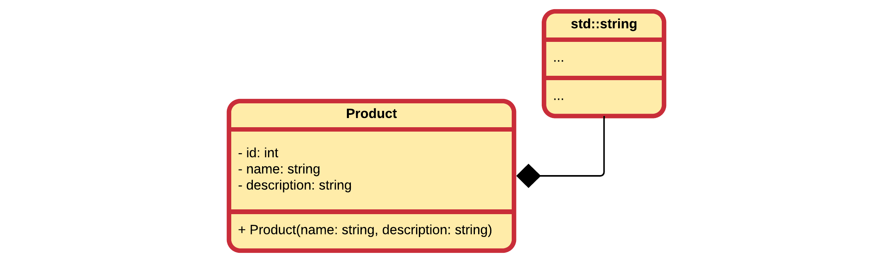
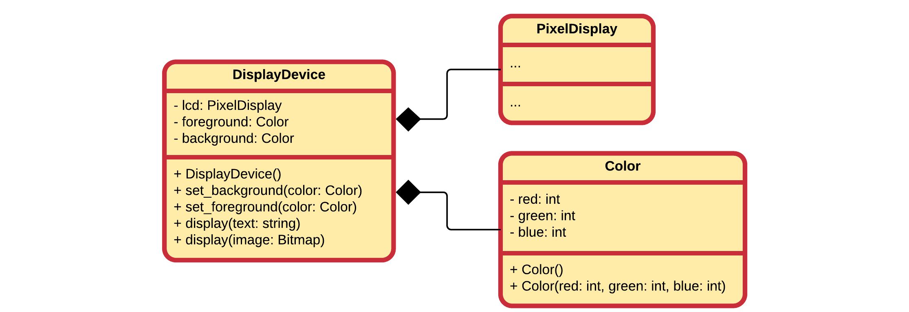
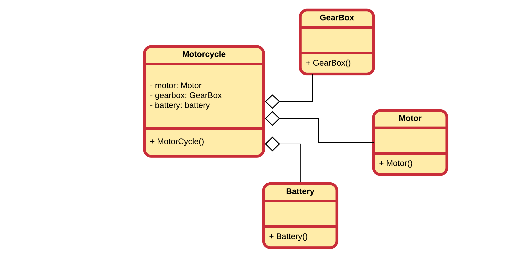

# Chapter 04 - Composition

One of the most used mechanisms to **reuse** code is by using composition and aggregation. By using composition we build **objects that consist of other objects**. Think of it as creating another type of object by packaging together other objects.

Composition also allows us to hide complexity behind the simplicity of objects. In other words, objects allow us to create new levels of abstraction.

Composition/Aggregation comes with a great deal of flexibility. Member objects of the new class can be made private, making them inaccessible to client programmers. This means that there can be changes without disturbing existing client code. This can even be done at runtime, to dynamically change the behavior of your program. This cannot be done using inheritance since the compiler must place compile-time restrictions on classes created with inheritance.

Because inheritance is one of the main pillars of object oriented design, it is often over-estimated and over-used. When used wrongly, it can result in awkward and overly-complicated designs. A good practice is to look at aggregation/composition first when creating new classes as it is simpler and more flexible.

## Composition or aggregation

While in most cases aggregation is synonym with composition, there is a subtle difference.

* **Aggregation** is a specialized form of association where all object have their own life cycle but there is ownership. In UML this is represented by a hollow diamond followed by a line.
* **Composition** is a specialized form of aggregation. It is a strong type of aggregation. In this relationship child objects do not have their own life cycle. If a parent object is destroyed, all its child objects will also be destroyed. In UML this is represented by a solid diamond followed by a line.

For more information please consult the section "Reusing Implementation" of the GitBook Object Oriented Thinking at [https://vives.gitbook.io/oot/all-about-objects/reusing-implementation](https://vives.gitbook.io/oot/all-about-objects/reusing-implementation).

While a clear distinction is made here between aggregation and composition, it is not always done so in practice. In practice, one does often speak of composition even if he/she were to mean aggregation. As a result this course may also use the word composition where aggregation is meant. Of course in cases where a clear distinction is needed, the correct term will be used.

## Creating new Classes Through Composition

You probable have already been using composition without realizing it. Consider the example below of a class Product that might be used in an online web shop as a model for products that are sold.


While developers will almost never document them as such in a UML diagram, the `name` and `description` attributes are actually instances of a class too, namely of `std::string`. So in other words `Product` is already a basic example of composition.



When composing objects of other objects, the *sub objects* are normally made private. This hides implementation and allows the designer of the class to change the implementation if needed.

Consider the following example where a `DisplayDevice` is modelled as a composition of an `PixelDisplay` object, which interacts with actual hardware, and `Color` objects that define the color of the letters and background.



By hiding the `PixelDisplay` object inside the `DisplayDevice` we hide the complexity of the hardware dependent class. This class may have methods for setting and resetting pixels, for changing hardware timings, for drawing rectangles, circles, and so on. We hide all that and we only expose the ability to show some text, through `display(text:string)`, and display a bitmap, through `display(image:Bitmap)`. This keeps our `DisplayDevice` simple and very user friendly.

Also if we ever wanted to switch from a backlit LCD pixel display to an OLED display, the classes that use the `DisplayDevice` never even have to change.

## Construction of Composite Objects

Whenever an object of a class is instantiated, its constructor is called. This however is not all that happens. When the object is composed of other objects, the constructors of those sub-objects is also called.

Take for example the class `Motorcycle` shown below, that is composed of several other classes, such as `GearBox`, `Motor`, ...



It is very important to know **which constructors** are called and at what time. Let's use the following implementation to illustrate which constructors are called when. Note that the constructors are implemented inline to shorten the code for this example.

**battery.h**

```c++
// battery.h
#pragma once
#include <iostream>

class Battery {
  public:
    Battery(void) {
      std::cout << "Constructing Battery" << std::endl;
    }
};
```

**gearbox.h**

```c++
// gearbox.h
#pragma once
#include <iostream>

class GearBox {
  public:
    GearBox(void) {
      std::cout << "Constructing GearBox" << std::endl;
    }
};
```

**motor.h**

```c++
// motor.h
#pragma once
#include <iostream>

class Motor {
  public:
    Motor(void) {
      std::cout << "Constructing Motor" << std::endl;
    }
};
```

And then for the composed object:

**motorcycle.h**

```c++
// motorcycle.h
#pragma once

#include <iostream>
#include "motor.h"
#include "gearbox.h"
#include "battery.h"

class Motorcycle {
  public:
    Motorcycle(void) {
      std::cout << "Constructing Motorcycle" << std::endl;
    }

  private:
    Motor motor;
    GearBox gearbox;
    Battery battery;
};
```

The main program could be as simple as:

```c++
//main.cpp
#include "motorcycle.h"

int main() {
    Motorcycle vn800;
    return 0;
}
```

Which would output:

```text
Constructing Motor
Constructing GearBox
Constructing Battery
Constructing Motorcycle
```

So basically, when constructing an object of a class, the default constructors of the composed objects are called first. When all composed objects are created, then the composing object is constructed.

Important to think about is:

* **Why are the constructors of the composed objects invoked before the actual constructor of the composing object ?** Simple, because those objects should be ready and in a valid state for the composing object to use it when it is constructed. For example: the MotorCycle may want to change the battery voltage to a different level in its constructor. It would not be able to do this if the battery was not yet constructed.
* The sub-objects are created in the order they are defined as attributes in the composing class.

This picture will become a bit more complicated once inheritance joins our arsenal of techniques.

## Constructor Initialization List

By default, the constructors invoked are the **default** ("no-argument") constructors. Moreover, all of these constructors are called before the class's own constructor is called.

But what if we do not want the default constructor to be invoked, or what if the composed object classes have no default constructors? In that case we need to be able to tell the compiler to execute a particular constructor when initializing the objects. This can be achieved using the **constructor initialization list**.

A constructor initialization list immediately follows the constructor's signature, separated by a colon `:`. Calling a different constructor a sub-object is accomplished by specifying the name of the attribute (object) followed by parentheses and the appropriate arguments.

Let's for example take a `Television` class that contains a `PowerSupply` that can convert any input voltage to any output voltage. We keep it simple and just implement the constructors to see what happens when the objects are instantiated.

**power_supply.h**

```c++
// power_supply.h
#pragma once

class PowerSupply {
  public:
    PowerSupply(double inputVoltage, double outputVoltage);

  private:
    double inputVoltage;
    double outputVoltage;
};
```

**power_supply.cpp**

```c++
// power_supply.cpp
#include "power_supply.h"
#include <iostream>

PowerSupply::PowerSupply(double inputVoltage, double outputVoltage) {
    this->inputVoltage = inputVoltage;
    this->outputVoltage = outputVoltage;

    std::cout << "Constructing PowerSupply: Input = " << this->inputVoltage;
    std::cout << " Output = " << this->outputVoltage << std::endl;
}
```

Since the `PowerSupply` class has no default constructor, the `Television` class needs to use the constructor initialization list to call a specific constructor of `PowerSupply`. Note that it is the name of the attribute that is used and not the name of the class. Otherwise if multiple attributes of the same class would be available we would not be able to differentiate between them.

**television.h**

```c++
// television.h
#pragma once
#include "power_supply.h"

class Television {
  public:
    Television(double inputVoltage);

  private:
    PowerSupply power;
};
```

**television.cpp**

```c++
// television.cpp
#include "television.h"
#include <iostream>

Television::Television(double inputVoltage)
    : power(inputVoltage, 12) {
    // Notice how we call the correct constructor
    // using the initialization list

    std::cout << "Constructing Television"<< std::endl;
}
```

A example program can be as simple as:

```c++
// main.cpp
#include "television.h"

int main() {
    Television samsungTv(220);
    return 0;
}
```

Which would result in the output:

```text
Constructing PowerSupply: Input = 220 Output = 12
Constructing Television
```

Of course in practice most classes will have default constructors and if you need to change anything to the state of your internal objects you can often do this by calling the appropriate setters. However, if other constructors are available which initialize the sub-object to the wanted state, it is a good idea to use them as it keeps your code cleaner.