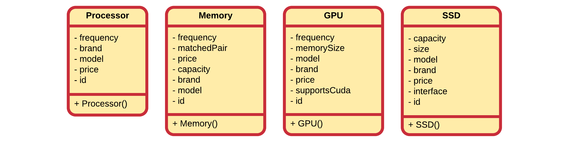

# Chapter 11 - Inheritance

Code reuse is probable one of the most powerful features of an object oriented programming language. While most programming languages provide functions / procedures which provide a low-level construct for code reuse, object oriented programming languages take this an important step further. OOP languages allow us to define classes and create relations between these classes, facilitating not only code reuse but also better overall design.

Inheritance is one of the main pillars of an object-oriented programming language and provides a clean way of reusing functionality. It allows a class to inherit both the attributes and methods of another class. Common data and functionality is structured inside a base class (also called superclass) from which the more specific classes inherit (called subclasses or derived classes) properties and behavior.

> **WARNING** - **Copy paste is not reuse**
>
> For all you copy-paste fanatics out there, copying code from one place to another is not considered code reuse. If the original code is ever extended, changed or corrected, chances are that you will forget to alter one of the copies.

As with most in an OOP language, the solution revolves around the class. Instead of creating classes from scratch we can use existing ones and extend them or embed them within our classes. The main advantages of this approach is that:

* we reuse code that has been tested and debugged
* code is not duplicated
* classes can be kept small and thus more manageable

The trick is to use the classes without soiling the existing code. There are two ways to accomplish this and one has already been discussed in this course.

The first approach is to create and embed objects of the already existing class inside the class you are developing. This is called **composition** as the new class is composed of objects of existing classes.

The second approach is to create a new class as a subtype of an existing class. You literally take the form of an existing class and extend it, and this without modifying the code of existing class. This is called **Inheritance**.

Both approaches are important cornerstones of an object oriented programming language.

## Vehicle Example

Consider a first example that models the classes `Truck`, `Racecar` and `Bus`. Each have a number of attributes and some methods. Below is a partial UML class diagram of the classes modeled without the use of inheritance. Each class has the full functionality implemented into the class itself.


When taking a look at this example it is pretty obvious that the design includes a lot of duplication. This can be solved by creating a **superclass** `Vehicle` that contains all the common attributes and methods of these classes.


> **INFO** - **Inheritance in UML class diagram**
>
> In a UML class diagram inheritance is depicted using a solid line and a hollow arrow attached at the side of the superclass.

While not documented inside the UML class diagrams, the subclasses `Truck`, `Racecar` and `Bus` also contain the attributes and methods of `Vehicle`.

Some attributes (such as the `trailer` of a `Truck`) and methods (such as `board(passenger)` of `Bus`) cannot be generalized to the `Vehicle` class. They are specific to the subclasses. This is perfectly valid when implementing inheritance.

By placing the common functionality and data inside a superclass a cleaner design is realized that also encourages code reuse.

## Introducing Inheritance

Inheritance allows a class to inherit (get) the properties and methods of another class. In other words, the **subclass** inherits the state and behavior from the **base class**. The subclass is also called the **derived class** while the base class is also known as the **super-class**. The derived classes can add their own additional attributes and methods. These additional attributes and methods differentiate the derived classes from the base class.

> **INFO** - **Inheritance = Extension**
>
> Inheritance is also often described as a mechanism to **extend** the behavior and properties of the superclass. This is just the reason why Java for example uses the extend keyword for inheritance.

It is also possible to change the implementation of certain methods in the base class, which is also known as **method overriding**.

> **WARNING** - **Method overloading vs. method overriding**
>
> Do not confuse method overloading with method overriding. Method overloading is a feature that allows a class to have two or more methods having same name, if their argument lists are different. Constructor overloading allows a class to have more than one constructors having different argument lists. Overloaded methods are differentiated by the number and the type of the arguments passed into the method. Method overriding replaces the implementation of a method of the base class.

A super-class can have any number of subclasses. While in Java, a subclass can have only one superclass, in C++ it is possible to inherit from multiple base classes, known as **multiple inheritance** (however not always a good idea or good practice).

## Computer Store Example

Let us revise the following application that is being build for an online computer web shop. A beginning developer has modeled some of the items that his client wants to sell online. However he has come to the conclusion that his design needs to be refactored.



While they are not documented in the UML, all attributes have getters and setters.

In a first iteration the most common attributes are extracted to a superclass. A good name might be `Product`. Since it is a store that sells products, it seems a logical choice. When selecting attributes from the subclasses to be placed inside `Product`, we must ask our self the question if that attribute is a logical property of computer store product. If not, then something is wrong or our models are wrong.


### Code always changes

Something to remember is that code evolves. It changes over time as things get added, removed or refactored. Static code will eventually become outdated and die. On top of that your boss, client, teacher, ... will never tell you the whole story. Once they get the first prototype, and they like it, there will always be a "would it be possible to add ..." moment. That is also why it is also more fun to program based on methodologies such as SCRUM and Agile as they take the fact of change into account.

So let us take the computer store example. Our developer needs help again as his client asked him to also add games to the list of products to sell. The overeager developer created a new class `Game` that inherits from the `Product` class. At first sight nothing seems wrong with it.


First of all it needs to be noted that adding a new product class was really easy as a lot of the functionality and properties are inherited from the `Product` base class.

Now taking a closer look at the classes, something can be noticed. Does a game have a model or a brand? In real life: no. Than why does it have a model and brand in the application?

Actually the class `Product` is not entirely accurate since games came into play. While each computer hardware product does have a model and brand, software and games do not. Basically we need to add a class `Hardware` which inherits from the `Product` class. Then our hardware products can inherit from `Hardware` and implicitly also from `Product`, while `Game` directly inherits from `Product`.


## Private, protected and public members

Attributes and methods are declared with an **access specifier** such as `private`, `protected` or `public`. These allow the developer to determine who can access the class, attributes or methods.

Very important to know is that a **derived class inherits all the members of its base class**, even the private ones. However it cannot access the **private members** (both attributes and methods) of its baseclass. For this reason getters and setters need to be provided for subclasses to have access to the attributes of their superclass.

Another solution would be to make the attributes `protected`. This would allow subclasses to access the attributes directly, while still keeping them inaccessible for outside classes. This can be a good solution in some cases, but most of the time it is cleaner to use accessors (getters and setters).

Do note that you can also make methods protected, allowing subclasses to use them, but not outside classes.

Let's take another example: consider a class `SpaceObject` with a subclass `Planet`. Next to that is a class `Space` which is composed of several `SpaceObject`s and `Planet`s. As shown below, protected attributes and methods are noted using the `#` symbol in UML.


In the example the `size` of a `SpaceObject` can only be accessed by `SpaceObject` itself, not even by the subclass `Planet`. However the `coordinates` are accessible by both `SpaceObject` and all of its subclasses (such as `Planet`). However not accessible from outside. `MAX_SIZE` is a `const` and `static` class variable which is made `public` and so accessible by all. However as it is `const` it can only be read and not written.

Below is an overview:

| Attribute of SpaceObject | Accessible by Planet? | Accessible by Space? |
|----|----|----|
|size|NO|NO|
|coordinates|YES|NO|
|MAX_SIZE|YES|YES|

The same rules apply for access specifiers of methods.

## Is-a Relationships

The superclass and subclass have an **"is-a"** relationship between them. Take the basic example of pets shown below.


Here we can for example state that a `Cat` is-a `Pet`, a `Bunny` is-a `Pet` and a `Dog` is-a `Pet`.

If you cannot logically state that 'subclass' is-a 'superclass' than you made a mistake to make 'subclass' inherit from 'superclass'. An example of this would be the case when you would create a subclass `Mosquito` from `Pet` because `Mosquito` also has color, favorite food and an age. This may seem DRY but it is illogical. You can't state that `Mosquito` is-a `Pet`.

If we needed to model both a `Bus` class and a `Car` class it makes perfect sense to create a `Vehicle` class and make both `Bus` and `Car` inherit from them. It's perfectly valid to state that

* a `Bus` is a `Vehicle`
* a `Car` is a `Vehicle`

However it would of been illogical to make *Bus* inherit from *Car* or vice versa as it would not have been logical to state that:

* a Bus is a Car
* a Car is a Bus

A `ChoppingCart` should not inherit from `Vehicle` because it has wheels.

## Inheritance in C++

To implement inheritance in C++ all you need is a baseclass and a subclass. The subclass needs to *extend* the baseclass and this can be accomplished by using the syntax shown below:

```c++
class <subclass> : public <baseclass>
  // Implementation
}
```

Note that **extending** the baseclass is exactly what we are doing when implementing inheritance. We take a general class and add something to it: data, behavior or both.

Depending on the context and strategy, inheritance can also be though of as **generalization**, where functionality of subclasses is extracted and placed inside a more generalized super class.