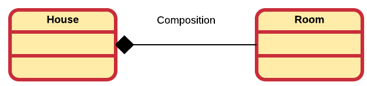
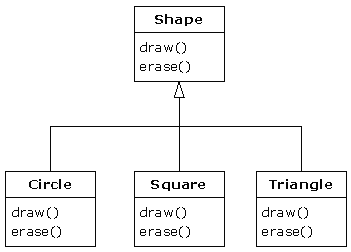
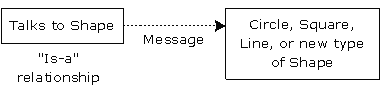
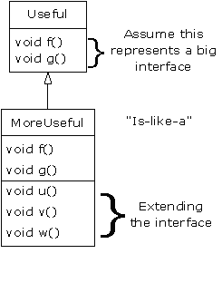
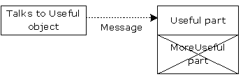

<!-- toc -->

# Its all about Objects

This chapter will give a quick introduction in the concepts of object oriented programming (OOP). While not explicitly necessary, this chapter does assume you have some basic knowledge about OOP and programming. If not, please review the GitBook course "Object Oriented Programming with Java" which can be found at https://bioboost.gitbooks.io/object-oriented-programming-using-java/content/.

While this chapter serves as an introduction to the course, it will also provide an overview of the concepts thought in this course. Most concepts given in this chapter will be discussed in detail further in the course. So this chapter will provide the big picture of OOP and connect all the different chapters. If you do not understand some of the parts in this chapter, do not panic, keep reading and return here after advancing further in the book.

## Abstracting Things

Abstracting things allows us to establishing a level of complexity on which a person interacts with the system. The more complex details are hidden below the current level. The user works with an idealized interface (usually well defined) and can add additional levels of functionality that would otherwise be too complex to handle.

> The essence of abstractions is preserving information that is relevant in a given context, and forgetting information that is irrelevant in that context.
>
> John V. Guttag (2013-01-18)

Take for example a programmer that is developing a calculator application. This programmer might not be interested in the way numbers are represented in the underlying hardware (e.g. whether they're 16 bit or 32 bit integers). The boundary where those details have been suppressed, we can state that they have been abstracted away. The programmer now just has numbers with which he can work.

All programming languages provide abstractions. The actual quality of the abstractions will determine the complexity of the problem you are able to solve. Try writing an MMORPG game using nothing but assembler.

In fact assembly language is an abstraction for machine code which is an abstraction of the actual hardware of a computer system.

![Assembler is an abstraction of Machine Code [^1]](img/assembler_abstraction.jpg)

[^1]: Source http://www.androidauthority.com/assembly-language-and-machine-code-678230/

Many imperative languages that followed (such as Fortran, C, Pascal, ...) were another level of abstraction introduced on top of the assembly language.


So called imperative languages are a big improvement over the low-level assembly language. They do however still require that the programmer thinks in terms of the structure of the computer rather than in terms of the structure of the problem.

Think for example about a simple program that can perform several operations on triangles. A simple C implementation may keep track of all the coordinates (x and y) of the triangle corners using arrays. The operations would be implemented using functions that take the necessary parameters or even act on global data and return a result or change the global data. Here we are storing data in arrays of a certain type and defining functions that can operate on that particular data.

The programmer must establish the association between the machine model (**the solution space**, the place where the problem is being modelled and solved) and the model of the problem (**the problem space**, the place where the problem exists).


The effort to make this mapping between the solution and problem space creates programs that are difficult write and expensive to maintain.

The alternative to modeling the machine is to *model the problem* you are trying to solve. This was introduced by languages such as:
* LISP: All problems are ultimately lists
* APL: All problems are algorithmic
* Prolog: All problems are chains of decisions

These languages chose a particular views of the world of problems. While they are good solutions to particular classes of problems, they do become awkward when you step outside their domain.

The object oriented approach takes it all a step further by given the programmer the ability to represent the elements from the problem space in the solution space. This representation is general enough so that it is not constrained to any particular type of problem. Elements in the problem space are represented in the solution space as **objects**.

This also allows the programmer to express the solution using the lingo of the problem space by adding types of objects. In other words, reading the code that describes the solution uses the same words that also express the problem. Of course a programmer will also be able to create objects that are not directly related to the problem space.

Coming back to the example of the triangle translation and rotation problem, we would actually be able to create a Triangle type. By creating objects of this type we would be able to create a solution with objects representing the elements of the problem, rather than in terms of the computer where the solution will run.

However, a connection does still exist between the solution and the computer. This in the analogy that an object can be seen as a small computer with state and actions it can be asked to perform. This is an analogy which can be extended to the real world where objects have characteristics and behavior.

Alan Kay, a renowned computer scientist, listed the five characteristics of Smalltalk, the first successful object oriented programming language and one of the languages on which C++ is based. They summarize the characteristics that represent a pure approach to object oriented programming:

1. **Everything is an Object.** An object contains both data and behavior (this is  also knows as *encapsulation*). It keeps state and can satisfy outside requests by performing operations on itself. You can basically create objects of any conceptual component in the problem you are trying to solve (people, buildings, lists, records, ...).

2. **A program is a bunch of objects telling each other what to do by sending messages.** To make a request of an object, a message needs to be send to it. This will call a certain method of that particular object.

3. **Each object has its own memory made up of other objects.** Think of this as creating another type of object by packaging together other objects, this will later be seen as what is called *composition*. This allows us to hide complexity behind the simplicity of objects. In other words, objects allows to create new levels of abstraction.

4. **Every object has a type.** Or in OOP lingo, each object is an *instance* of a *class* in which class actually is a synonym of type. A class defines what messages can be send to the objects of that particular class.

5. **All objects of a particular type can receive the same messages.** This is a bit more complex than it sounds. Basically, an object of type *circle* is also an object of type *shape*, meaning that a circle object will be guaranteed to also accept shape messages. This is where *polymorphism* comes into play: meaning you can write code that talks to shapes and automatically handles other objects that also fit the description of shapes, such as circles. This *substitutability* forms one of the most powerful concepts of OOP.

## The interface of an Object

Aristotle was one of the first to study the concept of *type*. He spoke of *the class of fishes and the class of birds*. The idea is that each object is unique (because of their state) but is also part of a class of objects that share characteristics and behavior.

The fundamental keyword *class* was first used in Simula-67, the first object oriented programming language, and allowed for the creation of new types in the program.

The number of objects that can be instantiated from a class is only limited by the memory available in the system the program is running on. Each object has its own state (contained within its data members) and identity.

These objects can then be manipulated (by sending them messages) as if they were the elements from the problem that is being solved.

Objects satisfy the requests that are being send to them (ex. draw something on the screen, complete a bank transaction, download a file from the Internet, ...). In practice, a *contract* is created between the creator of the class and the user of the class, which defines what messages can be send to a certain class of objects. This contract is realized by the **public interface** of the objects. In other words the interface of a class establishes what requests you can make to its objects.

There must however be code somewhere to satisfy the requests. This along with the hidden data comprises the *implementation* of the class.

So summarized: a type (class) has a method associated with each the possible requests (the interface) that can be made to the objects of that class. When a message is send to an object, the corresponding method is called, and the object figures out what to by executing the code that forms the implementation of that method.

Lets take a look at a simple example such as a light bulb. It might be represented as shown below.


The diagram above follows the UML standard (Unified Modeling Language). The diagram consists of three parts:

* The top box shows the **name of the class**. In this case Light. Note how the classname begins with a capital letter and is in the singular form.
* Below that is a list of **attributes**. They contain the characteristics or state of the objects that will be created from the class.
* Last is the box with the **methods** that are available for the class.

Except for the name of the class, the other parts of the diagram are optional and are only added when useful.

The minus '-' sign in front of the attributes state that these are private and cannot be accessed from outside the objects themselves. The plus '+' sign in front of the methods states that they are public and can be called by other type of objects.

Note that the interface of the class only consists of the public portions of the methods and attributes. The methods and attributes that are private are not considered part of the **public interface** of the class. Because of this, some programmers will leave out the private parts of the class from the UML class diagram, as they are considered private details to the actual implementation of the class

### Creating Objects in C++

Once a class is defined, objects can be instantiated from the class. This is done as shown in the code example below. First the type is specified followed by a arbitrary name chosen by the programmer.

```c++

// Create an object of type Light
Light bedroomLight;

// Send message to turn it on (method call)
bedroomLight.on();
```

The code sample also shows how a message can be send to the light bulb to request it to be turned on. This is was is what is called calling a method of that object. As a user of the object you need to specify the name that was given to the object (`bedroomLight` in this case), followed by the name of the method to call.

## Hide your Implementation

When taking a look at the object concept two parties of programmers can be distinguished. On one side is the *class creator* that defines the class and takes care of its implementation. He creates new data types and maintains the internal workings of those classes. On the other side is the *client programmer*, the class consumer, who uses the class and instantiates objects from it.

The client programmers goal is to collect a toolbox of helpful classes (libraries) and use these to develop a solution to his problem as fast as possible and with the least effort.

The class creators goal is to build a class that only exposes what is necessary and hide everything else.

Both these programmers can be the same physical person, however even in this case it is helpful to make a logical distinction between the user and the creator of a class.

Why hide as much as possible? Several reasons:
* If it is hidden, the client programmer can't use it and if he can't use it, he can't misuse it either. The hidden parts of a class represent the tender insides of the implementation and could be easily corrupted if made public.
* Hiding implementation details also allows the class creator to make changes to the hidden portions without having to worry about breaking contract with the client programmer. If you ever decide to for example optimize your implementation you would not need to worry about the people using your library.
* The simpler the public interface of the class, the more programmers will use.

In any case, in any relationship it is important to have boundaries that are respected by all involved parties. When creating libraries, you actually establish a relationship between yourself and the client programmer. That is why we often state that the public interface is a representation of the contract between a class creator and his clients.

**Access control** prevents client programmers to keep hands off portions they shouldn't touch. Hiding the internals that are not part of the interface that users need, is actually a service to the users. Client programmers can easily see what's important for them and ignore the rest.

C++ uses three keywords called **access modifiers** to set those boundaries in a class:
* `public`: Available to everyone ('+' sign in UML)
* `private`: Only available inside the class itself ('-' sign in UML)
* `protected`: Similar to private, except that subclasses can access these members ('#' sign in UML)

Trying to access members that are not available to you, will result in compile-time errors.

![Hiding implementation - Important for both client and creator[^2]](img/hiding_implementation.gif)

[^2]: Source http://javarevisited.blogspot.be/2010/10/abstraction-in-java.html

## Reusing implementation

Once a class has been created and hopefully tested it should ideally represent a useful unit of code.  In this case it begs to be reused and not go to waste. It also turns out that code reuse is one of the main advantages of object oriented programming.

> #### Warning::Reuse and DRY
>
> Code reuse is not, as some understand it to be (students in particular), the ability to be copy pasted from one part inside your program to another! This is actually *code duplication* and is considered bad practice. The DRYness (DRY - Don't Repeat Yourself) of once code is one of the indicators of the maintainability of that code.

Multiple ways exist to reuse a class:

* **Association**: Just use the objects of a class.
* **Composition/Aggregation**: Build classes that consist of other objects.
* **Inheritance**: Extend an existing class by inheriting from a base class.

### Association

The simplest way to reuse a class is by creating objects from it and using those objects. In other words an object of one class may use services/methods provided by an object of another class. This kind of relationship is termed as an association.

An association represents a relationship between two or more objects where all objects have their own lifecycle[^3] and there is no owner[^4]. The name of an association specifies the nature of relationship between objects. This is represented in UML by a solid line.

[^3]: The life cycle of an object is the time between an object's creation and its destruction. Rules for object lifetime vary significantly between languages, in some cases between implementations of a given language, and lifetime of a particular object may vary from one run of the program to another.

[^4]: [TODO] Needs a decent definition

Let's take an example of relationship between Teacher and Student. Multiple students can associate with a single teacher and a single student can associate with multiple teachers. But there is no ownership between the objects and both have their own lifecycle. Both can be created and deleted independently.


### Aggregation and Composition

Another way to reuse implementation is by creating classes that consist of other objects. In this case a differentiation can be made between what is called aggregation and composition.

**Aggregation** is a specialized form of association where all object have their own lifecycle but there is ownership. This represents "whole-part or a-part-of" relationship. In UML this is represented by a hollow diamond followed by a line.

Let's take an example of a relationship between Department and Teacher. A Teacher may belong to multiple departments. Hence Teacher is a part of a Department. But if we delete a Department object, no Teacher objects will be destroyed.


**Composition** is a specialized form of aggregation. It is a strong type of aggregation. In this relationship child objects do not have their own lifecycle. If a parent object is destroyed, all its child objects will also be destroyed. This represents a "death-relationship". In UML this is represented by a solid diamond followed by a line.

Let's take an example of relationship between a House and a Room. House can contain multiple rooms, but there is no independent life of Room and a Room cannot belong to two different houses. If we destroy the house, the rooms will automatically be destroyed too.



While a clear distinction is made here between aggregation and composition, it is not always done so in practice. In practice, one does often speak of composition even if he/she were to mean aggregation. As a result this course may also use the word composition where aggregation is meant. Of course in cases where a clear distinction is needed, the correct term will be used.

Composition/Aggregation comes with a great deal of flexibility. Member objects of the new class can be made private, making them inaccessible to client programmers. This means that they can be changes without disturbing existing client code. This can even be done at runtime[^5], to dynamically change the behavior of your program. This cannot be done using inheritance since the compiler must place compile-time restrictions on classes created with inheritance.

[^5]: In computer science, at runtime is the time during which a program is running (executing), in contrast to other program lifecycle phases such as compile time, link time and load time.

Because inheritance is one of the main pillars of object oriented design, it is often over-estimated and over-used. When used wrongly, it can result in awkward and overly-complicated designs. A good practice is to look at aggregation/composition first when creating new classes as it is simpler and more flexible. Later in this course some good guidelines will be given on when to use or not to use inheritance.

## Reusing the Interface - Inheritance

The concept of an object is a convenient tool. It allows you to package data and functionality together by concept. It would be a pity if one had to go through all the trouble to create a class and then be forced to create a brand new one even if it is very similar to the other one.

It's much more convenient to be able to clone classes and make additions and modifications to this clone. This is exactly what **inheritance** allows us to do. Inheritance lets you reuse classes as new classes that might have a similar functionality. On top of this, if the original class is modified, these modifications are also reflected in the clones.

Inheritance is visualized in a UML class diagram using an arrow from the new class (called the **derived, inherited, child or sub class**) to the original class (called the **super, base or parent class**).


Object-oriented programming allows classes to inherit commonly used state and behavior from other classes. In an inheritance hierarchy the base class contains all the common characteristics and behaviors of the derived classes. The more specific behaviors and characteristics can be found in the derived classes.

When inheriting from an existing type, you create a new type. This new type contains all the data members (even private once, although they are hidden and inaccessible) as well as duplication of the interface of the base class. In other words, objects of the derived class can receive the same messages as the original base class objects.

Let's take a look at the inheritance hierarchy shown in the following Shape example.


The base type here is the *Shape* class. All shapes have a size, color, position, ... All shapes can be drawn, erased, moved, colored, ... Specific shapes, such as Circle, Square and Triangle, are derived from this base class and inherit these characteristics and behavior.

Each subclass may also have additional characteristics and behavior. For example a circle has a radius while a square has the size of its side and a triangle has its width and height. Some addition behavior may be added, such as the ability to flip a Triangle (useless for a Circle and Square).

Besides that, some behavior may also be altered. For example drawing the shapes will be different for each type of Shape. This is referred to as overriding a method. When overriding a method, you keep the same interface method, but the definition (implementation) will differ from the original one.

Since all the subtypes can receive the same messages as the base type, it can be stated that the derived class is the same type as the base class. This means that we can state that:
* a Circle is a Shape
* a Square is a Shape
* a Triangle is a Shape

Because of this, inheritance is often called a **"is-a relationship"**. This can also serve as a check to see if inheritance is the correct path to follow. Type equivalence via inheritance is one of the fundamental gateways in understanding the meaning of object-oriented programming

Let's for example take a look at the following inheritance hierarchy. It may look acceptable if you state that a Bicycle is a sort of means to drive from point A to point B which you have modelled for your program. Later upon expanding your program you needed a model for a Car and noticed that it is a vehicle that can also drive from point A to point B. The only difference is that you need to keep track of mileage and allow it to be locked.


Now if you try out the same guideline and state "a Car is a Bicycle" you can definitely feel that something went wrong. While the design flaw can be spotted pretty easy here, it will not always be so obvious. A solution might be as simple as renaming Bicycle to Vehicle and if necessary create a subtype of Vehicle called Bicycle at the same level as Car.

### Is-a versus is-like-a relationship

When studying inheritance, it would seem that the cleanest way to create an inheritance hierarchy is to take the "pure" approach. That is, only methods that have been established in the base class or interface are to be overridden in the derived class, as seen in this diagram:



This can be called a pure "is-a" relationship because the interface of a class establishes what it is. Inheritance guarantees that any derived class will have the interface of the base class and nothing less. If you follow this diagram, derived classes will also have no more than the base-class interface.

This can be thought of as pure substitution, because derived class objects can be perfectly substituted for the base class, and you never need to know any extra information about the subclasses when you're using them.



That is, the base class can receive any message you can send to the derived class because the two have exactly the same interface. All you need to do is upcast from the derived class and never look back to see what exact type of object you’re dealing with. Everything is handled through polymorphism.

When you see it this way, it seems like a pure is-a relationship is the only sensible way to do things, and any other design indicates muddled thinking and is by definition broken.

This too is a trap. As soon as you start thinking this way, you'll turn around and discover that extending the interface (which, unfortunately, the keyword `extends` seems to encourage) is the perfect solution to a particular problem. This could be termed an "is-like-a" relationship, because the derived class is like the base class - it has the same fundamental interface - but it has other features that require additional methods to implement:



While this is also a useful and sensible approach (depending on the situation), it has a drawback. The extended part of the interface in the derived class is not available from the base class, so once you upcast, you can't call the new methods:



If you're not upcasting in this case, it won't bother you, but often you'll get into a situation in which you need to rediscover the exact type of the object so you can access the extended methods of that type.

Consider the example of a house that wired with controls for a cooling system; that is, it has an interface to control cooling.


Imagine that later on you decide to replace the air conditioner with a heat pump which has both a heating and cooling system. The heat pump "is-like" your previous air conditioner but it can do more. Because your control system is limited to cooling, it can only talk to the cooling part of the new object. The new interface of the new system has been extended and the existing system doesn't know about anything but the original interface.

Once you take a good look at the design it may become clear that the base class is not general enough and should be renamed to "TemperatureControlSystem" so that it can also include heating. At this point it would be possible to talk about "pure substitution".

However, this is quite a trivial example and real-world designs might not be so obvious.

You may feel that pure substitution is the only way to go, and in fact it is nice if your design works out this way. However there will be times when it is equally clear that you need to extend the base interface with new methods.

## Interchangeable objects and polymorphism

[todo]
