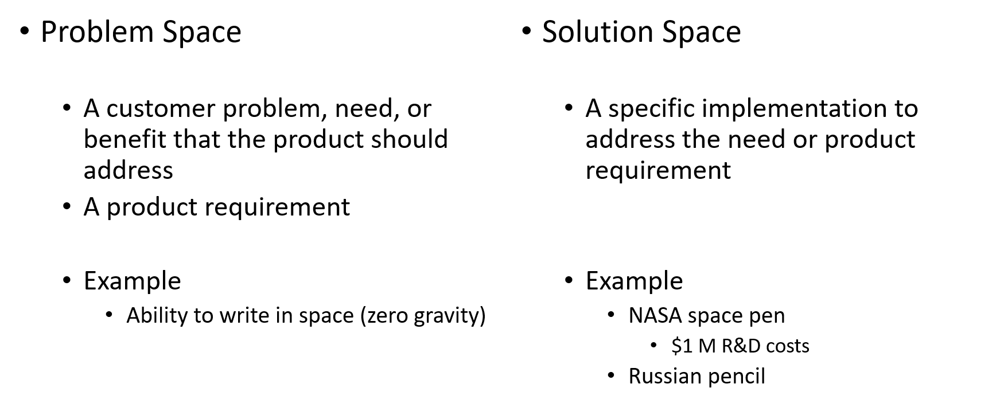

# Its all about Objects

This chapter will give a quick introduction in the concepts of object oriented programming (OOP). While not explicitly necessary, this chapter does assume you have some basic knowledge about OOP and programming. If not, please review the GitBook course "Object Oriented Programming with Java" which can be found at https://bioboost.gitbooks.io/object-oriented-programming-using-java/content/.

While this chapter serves as an introduction to the course, it will also provide an overview of the concepts thought in this course. Most concepts given in this chapter will be discussed in detail further in the course. So this chapter will provide the big picture of OOP and connect all the different chapters. If you do not understand some of the parts in this chapter, do not panic, keep reading and return here after advancing further in the book.

## Abstracting Things

Abstracting things allows us to establishing a level of complexity on which a person interacts with the system. The more complex details are hidden below the current level. The user works with an idealized interface (usually well defined) and can add additional levels of functionality that would otherwise be too complex to handle.

> The essence of abstractions is preserving information that is relevant in a given context, and forgetting information that is irrelevant in that context.
>
> John V. Guttag (2013-01-18)

Take for example a programmer that is developing a calculator application. This programmer might not be interested in the way numbers are represented in the underlying hardware (e.g. whether they're 16 bit or 32 bit integers). The boundary where those details have been suppressed, we can state that they have been abstracted away. The programmer now just has numbers with which he can work.

All programming languages provide abstractions. The actual quality of the abstractions will determine the complexity of the problem you are able to solve. Try writing an MMORPG game using nothing but assembler.

In fact assembly language is an abstraction for machine code which is an abstraction of the actual hardware of a computer system.

![Assembler is an abstraction of Machine Code [^1]](img/assembler_abstraction.jpg)

[^1]: Source http://www.androidauthority.com/assembly-language-and-machine-code-678230/

Many imperative languages that followed (such as Fortran, C, Pascal, ...) were another level of abstraction introduced on top of the assembly language.

![High-level Programming Languages [^2]](img/multiple_abstraction_layers.png)

[^2]: Source http://www.webopedia.com/TERM/A/assembly_language.html

So called imperative languages are a big improvement over the low-level assembly language. They do however still require that the programmer thinks in terms of the structure of the computer rather than in terms of the structure of the problem.

Think for example about a simple program that can perform several operations on triangles. A simple C implementation may keep track of all the coordinates (x and y) of the triangle corners using arrays. The operations would be implemented using functions that take the necessary parameters or even act on global data and return a result or change the global data. Here we are storing data in arrays of a certain type and defining functions that can operate on that particular data.

The programmer must establish the association between the machine model (**the solution space**, the place where the problem is being modelled and solved) and the model of the problem (**the problem space**, the place where the problem exists).

The effort to make this mapping between the solution and problem space creates programs that are difficult write and expensive to maintain.

The alternative to modeling the machine is to *model the problem* you are trying to solve. This was introduced by languages such as:
* LISP: All problems are ultimately lists
* APL: All problems are algorithmic
* Prolog: All problems are chains of decisions

These languages chose a particular views of the world of problems. While they are good solutions to particular classes of problems, they do become awkward when you step outside their domain.

The object oriented approach takes it all a step further by given the programmer the ability to represent the elements from the problem space in the solution space. This representation is general enough so that it is not constrained to any particular type of problem. Elements in the problem space are represented in the solution space as **objects**.

This also allows the programmer to express the solution using the lingo of the problem space by adding types of objects. In other words, reading the code that describes the solution uses the same words that also express the problem. Of course a programmer will also be able to create objects that are not directly related to the problem space.

Coming back to the example of the triangle translation and rotation problem, we would actually be able to create a Triangle type. By creating objects of this type we would be able to create a solution with objects representing the elements of the problem, rather than in terms of the computer where the solution will run.

However, a connection does still exist between the solution and the computer. This in the analogy that an object can be seen as a small computer with state and actions it can be asked to perform. This is an analogy which can be extended to the real world where objects have characteristics and behavior.

Alan Kay, a renowned computer scientist, listed the five characteristics of Smalltalk, the first successful object oriented programming language and one of the languages on which C++ is based. They summarize the characteristics that represent a pure approach to object oriented programming:

1. **Everything is an Object.** An object contains both data and behavior, also knows as *encapsulation*. It keeps state and can satisfy outside requests by performing operations on itself. You can basically create objects of any conceptual component in the problem you are trying to solve (people, buildings, lists, records, ...).

2. **A program is a bunch of objects telling each other what to do by sending messages.** To make a request of an object, a message needs to be send to it. This will call a certain method of that particular object.

3. **Each object has its own memory made up of other objects.** Think of this as creating another type of object by packaging together other objects, this will later be seen as what is called *composition*. This allows us to hide complexity behind the simplicity of objects. In other words, objects allows to create new levels of abstraction.

4. **Every object has a type.** Or in OOP lingo, each object is an *instance* of a *class* in which class actually is a synonym of type. A class defines what messages can be send to the objects of that particular class.

5. **All objects of a particular type can receive the same messages.** This is a bit more complex than it sounds. Basically, an object of type *circle* is also an object of type *shape*, meaning that a circle object will be guaranteed to also accept shape messages. This is where *polymorphism* comes into play: meaning you can write code that talks to shapes and automatically handles other objects that also fit the description of shapes, such as circles. This *substitutability* forms one of the most powerful concepts of OOP.

## Object Contracts

[TODO]

## Hiding implementation

[TODO]

## Reusing implementation
