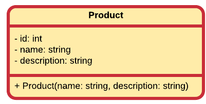
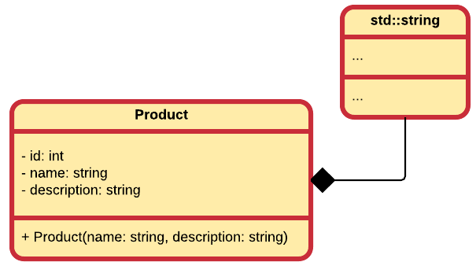
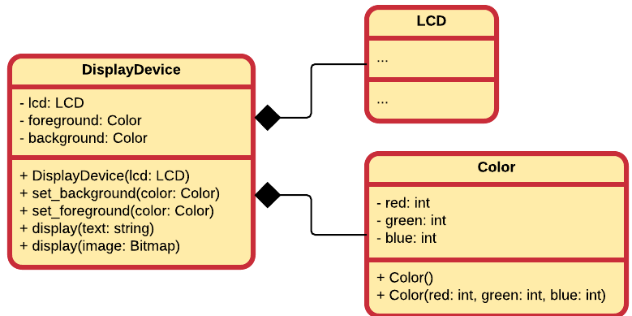

<!-- toc -->

# Composition / Aggregation

One of the most used mechanisms to reuse code is by using composition and aggregation. By using composition we build classes that consist of other objects. Think of this as creating another type of object by packaging together other objects.

Composition also allows us to hide complexity behind the simplicity of objects. In other words, objects allow us to create new levels of abstraction.

Composition/Aggregation comes with a great deal of flexibility. Member objects of the new class can be made private, making them inaccessible to client programmers. This means that they can be changes without disturbing existing client code. This can even be done at runtime, to dynamically change the behavior of your program. This cannot be done using inheritance since the compiler must place compile-time restrictions on classes created with inheritance.

Because inheritance is one of the main pillars of object oriented design, it is often over-estimated and over-used. When used wrongly, it can result in awkward and overly-complicated designs. A good practice is to look at aggregation/composition first when creating new classes as it is simpler and more flexible.

## Composition or aggregation

While in most cases aggregation is synonym with composition, there is a subtle difference.

**Aggregation** is a specialized form of association where all object have their own lifecycle but there is ownership. This represents "whole-part or a-part-of" relationship. In UML this is represented by a hollow diamond followed by a line.

Let's take an example of a relationship between Department and Teacher. A Teacher may belong to multiple departments. Hence Teacher is a part of a Department. But if we delete a Department object, no Teacher objects will be destroyed.

**Composition** is a specialized form of aggregation. It is a strong type of aggregation. In this relationship child objects do not have their own lifecycle. If a parent object is destroyed, all its child objects will also be destroyed. This represents a "death-relationship". In UML this is represented by a solid diamond followed by a line.

Let's take an example of relationship between a House and a Room. House can contain multiple rooms, but there is no independent life of Room and a Room cannot belong to two different houses. If we destroy the house, the rooms will automatically be destroyed too.

While a clear distinction is made here between aggregation and composition, it is not always done so in practice. In practice, one does often speak of composition even if he/she were to mean aggregation. As a result this course may also use the word composition where aggregation is meant. Of course in cases where a clear distinction is needed, the correct term will be used.

## Creating new Classes Through Composition

You probable have already been using composition without realizing it. Consider the example below of a class Product that might be used in an online web shop as a model for products that are sold.

While we will almost never include them as such, the `name` and `description` are actually instances of a class too, namely `std::string`. So in other words `Product` is already an basic example of composition.

When composing objects of other objects, the *sub objects* are normally made private. This hides implementation and allows the designer of the class to change the implementation if needed.

Consider the following example where a `DisplayDevice` is modelled as a composition of an `LCD` objects, which interacts with actual hardware, and `Color` objects that define the color of the letters and background.

By hiding the `LCD` object inside the `DisplayDevice` we hide the complexity of the hardware dependent class. This class may have methods for setting and resetting pixels, for changing hardware timings, for drawing rectangles, circles, and so on. We hide all that and we only expose the ability to show some text, through `display(text:string)`, and display a bitmap, through `display(image:Bitmap)`. This keeps our `DisplayDevice` simple and very user friendly.

## Constructor Initialization List

http://www.cprogramming.com/tutorial/initialization-lists-c++.html
