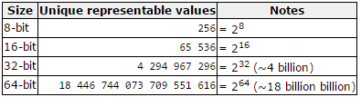

# Chapter 02 - Basics of C++ in a Nutshell

This chapter will introduce the basics of the C++ language. It does expect you to already be familiar with another programming language such as C# or Java.

<!-- TODO: Casting of double to int and also explain narrowing conversion -->
<!-- TODO: Explain variable scope -->
<!-- TODO: Better intro - explain C++ and where it serves its purpose -->
<!-- TODO: Add enums -->
<!-- TODO: cin, getline, cout, cerr ; streams in general ?-->

## Variables

While programming in any programming language, you need to reserve memory when you wish to store data. This can be achieved by using variables. When you create a variable, you actually **reserve space in memory**. Luckily you do not need to use the actual memory location to access the data, but you can use the variable which is a **symbolic name** that references the memory location.

**Primitive types** are the **most basic data types available** within a programming language. These types serve as the building blocks of data manipulation. Such types serve only one purpose - containing pure, simple values of a certain type. Because these data types are defined into the type system by default, they come with a number of operations predefined (`+`, `-`, `*`, `/`, `%`, ...).

C++ supports several primitive datatypes as shown in the following table.


Primitive data types are basic types implemented directly by the language that represent the basic storage units supported natively by most systems. They can mainly be classified into:

* **Character types**: These can represent a single character, such as `'A'` or `'$'`. The most basic type is `char`, representing a single character. Other types are also provided for wider characters.
* **Numerical integer types**: They can store a whole number value, such as `7` or `1024`. They exist in a variety of sizes, and can either be `signed` or `unsigned`, depending on whether they support negative values or not.
* **Floating-point types**: These types represent real values, such as `3.14` or `0.01`, with different levels of precision, depending on which of the three floating-point types is used.
* **Boolean type**: The boolean type, known in C++ as `bool`, can only represent one of two states, `true` or `false`.

While the `bool` type does represent a `true` or `false` value, in the background it is actually an integer value. `false` is represented with the value of `0` and `true` is represented with anything different from `0`.

```cpp
bool a = true;
bool b = false;
bool c = 0;
bool d = -15;
bool e = 23;

std::cout << "Value of a: " << a << std::endl;
std::cout << "Value of b: " << b << std::endl;
std::cout << "Value of c: " << c << std::endl;
std::cout << "Value of d: " << d << std::endl;
std::cout << "Value of e: " << e << std::endl;
```

::: codeoutput
<pre>
Value of a: 1
Value of b: 0
Value of c: 0
Value of d: 1
Value of e: 1
</pre>
:::

::: warning Datatype sizes
Note that the C++ standard does not specify a concrete size for each type. This means that the size of the data types actually dependent on the system you are compiling for. In certain situations you will need to keep this in mind.
:::

Within each of the groups above, the difference between types is only their size (i.e., how much space they occupy in memory): the first type in each group is the smallest, and the last is the largest, with each type being at least as large as the one preceding it in the same group. Other than that, the types in a group have the same properties.

::: tip The fundamental storage unit in C++
*From the draft version of the C++ 17 Standard $4.4/1*
The fundamental storage unit in the C++ memory model is the byte. A byte is at least large enough to contain any member of the basic execution character set (5.3) and the eight-bit code units of the Unicode UTF-8 encoding form and is composed of a contiguous sequence of bits, the number of which is implementation defined.
:::

Type sizes above are expressed in bits; the more bits a type has, the more distinct values it can represent. On the other hand, the larger the size, the more memory a datatype consumes.



### Declaring variables

**C++ is a strongly-typed language**, and requires every variable to be declared with its type **before** its first use. This informs the compiler the size to reserve in memory for the variable and how to interpret its value. The syntax to define a new variable in C++ is straightforward: simply write the type followed by the variable name (also known as its identifier).

::: warning Declaration versus definition
Note that defining a variable is not the same as declaring it. Declaring a variable is stating that it exists somewhere, while defining a variable is actually creating it. Declaring a variable is done using the `extern` keyword. While less important for variables, the distinction will be more clear in the context of functions, methods and classes.
:::

```cpp
int radius;                 // Definition
double area;                // Definition
char firstLetter = 'a';     // Definition + initialization
bool isSucces, isFinished;  // Multiple definitions are possible as comma separated list
int sum = 0;
int average = 0.0;
```

As shown in the example above, you can also initialize the variable while defining it. When a value like `'a'` or `0.0` is used inside code, it is called a **literal value**.

The name of a variable can be composed of letters, digits, and the underscore character. It must begin with either a letter or an underscore, not with a digit. Upper and lowercase letters are distinct because **C++ is case-sensitive**.

### The Assignment Operator

The most used operator is the assignment operator `=`. It assigns a value to a variable. For example:

```cpp
int x = 5;
int y = x;      // Assign value of x to y
```

The last statement assigns the value of the variable `x` to the variable `y`. Consider also that we are only assigning the value of `x` to `y` at the moment of the assignment operation. Therefore, if `x` changes at a later moment, it will not affect the value held by `y`. In other words a copy is made of the value held by `x` and then stored in `y`.

### Variable initialization

While a variable does not need to be initialized immediately, it should not be used before a meaningful value is assigned to it. Uninitialized variables in C++ actually cause garbage data and may cause unpredictable results if their value is used before they are assigned a decent value.

Try the following code example

```cpp
#include <iostream>

using namespace std;

int main() {
  int a, b, c

  cout << "a = " << a << endl;
  cout << "b = " << b << endl;
  cout << "c = " << c << endl;

  return 0;
}
```

The output is actually **undefined**.

::: codeoutput
<pre>
a = 32765
b = 0
c = 0
</pre>
:::

Both C and C++ define the values as undefined. Undefined means it may be **anything**, including being initialized to 0, taking previous value of the memory, being initialized to `0xDEADBEEF` or consecutive bytes of string `"blarg! blarg! blarg!"`, or anything else. In modern operating systems memory is usually zeroed at start and hence short-lived programs will typically have 0s everywhere. Basically you're getting a random value, which happens to sometimes be 0. But it's not guaranteed to be 0.

So important lesson: **Make sure to assign a meaningful value to variables before using them as they may lead to hard-to-track bugs inside your application.**

## Constants

In C++ there are two ways to define constant values:

* Using the preprocessor `#define` directive
* Using the `const` keyword

Constants can be defined using a preprocessor directive using the following template.

```cpp
#define IDENTIFIER <value>
```

Notice that no assignment operator or statement terminator is required.

An example:

```cpp
#define MAX_NUMBER_OF_STUDENTS 25
```

When the application is compiled the preprocessor actually replaces all the occurrences of these directives with their actual values. Think of it as an automatic search and replace in your source code.

You can also use `const` prefix to declare constants with a specific type as follows:

```cpp
const <datatype> VARIABLE_NAME = <value>;
```

For example:

```cpp
const int NUMBER_OF_TEACHERS = 85;
```

A const variable declaration declares an actual variable in the language, which you can use like a real variable: take its address, pass it around, use it, cast it, convert it, etc.

Perhaps one might think that avoiding the declaration of a variable saves time and space, but with any sensible compiler optimization levels there will be no difference, as constant values are already substituted and folded at compile time. But you gain the huge advantage of type checking and making your code known to the debugger, so there's really no reason not to use const variables.

Typically constants are defined using an all CAPITALS name and underscores between the different words. This is a good programming practice.

## Mathematical Operators

The most basic operators are the mathematical operators. They are easy to understand because they have the same functionality as in math. The following operators are available to do basic math operations:

| Operator | Description |
| --- | --- |
| `+` | Additive operator (also used for String concatenation) |
| `-` | Subtraction operator |
| `*` | Multiplication operator |
| `/` | Division operator |
| `%` | Remainder operator |

These operators are part of the **binary operators** because they take **two operands**, namely a left and a right operator. For example in the summation below `left` is the left operand and `right` is the right operand. The result of the operation is stored in the variable `sum`.

```cpp
int right = 14;
int left = 12;

int result = left + rights;     // Result is now 26
```

The `+`, `-` and `*` operators function the same as in math. Their use can be seen in the code below.

```cpp
int a = 2 + 3;      // a = 5
int b = a + 5;      // b = 10

int c = 6 * b;      // c = 60
int d = c - 120;    // d = -60
```

The division and remainder operators deserve some special attention. The division operator has a different result based on the types of its left and right operand. If both are of an integral type (`short`, `int`, `byte`) then a whole division will be performed. Meaning that `3 / 2` will result in `1`. If either operand is a floating point operand (`float` or `double`) than the division operator will perform a real division: `3.0 / 2` will result in `1.5`.

If your operands are of integral type and you wish to perform a real division, you can always multiply one of the operands with `1.0` to explicitly convert it to a floating point number without having to change its actual data type. Let us take a look at some examples.

```cpp
int x = 5;
int y = 2;

int z = x / y;              // z = 2 (whole division)
double w = x / y;           // w = 2.0 (still whole division)
double q = 1.0 * x / y;     // w = 2.5 (real division)

double a = 3.0;
double b = 2;       // 2 will actually be converted to 2.0

double k = a / b;   // k = 1.5 (real division)
```

Notice that even `double w = x / y;` results in `2.0`. The reason behind this is that `x / y` equals to `2` as it is a whole division since both operand are of integral type. The result is then implicitly converted to a `double`, and stored in `w`.

While the **precedence** (order) in which mathematical operations are performed is defined in C++, most programmers do not know all of them by heart. It is much more clear and simpler to use round brackets `()` to enforce the precedence of the calculations. Take a look at the following piece of code:

```cpp
int a = 5;
int b = 6;
int c = 10;
int d = 2;

int result = a * b + c - d * a / 5 - 3;     // result = 35

std::cout << "The result is " << result << std::endl;
```

The result of the code above is `35`. Would you have known? By using round brackets this becomes much clearer and the chance of making a mistake is a lot smaller.

```cpp
int a = 5;
int b = 6;
int c = 10;
int d = 2;

int result = (a * b) + c - (d * a / 5) - 3;     // result = 35

std::cout << "The result is " << result << std::endl;
```

Operators that have the same precedence are bound to their arguments in the direction of their associativity. For example, the expression `a = b = c` is parsed as `a = (b = c)` because of right-to-left associativity of assignment. The expression `a + b - c` is parsed `(a + b) - c` because of left-to-right associativity of addition and subtraction.

### Compound Operators

Programmers are very lazy creatures that are always looking for ways to make their life's easier. That is why the compound operators were invented. They are a way to write shorter mathematical operations on the same variable as the result should be store in.

```cpp
int x = 5;

x += 4;   // Same as writing x = x + 4;
x -= 4;   // Same as writing x = x - 4;
x *= 4;   // Same as writing x = x * 4;
x /= 4;   // Same as writing x = x / 4;
x %= 4;   // Same as writing x = x % 4;
```

### Increment and Decrement Operators

Incrementing (+1) and decrementing (-1) a variable is done very often in a programming language. It is one of the most used operations on integral values. It is most common used in loop-constructs as we will see in this chapter later on.

Because of this a shorter way has been introduced using an increment `++` or decrement `--` operator as shown below.

```cpp
int i = 5;

i++;    // Same as writing i = i + 1;
i--;    // Same as writing i = i - 1;
```

There is however a caveat to keep in mind. Both operators come in a **suffix** (e.g. `i++`) and a **prefix** (e.g. `++i`) version. The end result of both versions is exactly the same, but there is a difference if you assign their value to another variable while using the increment or decrement operator.

Let us take a look at two examples. First we take a look at the prefix version. In this case the value of `i` will be incremented to 6 before its value assigned to the variable `b`. Meaning at the end of this code both `i` and `b` will have a value of 6.

```cpp
int i = 5;
int b = ++i;    // b = 6, i = 6
```

Next we take a look at the suffix version. In this case the value of `i` will first be assigned to `b` before it is incremented. This results in a `b` having a value of 5 and `i` having a value of 6 at the end of the example.

```cpp
int i = 5;
int b = i++;  // b = 5, i = 6
```

While this may not seem all that important at the moment we will require to know this once we start to work with arrays.

## Comparison Operators

Comparison (aka relational) operators are used to **compare two values** with each other.

The table below shows the available comparison operators that can be used in C++ to build a condition.

| Operator | Description |
|---|---|
| `==` | equal to |
| `!=` | not equal to |
| `>` | greater than |
| `>=` | greater than or equal to |
| `<` | less than |
| `<=` | less than or equal to |

Since a conditional statement actually produces a single `true` or `false` result, this result can actually be assigned to a variable of type `bool`.

Let's take a look at some examples of comparison operators:

```cpp
int a = 4;
int b = 8;
bool result;
result = (a < b);     // true
result = (a > b);     // false
result = (a <= 4);    // a smaller or equal to 4 - true
result = (b >= 9);    // b bigger or equal to 9 - false
result = (a == b);    // a equal to b - false
result = (a != b);    // a is not equal to b - true
```

Note how we need to use two equality signs `==` to test if two values are equal, while we use a single sign `=` for assignment.

While the comparison operators will not often be used in a situation as shown in the code above, they will often be used when making decisions in your program.

## Conditional Operators

When creating more complex conditional statements you will need to use the conditional operators to create combinations of conditions.

The table below gives an overview of the available conditional operators in C++.

| Operator | Description |
|---|---|
| `&&` | AND |
| `||` | OR |
| `!` | NOT |

These work as you know them from the Boolean algebra. The `||` (OR) operator will return `true` if either of the operands evaluate to `true`. The `&&` (AND) operator will return `true` if both operands evaluate to `true`. A logical expression can be negated by placing the `!` (NOT) operator in front of it.

The code example below checks if a person is a child, an adult or an adolescent based on his/her `age`.

```cpp
int age = 16;
bool isAChild = (age >= 0 && age <= 14);        // false
bool isAnAdolescent = (age > 14 && age < 18);   // true
bool isAnAdult = (age >= 18 && age <= 75);      // false
```

### Lazy Evaluation

The conditional operators exhibit **"short-circuiting"** behavior, which means that the second operand is evaluated only if needed. This is also called **lazy evaluation**. So for example in an OR statement, if the first operand evaluates to `true` the outcome must also be `true`. For this reason the second operand is not checked anymore.

This can lead to confusing C++ constructions which should be avoided when possible. However as a future professional C++ programmer you may encounter them and need to understand their behavior.

An example where the second operand of the condition is not checked:

```cpp
int counter = 0;
bool result = (false && counter++);
std::cout << "Counter: " << counter << std::endl;
std::cout << "Result: " << result << std::endl;
```

::: codeoutput
<pre>
Counter: 0
Result: 0
</pre>
:::

And an example where the second operand of the condition is always evaluated:

```cpp
int counter = 0;
bool result = (true && counter++);
std::cout << "Counter: " << counter << std::endl;
std::cout << "Result: " << result << std::endl;
```

::: codeoutput
<pre>
Counter: 1
Result: 0
</pre>
:::

Do note that in the last example the postfix operator is used and not the prefix operator. Meaning that the value of `counter` is evaluated before it is incremented. As its initial value was `0` it is evaluated to `false`, meaning that `result` is assigned `false`.

## The if statement

The statements inside your source files are generally executed from top to bottom (in the order that they appear). Control flow statements, however, break up the flow of execution by employing decision making, enabling your program to conditionally execute particular blocks of code. This section describes the `if` and `if-else` statements that allow code to be executed based on a given condition.

The `if` statement is the most basic of all the control flow statements. It allows an application to execute a certain section of code only if a particular condition evaluates to `true`.

Examine the following example where the user is requested to enter a temperature. Next the given value is evaluated and if it is above (or equal to) a certain threshold value (`85` in this case) a warning message is outputted to the terminal.

```cpp
int temperature = 0;

std::cout << "Please enter temperature: ";
std::cin >> temperature;

if (temperature >= 85) {
  std::cout << "Warning, temperature is too high!" << std::endl;
}
```

<!-- TODO: Explain cin a bit earlier? -->

If this test evaluates to `false` (meaning that the temperature is below `85`), control jumps to the end of the if statement.

## The if-else Statement

The if-else statement provides a secondary path of execution when an "if" clause evaluates to `false`. Taking the previous example you could output an "all is good" message when the temperature is below the threshold value.

```cpp
int temperature = 0;

std::cout << "Please enter temperature: ";
std::cin >> temperature;

if (temperature >= 85) {
  std::cout << "Warning, temperature is too high!" << std::endl;
} else {
  std::cout << "All is good" << std::endl;
}
```

The if-else statement can be extended with **even more if-else statements**. Each if-else will need a new condition that needs to be checked. The first one that evaluates to `true` is executed, after which control jumps to the end of the if-else statements.

Let us extend the temperature example with a number of ranges.

```cpp
int temperature = 0;

std::cout << "Please enter temperature: ";
std::cin >> temperature;

if (temperature < 85) {
  std::cout << "All is good" << std::endl;
} else if (temperature >= 85 && temperature < 100) {
  std::cout << "Warning, temperature is too high!" << std::endl;
} else if (temperature >= 100 && temperature <= 200) {
  std::cout << "Time to run!" << std::endl;
} else {
  std::cout << "We are doomed!!!!" << std::endl;
}
```

<!-- You may have noticed that the value of `temperature` can satisfy more than one expression in the combined statements. However the conditions are checked sequentially and once a condition is satisfied, the appropriate statements are executed and the remaining conditions are not evaluated anymore. -->

## The Switch Statement

Let us take a look at some code that will allow the user to enter the number of the day of the week. The program will than determine the name of the day and output it to the user.

```cpp
  int dayOfTheWeek = 0;

  std::cout << "What day of the week is it today [1-7]? ";
  std::cin >> dayOfTheWeek;

  if (dayOfTheWeek == 1) {
    std::cout << "Than it's Monday today" << std::endl;
  } else if (dayOfTheWeek == 2) {
    std::cout << "Than it's Tuesday today" << std::endl;
  } else if (dayOfTheWeek == 3) {
    std::cout << "Than it's Wednesday today" << std::endl;
  } else if (dayOfTheWeek == 4) {
    std::cout << "Than it's Thursday today" << std::endl;
  } else if (dayOfTheWeek == 5) {
    std::cout << "Than it's Friday today" << std::endl;
  } else if (dayOfTheWeek == 6) {
    std::cout << "Than it's Saturday today" << std::endl;
  } else if (dayOfTheWeek == 7) {
    std::cout << "Than it's Sunday today" << std::endl;
  } else {
    std::cout << "That is not a valid number" << std::endl;
  }
}
```

When **checking a single variable for equality** using multiple if-else statements, it can be replaced with another structure called a switch structure. The template of the switch structure is shown below. Each case needs a **literal integral value** to compare the variable against. If it matches (equals) than the code between the colon `:` and the `break;` statement is executed. The `break` is required for the switch to be stopped when a match is found. If no `break` is placed, the execution falls through to the next case.

```java
switch (<variable>) {
  case <integral_literal_1>:
    // Code to be executed
    break;
  case <integral_literal_2>:
    // Code to be executed
    break;
  case <integral_literal_3>:
    // Code to be executed
    break;
  // ...
  default:
    // Code to be executed in case no match found
}
```

Replacing the if-else structure of the day-of-the-week example with a switch statement results in the following code.

```java
int dayOfTheWeek = 0;

std::cout << "What day of the week is it today [1-7]? ";
std::cin >> dayOfTheWeek;

switch(dayOfTheWeek) {
  case 1:
    std::cout << "Than it's Monday today" << std::endl;
    break;
  case 2:
    std::cout << "Than it's Tuesday today" << std::endl;
    break;
  case 3:
    std::cout << "Than it's Wednesday today" << std::endl;
    break;
  case 4:
    std::cout << "Than it's Thursday today" << std::endl;
    break;
  case 5:
    std::cout << "Than it's Friday today" << std::endl;
    break;
  case 6:
    std::cout << "Than it's Saturday today" << std::endl;
    break;
  case 7:
    std::cout << "Than it's Sunday today" << std::endl;
    break;
  default:
    std::cout << "That is not a valid number" << std::endl;
}
```

No general rule exists for when to use which construct. Some programmers don't like the switch statement. In most cases it is a case of preference.

Some important points about the switch statement:

* The expression provided in the switch should result in a constant value otherwise it would not be valid.
  * Valid expressions for switch:
    * `switch(1+2+23)`
    * `switch(1*2+3%4)`

  * Invalid switch expressions for switch:
    * `switch(ab+cd)`
    * `switch(a+b+c)`

* Duplicate case values are not allowed.
* The `default` statement is optional. Even if the switch case statement did not have a default statement, it would run without any problem.
* The `break` statement is optional. If omitted, execution will continue on into the next case. The flow of control will fall through to subsequent cases until a `break` is reached.
* Nesting of switch statements are allowed, which means you can have switch statements inside another switch. However nested switch statements should be avoided as it makes code more complex and less readable.

<!-- TODO: Add warning here about scope of local variables inside of cases. Need `{}` to limit scope. Also see remark on paper -->

## The for loop

Basically a for loop is most often used when the number of iterations is pre-determined. A typical example would be a list of items where an actions needs to be applied to each item in the list.

The syntax of a for loop in C++ is:

```cpp
for ( <initialization>; <condition>; <increment> ) {
  // statements
}
```

* The **initialization step** is executed first, and only once. This step allows you to declare and initialize any loop control variables. You are not required to put a statement here, as long as a semicolon appears.
* Next, **the condition is evaluated**. If it is `true`, the body of the loop is executed. If it is `false`, the body of the loop does not execute and flow of control jumps to the next statement just after the for loop.
* After the body of the for loop has executed, the flow of control jumps back up to the **increment statement**. This statement allows you to update any loop control variables. This statement can be left blank, as long as a semicolon appears after the condition.
* The condition is now evaluated again. If it is true, the loop executes and the process repeats itself (body of loop, then increment step, and then again condition). After the condition becomes false, the for loop terminates.

Each of these components are optional. However the semicolon used to distinguish between each part is mandatory.

An example of a simple for-loop that iterates between 0 and 9 and outputs each value of `i`.

```cpp
for (int i = 0; i < 10; i++) {
  cout << "i = " << i << endl;
}
```

Note that `i` actually has block scope here and will not be available outside of the for-loop. If you want to keep the last iteration value after the for-loop you need to define the iterator before the for-loop.

```cpp
int i = 0;
for (; i < 10; i++) {
  cout << "i = " << i << endl;
}
cout << "After the for-loop i = " << i << endl;
```

An endless loop would look like this.

```cpp
for (;;;) {
  // Do something forever
}
```

## Functions

A function **groups together a block of statements that inherently belong together**. A function performs a **single well defined task**. Every C++ program has at least one function, namely `main()`. By grouping together statements as a function we also **allow the reuse of functionality** inside our applications, which contributes to the DRYness of our code.

The C++ standard library provides numerous built-in functions that your program can call. Take a look at the reference of the standard C++ library at [http://www.cplusplus.com/reference/](http://www.cplusplus.com/reference/).

Functions are given a symbolic name, allowing for easy calling of the functions and also making it more clear what the function does exactly (of course if the creator of the function gives it a clear and understandable name).

### Calling Existing Functions

To call a function, you need to pass the required parameters along with the function name. If the function returns a value, then you can also store the returned value for later use. When a program calls a function, program control is transferred to the called function. A called function performs a defined task and when it is finished it returns program control back to the code that called the function, ready to execute the statement following the function call.

<!-- TODO: UML flow diagram? -->

For example the `max()` function in the standard `algorithm` library compares the two arguments and returns the greatest of the two:

```cpp
#include <iostream>
#include <algorithm>

int main() {
  double biggest = std::max(3.14, 15.12);
  std::cout << "max(3.14, 15.12) => " << biggest << std::endl;
  return 0;
}
```

The `max()` function takes two arguments and returns the result. While the above code example shows an example with two literal values, it is also perfectly possible to pass variables. It is also possible to directly use the return value (without using the `biggest` variable in this case).

```cpp
#include <iostream>
#include <algorithm>

int main() {
  double pi = 3.14;
  double someNumber = 15.12;

  std::cout << "max(" << pi << ", " << someNumber
    << ") => " << std::max(pi, someNumber) << std::endl;

  return 0;
}
```

But how does one know how to call a certain function? Simple: by reading the online reference or documentation and by trying to understand the examples. Start by taking a look at the documentation of the `max()` function: [http://www.cplusplus.com/reference/algorithm/max/](http://www.cplusplus.com/reference/algorithm/max/).

### Creating Custom Functions

To create custom functions two components are required:

* A function declaration (also called the prototype), which tells the compiler about a function's name, return type, and its parameters;
* A function definition, which provides the actual body (implementation) of the function.

#### Defining a Function

The general form of a C++ function definition looks like the template below

```text
<return_type> function_name( <comma_separated_parameter_list> ) {
  // Statements (body / implementation)
  return <value>;  // In case of a non-void function
}
```

A C++ function definition consists of a function header (same as the prototype) and a function body:

* **The return type**: A function may return a value. The return type is the data type of the value the function returns. Some functions perform the desired operations without returning a value. In this case, the return type is the keyword `void`.
* **The function name**: This is the actual name of the function.
* **Comma separated parameter list**: A parameter is like a special local variable to the function. When a function is invoked, you pass a value to the parameter. This value is referred to as an **actual parameter** or argument. The parameter list refers to the type, order, and number of the parameters of a function. Parameters are optional; that is, a function may contain no parameters.
* **Function body**: The function body contains a collection of statements that together define what the function does.

The function name and the parameter list together constitute the **function signature**. Note that the return type is not part of the function signature. As the standard says in a footnote, "Function signatures do not include return type, because that does not participate in overload resolution".

::: tip Overload resolution
A function signature is the parts of the function declaration that the compiler uses to perform overload resolution. Since multiple functions might have the same name (ie., they're overloaded), the compiler needs a way to determine which of several possible functions with a particular name a function call should resolve to. The signature is what the compiler considers in that overload resolution.
:::

If a function is to use arguments, it must declare variables that accept the values of the arguments. These variables are called the **formal parameters** of the function. The formal parameters behave like other local variables inside the function and are created upon entry into the function and destroyed upon exit.

Consider the function `sum()` shown below that determines the sum of two integral values.

```cpp
int sum(int a, int b) {
  return a + b;
}
```

Some things to note:

* The name of the function is `sum`
* The return value of the function is `int` so it needs to have a return statement that returns an integer value
* It takes two parameters, namely `a` of type `int` and `b` also of type `int`. Each parameter needs an explicit type specification.

#### Declaring a Function

A function declaration tells the compiler about a functions name and how to call the function. The actual body of the function can be defined separately.

A function declaration has the following parts:

```text
<return_type> function_name( <comma_separated_parameter_list> );
```

In other words the function declaration is exactly the same as the function header but without the attached body found with the actual definition.

For the previous defined function `sum()`, the function declaration would be:

```cpp
int sum(int a, int b);
```

Parameter names are not important in function declaration only their type is required, so the following is also a valid declaration:

```cpp
int sum(int, int);
```

A separate function declaration is required when you

* define a function below the point where you call the function (for example using a custom function in `main()` that is defined below main)
* define a function in one source file and you call that function in another file. In such case, you should declare the function at the top of the file calling the function.

#### Putting it all together

Below is an example of the `sum()` function being called from the `main()` function. Note that no declaration (prototype) is required as the `sum()` function is defined before main.

```cpp
#include <iostream>

int sum(int a, int b) {
  return a + b;
}

int main() {
  std::cout << "sum of 12 and 15 = " << sum(12, 15) << std::endl;
  return 0;
}
```

Now if one were to place the `sum()` function below main, the compiler would generate the error: `error: 'sum' was not declared in this scope`. This can be fixed by adding a declaration of the `sum()` function before `main()`.

```cpp
#include <iostream>

// Function declaration, comment out to see the compiler error
int sum(int a, int b);

int main() {
  std::cout << "sum of 12 and 15 = " << sum(12, 15) << std::endl;
  return 0;
}

int sum(int a, int b) {
  return a + b;
}
```

### Default parameter values

When you define a function, you can specify a default value for each of the **last parameters**. This value will be used if the corresponding argument is left blank when the function is called.

This is done by using the assignment operator and assigning values for the arguments in the function definition. If a value for that parameter is not passed when the function is called, the default value is used, but if a value is specified, this default value is ignored and the passed value is used instead.

Let us consider a function `print_terminal()` that prints out the terminal sign of a console (for example `>` in powershell).

```cpp
void print_terminal(char sign = '>') {
  std::cout << sign;
}
```

If no argument is passed, the default `>` is printed. In the other case the passed symbol is outputted.

```cpp
#include <iostream>

void print_terminal(char sign = '>') {
  std::cout << sign;
}

int main() {
  // Using the default symbol
  print_terminal();
  std::cout << std::endl;

  // Passing another symbol
  print_terminal('$');
  std::cout << std::endl;
  return 0;
}
```

Default parameter values can be placed in the declaration and in the definition of a function but not in both. The most logical place is the declaration as this is most likely the only thing the user sees (the definition may be hidden as we will see later).

### Functions versus methods

A **function** is a piece of code that is called by name. It can be passed data to operate on (i.e., the parameters) and can optionally return data (the return value). All data that is passed to a function is passed explicitly.

A **method** is a piece of code that is called by name that is **associated with an object**. In most respects it is identical to a function except for two key differences.

* It is implicitly passed a reference to the object for which it was called.
* It is able to operate on data that is contained within the class (remembering that an object is an instance of a class - the class is the definition, the object is an instance of that class).

### Pass by value, by pointer or by reference

While calling a function, there are three ways that arguments can be passed to a function

* **Pass by value**: This copies the actual value of an argument into the formal parameter of the function. In this case, changes made to the parameter inside the function have no effect on the argument
* **Pass by pointer**: This copies the address of an argument into the formal parameter. Inside the function, the address is used to access the actual argument used in the call. This means that changes made to the parameter affect the argument.
* **Pass by reference**: This copies the reference of an argument into the formal parameter. Inside the function, the reference is used to access the actual argument used in the call. This means that changes made to the parameter affect the argument.

By default, C++ uses pass by value to pass arguments. In general, this means that code within a function cannot alter the arguments used to call the function.

<!-- Maybe note for later: Even return statements pass-by-value. That is why the linux kernel almost never returns values. Its all using global variable. -->

Take for example the code below where a `swap()` function tries to swap the values of two variables.

```cpp
#include <iostream>
using namespace std;

void swap(int x, int y) {
  int temp = x;
  x = y;
  y = temp;
}

int main() {
  int a = 10;
  int b = 136;

  cout << "Before call to swap:" << endl;
  cout << "a: " << a << endl;
  cout << "b: " << b << endl;

  swap(a, b);

  cout << "\nAfter call to swap:" << endl;
  cout << "a: " << a << endl;
  cout << "b: " << b << endl;

  return 0;
}
```

As C++ passes arguments by value, a copy of `a` and `b` is created and placed inside the local parameter variables `x` and `y`. Because of this changes to `x` and `y` are local to the scope of the function itself. Luckily enough because otherwise every function would be able to alter the original variables which would lead to a lot of bugs and hard to solve problems.

::: codeoutput
<pre>
Before call to swap:
a: 10
b: 136

After call to swap:
a: 10
b: 136
</pre>
:::

But what if we wanted this to work. Well then you need to pass the data using pointers or references. More on this later.

## Arrays

An array data structure, or simply an array, is **a data structure consisting of a collection of elements**, each identified by at least one **array index** or key. An array is stored so that the position of each element can be computed from its index by a mathematical formula. The simplest type of data structure is a linear array, also called one-dimensional array.

For example, an array of ten 32-bit (4 bytes) integer variables, with indices 0 through 9, may be stored as 10 words at memory addresses 2000, 2004, 2008, ... 2036, so that the element with index `i` has the address `2000 + 4 × i`.

The memory address of the first element of an array is called the first address or foundation address.

Because the mathematical concept of a matrix can be represented as a two-dimensional grid, two-dimensional arrays are also sometimes called matrices. Arrays are often used to implement tables, especially lookup tables; the word table is sometimes used as a synonym of array.

Arrays are among the oldest and most important data structures, and are used by almost every program. They are also used to implement many other data structures, such as lists and strings. They effectively exploit the addressing logic of computers. In most modern computers and many external storage devices, the memory is a one-dimensional array of words, whose indices are their addresses.

Arrays are useful mostly because the element indices can be computed at run time. Among other things, this feature allows a single iterative statement to process arbitrarily many elements of an array. For that reason, the elements of an array data structure are required to have the same size and should use the same data representation.

### One Dimensional Arrays

An array is a **container object** that holds a **fixed number of values** of a **single type**. The length of an array is established when the array is created. After creation, its length is fixed.

The next code example shows how to declare and create an array of `10` integers:

```cpp
int someNumbers[10];
```

By placing square brackets after the name of the variable we declare the variable to be an array.

A visualization of the array may look something like this:


Each item in an array is called **an element**, and each element is accessed by its numerical index. As shown in the preceding visualization, numbering begins with 0 (this is called **zero-indexed**). The 9th element, for example, would therefore be accessed at index 8.

Let us take a look at some code that stores 5 integers requested from the user. Once all numbers are inputted the total and average is calculated and reported back to the user.

```cpp
#include <iostream>

using namespace std;

int main()
{
    const unsigned int NUMBERS_SIZE = 5;
    int userNumbers[5];

    int sum = 0;        // Make sure to initialize
    for (unsigned int i = 0; i < NUMBERS_SIZE; i++) {
        cout << "Please enter a number (" << (NUMBERS_SIZE-i) << " left): ";
        cin >> userNumbers[i];
        sum += userNumbers[i];
    }

    cout << "The sum equals " << sum << endl;
    return 0;
}
```

From the code above it can be seen that the array elements can be accessed by using `[]` with the index specified between them.

### Quick Initialization

It is perfectly possible to initialize all array elements using a for-loop construct as shown below.

```cpp
#include <iostream>
using namespace std;
int main()
{
    const unsigned int NUMBERS_SIZE = 5;
    int numbers[NUMBERS_SIZE];

    for (unsigned int i = 0; i < NUMBERS_SIZE; i++) {
        numbers[i] = 0;
    }
    return 0;
}
```

However in some cases shorter options are available using an array initialization list. Obviously if no initialization is done, the elements contain "random" scrap data.

Initializing all elements to zero can be achieved using the following constructs:

```cpp
// initialize all elements to 0
// (not allowed in C)
int someArray[10] = {};

// Initialize all elements to 0
// (allowed in C)
int someOtherArray[10] = { 0 };
```

Initializing elements to a certain value is also possible.

```cpp
int myArray[10] = { 5, 5, 5, 5, 5, 5, 5, 5, 5, 5 };
```

Elements with missing values will be initialized to 0:

```cpp
int myArray[10] = { 1, 2 };   // initialize to 1, 2, 0, 0, 0 ...
```

If you provide enough initialization values you can also omit the array size. The compiler will then automatically create an array large enough to hold the values.

```cpp
int myArray[] = { 1, 2, 3, 4, 5 };      // Will automatically create an array of 5 elements
```

### Multi-Dimensional Arrays

C++ allows the declaration of multi-dimensional arrays. Multidimensional arrays can be described as **"arrays of arrays"**. Below is the general declaration template of such a structure:

```cpp
<type> name_of_array[size1][size2]...[sizeN];
```

The simplest form of the multi-dimensional array is the two-dimensional array. A two-dimensional array is, in essence, an array of one-dimensional arrays. To declare a two-dimensional integer array of size 2 by 4 one would declare it as follows:

```cpp
int matrix[2][4];
```

So this can be thought of as an array with two elements where each element points to an array of 4 elements.

The initialization list can also be used with multi-dimensional arrays as shown below:

```cpp
int matrix[2][4] = {  
   {0, 1, 2, 3},
   {4, 5, 6, 7}
};
```

Of course if you wish to access the elements you will need to provide as much indexes as there are dimensions in the array structure.

Take a look at the three-dimensional array initialization example shown below.

<!-- TODO: A bit of a stupid example. Think of something more useful. -->

```cpp
#include <iostream>
using namespace std;
int main()
{
    const int SIZE_X = 5, SIZE_Y = 5, SIZE_Z = 5;
    double space[SIZE_X][SIZE_Y][SIZE_Z] = {};
          // Initialize all to zero

    for (unsigned int x = 0; x < SIZE_X; x++) {
        for (unsigned int y = 0; y < SIZE_Y; y++) {
            for (unsigned int z = 0; z < SIZE_Z; z++) {
                cout << "space[" << x << "][" << y << "]["
                    << z << "] = " << space[x][y][z] << endl;
            }
        }
    }

    return 0;
}
```

As multi-dimensional arrays can become complex quite fast, it is important to name your indexes clearly and also to keep it as simple as possible.

## Overview of Keywords in C++

This is a list of reserved keywords in C++. Since they are used by the language itself, these keywords are not available for re-definition or overloading. This also implies that they cannot be used as names for variables.

| Keyword | Short description |
| ---- | ------ |
| alignas (since C++11) | - |
| alignof (since C++11) | - |
| and | - |
| and_eq | - |
| asm | - |
| auto(1) | - |
| bitand | - |
| bitor | - |
| bool | - |
| break | - |
| case | - |
| catch | - |
| char | - |
| char16_t (since C++11) | - |
| char32_t (since C++11) | - |
| class(1) | - |
| compl | - |
| concept (since C++20) | - |
| const | - |
| constexpr (since C++11) | - |
| const_cast | - |
| continue | - |
| decltype (since C++11) | - |
| default(1) | - |
| delete(1) | - |
| do | - |
| double | - |
| dynamic_cast | - |
| else | - |
| enum | - |
| explicit | - |
| export(1) | - |
| extern(1) | - |
| false | - |
| float | - |
| for | - |
| friend | - |
| goto | - |
| if | - |
| inline(1) | - |
| int | - |
| long | - |
| mutable(1) | - |
| namespace | - |
| new | - |
| noexcept (since C++11) | - |
| not | - |
| not_eq | - |
| nullptr (since C++11) | - |
| operator | - |
| or | - |
| or_eq | - |
| private | - |
| protected | - |
| public | - |
| register(2) | - |
| reinterpret_cast | - |
| requires (since C++20) | - |
| return | - |
| short | - |
| signed | - |
| sizeof(1) | - |
| static | - |
| static_assert (since C++11) | - |
| static_cast | - |
| struct(1) | - |
| switch | - |
| template | - |
| this | - |
| thread_local (since C++11) | - |
| throw | - |
| true | - |
| try | - |
| typedef | - |
| typeid | - |
| typename | - |
| union | - |
| unsigned | - |
| using(1) | - |
| virtual | - |
| void | - |
| volatile | - |
| wchar_t | - |
| while | - |
| xor | - |
| xor_eq | - |
