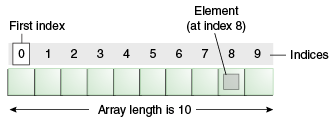

# Chapter 03 - Arrays

An array data structure, or simply an array, is **a data structure consisting of a collection of elements**, each identified by at least one **array index** or key. An array is stored so that the position of each element can be computed from its index by a mathematical formula. The simplest type of data structure is a linear array, also called one-dimensional array.

For example, an array of ten 32-bit (4 bytes) integer variables, with indices 0 through 9, may be stored as 10 words at memory addresses 2000, 2004, 2008, ... 2036, so that the element with index `i` has the address `2000 + 4 × i`.

The memory address of the first element of an array is called the first address or foundation address.

Because the mathematical concept of a matrix can be represented as a two-dimensional grid, two-dimensional arrays are also sometimes called matrices. Arrays are often used to implement tables, especially lookup tables; the word table is sometimes used as a synonym of array.

Arrays are among the oldest and most important data structures, and are used by almost every program. They are also used to implement many other data structures, such as lists and strings. They effectively exploit the addressing logic of computers. In most modern computers and many external storage devices, the memory is a one-dimensional array of words, whose indices are their addresses.

Arrays are useful mostly because the element indices can be computed at run time. Among other things, this feature allows a single iterative statement to process arbitrarily many elements of an array. For that reason, the elements of an array data structure are required to have the same size and should use the same data representation.

## One Dimensional Arrays

An array is a **container object** that holds a **fixed number of values** of a **single type**. The length of an array is established when the array is created. After creation, its length is fixed.

The example code below shows how to declare and create an array of 10 integers:

```c++
int someNumbers[10];
```

By placing square brackets after the name of the variable we declare the variable to be an array.

A visualization of the array may look something like this:



Each item in an array is called **an element**, and each element is accessed by its numerical index. As shown in the preceding visualization, numbering begins with 0 (this is called **zero-indexed**). The 9th element, for example, would therefore be accessed at index 8.

Let us take a look at some code that stores 5 integers requested from the user. Once all numbers are inputted the total and average is calculated and reported back to the user.

```c++
#include <iostream>

using namespace std;

int main()
{
    const unsigned int NUMBERS_SIZE = 5;
    int userNumbers[5];

    int sum = 0;        // Make sure to initialize
    for (unsigned int i = 0; i < NUMBERS_SIZE; i++) {
        cout << "Please enter a number (" << (NUMBERS_SIZE-i) << " left): ";
        cin >> userNumbers[i];
        sum += userNumbers[i];
    }

    cout << "The sum equals " << sum << endl;
    return 0;
}
```

From the code above it can be seen that the array elements can be accessed by using `[]` with the index specified between them.

## Quick Initialization

It is perfectly possible to initialize all array elements using a for-loop construct as shown below.

```c++
#include <iostream>
using namespace std;
int main()
{
    const unsigned int NUMBERS_SIZE = 5;
    int numbers[NUMBERS_SIZE];

    for (unsigned int i = 0; i < NUMBERS_SIZE; i++) {
        numbers[i] = 0;
    }
    return 0;
}
```

However in some cases shorter options are available using an array initialization list. Obviously if no initialization is done, the elements contain "random" scrap data.

Initializing all elements to zero can be achieved using the following constructs:

```c++
// initialize all elements to 0
// (not allowed in C)
int someArray[10] = {};

// Initialize all elements to 0
// (allowed in C)
int someOtherArray[10] = { 0 };
```

Initializing elements to a certain value is also possible.

```c++
int myArray[10] = { 5, 5, 5, 5, 5, 5, 5, 5, 5, 5 };
```

Elements with missing values will be initialized to 0:

```c++
int myArray[10] = { 1, 2 };   // initialize to 1, 2, 0, 0, 0 ...
```

If you provide enough initialization values you can also omit the array size. The compiler will then automatically create an array large enough to hold the values.

```c++
int myArray[] = { 1, 2, 3, 4, 5 };      // Will automatically create an array of 5 elements
```

## Multi-Dimensional Arrays

C++ allows the declaration of multi-dimensional arrays. Multidimensional arrays can be described as **"arrays of arrays"**. Below is the general declaration template of such a structure:

```c++
<type> name_of_array[size1][size2]...[sizeN];
```

The simplest form of the multi-dimensional array is the two-dimensional array. A two-dimensional array is, in essence, an array of one-dimensional arrays. To declare a two-dimensional integer array of size 2 by 4 one would declare it as follows:

```c++
int matrix[2][4];
```

So this can be thought of as an array with two elements where each element points to an array of 4 elements.

The initialization list can also be used with multi-dimensional arrays as shown below:

```c++
int matrix[2][4] = {  
   {0, 1, 2, 3},
   {4, 5, 6, 7}
};
```

Of course if you wish to access the elements you will need to provide as much indexes as there are dimensions in the array structure.

Take a look at the three-dimensional array initialization example shown below.

<!-- TODO: A bit of a stupid example. Think of something more useful. -->

```c++
#include <iostream>
using namespace std;
int main()
{
    const int SIZE_X = 5, SIZE_Y = 5, SIZE_Z = 5;
    double space[SIZE_X][SIZE_Y][SIZE_Z] = {};
          // Initialize all to zero

    for (unsigned int x = 0; x < SIZE_X; x++) {
        for (unsigned int y = 0; y < SIZE_Y; y++) {
            for (unsigned int z = 0; z < SIZE_Z; z++) {
                cout << "space[" << x << "][" << y << "]["
                    << z << "] = " << space[x][y][z] << endl;
            }
        }
    }

    return 0;
}
```

As multi-dimensional arrays can become complex quite fast, it is important to name your indexes clearly and also to keep it as simple as possible.