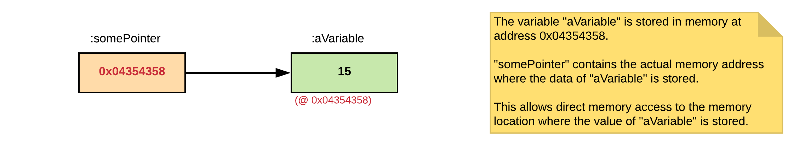

# Chapter 07 - Pointers

A pointer is **a variable which holds the address to a location in memory**. C++ gives you the power to manipulate data in the computer's memory directly via a pointer. C++ pointers may seem complex at first, but when used correctly they can be very powerfull. In certain areas they cannot be avoided, such as for example when handling **dynamic memory allocation**.



## Getting the Address of a Variable

As stated before, a **variable is a symbolic name for a certain location inside your computer memory**. This location is **actually an address**. Using the **reference operator** `&` one can determine the address of the variable. Consider the following example which will print the address of the variables `x` and `y`:

```cpp
#include <iostream>

int main() {
  int x = 15;
  int y = 0;

  std::cout << "x = " << x << " and has an address of " << &x << std::endl;
  std::cout << "y = " << y << " and has an address of " << &y << std::endl;

  return 0;
}
```

which would output something similar to:

::: codeoutput
<pre>
x = 15 and has an address of 0x6afefc
y = 0 and has an address of 0x6afef8
</pre>
:::

::: tip Logical, not physical addresses
Basically, any pointers in a program are **logical** (also called virtual) addresses, never physical (unless you are not running under an operating system - for example on a microcontroller). User space applications have no way of accessing the memory using physical addresses - that's one of the abstractions the OS gives each process. The MMU (Memory management unit) does the translation for every memory access, and it's up to the OS to set up the correct mapping for your process. To do all this in a way that goes completely unnoticed by processes, it has to create a layer of memory mappings that map the pointers that a process has to their actual physical location. But, certainly, the pointers that a program holds are indeed virtual addresses, the proof is simple: they don't change even as the process memory is relocated. Another indication of that is also the fact that if you try to access memory that isn't allocated to the current process, you get a "segmentation fault" or "access violation" error from the OS.
:::

## Declaring a Pointer Variable

Like any variable or constant, you must declare a pointer before you can work with it. As C++ is a statically typed language, the **type is required to declare a pointer** - this is the **type of the data** that will live at the memory address the pointer points to. The general form of a pointer variable declaration is:

<!-- TODO: Why does a pointer require a type? Because when dereferencing the pointer it needs to know. -->

```cpp
<type> * variable_name;
```

Basically this can be translated to `variable_name` is a pointer which can hold the address of a memory location containing a `type`. The type can be any valid C++ type, such as the primitive types, classes, structs, ...

Take a look at the following examples:

```cpp
int * pointerToInt;             // Pointer to an integer
double * pointerToDouble;       // Pointer to a double
float * pointerToFloat;         // Pointer to a float
char * pointerToChar;           // Pointer to character
Student * pointerToStudent;     // Pointer to an object of class Student
std::string * pointerToString;  // Pointer to an object of type std::string
```

The actual data type of the value of all pointers themselves, whether integer, float, character, or otherwise, is the same, a **long hexadecimal number that represents a memory address**. The only difference between pointers of different data types is the data type of the variable or constant that the pointer actually points to.

## Initializing a Pointer

As with any other variable, **a pointer needs to be initialized before it can be used**. To accomplish this, one needs to **assign the address of a variable to the pointer**. As shown before, the address of a variable can be retrieved by applying the address-of operator `&` to it. The resulting address can then be assigned to a pointer of the same type as the variable.

```cpp
// A pointer to a variable of type int
int x = 15;
int * pointerToX = &x;

// A pointer to a variable of type double
double z = 25.3;
double * pointerToZ = &z;

// A pointer to an object of type std::string
std::string greeting = "Hello there";
std::string * pointerToGreeting = &greeting;
```

## Using Pointers

Pointers are mainly used to directly access the memory they are pointing to. So in other words, one needs to be able to access the actual data and not the address inside the pointer. This can be achieved by **dereferencing** the pointer using the **dereference operator** `*`. Once the pointer is dereferenced, it can be threated as a normal variable.

An example where a pointer to an integer variable is used to change the actual value of the integer variable:

```cpp
#include <iostream>

int main() {
  int x = 15;
  int * pointerToX = &x;      // Make pointer point to memory location of x

  // Dereferencing the pointer to access the actual data
  (*pointerToX) = 22;

  std::cout << "x = " << x;
  std::cout << " or via pointer = " << (*pointerToX) << std::endl;

  return 0;
}
```

While not strictly necessary to add parentheses around the dereferenced pointers (as the dereference operator has a high precedence), it often makes the code more clear.

## Pointers and Arrays

Pointers and arrays are strongly related. In fact, an array variable is nothing more than a **constant pointer pointing at the first element of the array**. Actually a pointer can be dereferenced using the **indexing operator** `[]` used on an array variable as shown in the example below:

```cpp
#include <iostream>

int main() {
  const int SIZE = 5;
  int numbers[SIZE];
  int * pNumbers = numbers;

  for (unsigned int i = 0; i < SIZE; i++) {
    pNumbers[i] = 3 * i;
  }

  for (unsigned int i = 0; i < SIZE; i++) {
    std::cout << pNumbers[i] << std::endl;
  }

  return 0;
}
```

Also note that one does not need to request the address of the array to initialize the pointer. This because the **array variable is already a pointer**. Of course if you do wish to use the address-of operator you can use the following construct:

```cpp
const int SIZE = 5;
int numbers[SIZE];
int * pNumbers = &(numbers[0]);
```

This would allow you to create a pointer to an element somewhere inside the boundaries of the array. For example for the second element:

```cpp
const int SIZE = 5;
int numbers[SIZE];
int * pToElement = &(numbers[2]);
```

Since an array variable is actually a pointer, it is perfectly valid to dereference it using the dereference operator `*`.

```cpp
const int SIZE = 5;
int numbers[SIZE];

(*numbers) = 15;      // Would change the first element to a value of 15
```

However do keep in mind that an array variable is a **constant pointer**. This means that the array variable itself cannot be made to point to something else than the first element of the actual array in memory.

```cpp
const int SIZE = 5;
int numbers[SIZE];

// Invalid !!!!!!
numbers = &(numbers[3]);
```

Since an array is a constant pointer, it is also possible to use the indexing operator `[]` on a pointer to **use a pointer as an array**. The example below shows a small example where a pointer is indexed:

```cpp
const int SIZE = 5;
int numbers[SIZE];
int * pNumbers = numbers;

// Indexing of normal pointer as with an array
for (unsigned int i = 0; i < SIZE; i++) {
  std::cout << i << ": " << pNumbers[i] << std::endl;
}
```

Note that the indexing operator already dereferences the actual address.

### Pointer Arithmetic

Since pointers hold addresses, it is perfectly legal to perform **some arithmetic** operations on the actual address value held by the pointer. There are four arithmetic operators that can be performed on pointers:

* Increment: `++`
* Decrement: `--`
* Addition: `+`
* Subtraction: `-`

To understand pointer arithmetic one needs to keep in mind that the size of the datatype to which the pointer refers to, is also put into account. This means that if you have a pointer that points to integer at memory address `5000` on a 32-bit computer and you increment the pointer you will end up at address `5001`, assuming that the integer is represented using 32 bits. However, if you are working on an 8-bit computer, assuming that the integer is represented using 32 bits, incrementing the pointer will result in ending up at address `5004`.

This can actually be used in combination with a pointer to an array. Take a close look at the example below where a pointer is incremented to index all the array elements:

```cpp
#include <iostream>

int main() {
  const int SIZE = 5;
  int numbers[SIZE];
  int * pNumbers = numbers;

  for (unsigned int i = 0; i < SIZE; i++) {
    *(pNumbers++) = 3 * i;
  }

  pNumbers = numbers;
  for (unsigned int i = 0; i < SIZE; i++) {
    std::cout << "numbers[" << i << "] @ "
      << pNumbers << " = " << *(pNumbers++) << std::endl;
  }

  return 0;
}
```

Since an array is a constant pointer, it is also possible to use the indexing operator `[]` on a pointer to use a pointer as an array. The example below shows both the usage of using the indexing opator `[]` on a pointer, as applying some pointer arithmetics.

```cpp
#include <iostream>

using namespace std;

int main() {
  const int SIZE_OF_NUMBERS = 5;
  int numbers[SIZE_OF_NUMBERS];

  // Array is nothing but constant pointer so
  int * pNumbers = numbers;
  int * pNumbersIncrement = numbers;

  cout << "Address of numbers: " << numbers << endl;
  cout << "Or via pointer: " << pNumbers << endl << endl;

  for (unsigned int i = 0; i < SIZE_OF_NUMBERS; i++) {
    // Incrementing a pointer (point to next memory value)
    cout << "@" << pNumbersIncrement << ": " << *(pNumbersIncrement) << endl;
    pNumbersIncrement++;

    // One can also use indexing operator on pointer
    cout << "@" << &(pNumbers[i]) << ": " << pNumbers[i] << endl;

    // Simple addition
    cout << "@" << (pNumbers+i) << ": " << *(pNumbers+i) << endl << endl;
  }

  return 0;
}
```

which would result in a similar output:

::: codeoutput
<pre>
Address of numbers: 0x61fef0
Or via pointer: 0x61fef0

@0x61fef0: 4201424
@0x61fef0: 4201424
@0x61fef0: 4201424

@0x61fef4: 6422240
@0x61fef4: 6422240
@0x61fef4: 6422240

@0x61fef8: 6422296
@0x61fef8: 6422296
@0x61fef8: 6422296

@0x61fefc: 6422476
@0x61fefc: 6422476
@0x61fefc: 6422476

@0x61ff00: 1996867696
@0x61ff00: 1996867696
@0x61ff00: 1996867696
</pre>
:::

## Passing Pointers as Function Parameters

C++ allows you to pass a pointer as a parameter to a function. To do so, simply declare the function parameter as a pointer type.

Passing data to functions via pointers is often applied in the following situations:

* to allow the function to alter the actual value of the passed arguments
* to be able to return more than one value from a function (this is often used in C, less required in C++ as one can use data objects in this case)
* performance wise it is often done to pass larger and more complex objects (less memory usage)
* to pass an array to a function

Remember the `swap()` function from the "Introduction to C++" chapter. To get this to work one can actually use pointers to integers:

```cpp
#include <iostream>
using namespace std;

void swap(int * x, int * y) {
    int temp = *x;
    *x = *y;
    *y = temp;
}

int main() {
    int a = 10;
    int b = 136;

    cout << "Before call to swap:" << endl;
    cout << "a: " << a << endl;
    cout << "b: " << b << endl;

    swap(&a, &b);

    cout << "\nAfter call to swap:" << endl;
    cout << "a: " << a << endl;
    cout << "b: " << b << endl;

    return 0;
}
```

While the parameters are still passed by value, this time the addresses to the actual memory are copied. However via that same address one has access to the original data.

::: codeoutput
<pre>
Before call to swap:
a: 10
b: 136

After call to swap:
a: 136
b: 10
</pre>
:::

## Pointers to Objects

Consider a small class `Student`:

```cpp
// student.h
#pragma once
class Student {
  public:
    Student(std::string name);
    std::string get_name(void);
  
  private:
    std::string name;
};
```

```cpp
// student.cpp
#include "student.h"
Student::Student(std::string name) {
  this->name = name;
}

std::string Student::get_name(void) {
  return name;
}
```

To access member attributes or methods of an object via a pointer, one first needs to **dereference the pointer** before using the member-operator `.` on it. As with any pointer, dereferencing is done using the dereference operator `*`.

```cpp
#include <iostream>
#include "student.h"

using namespace std;

int main() {
  Student mark("Mark Dekker");

  // Pointer to an object
  Student * pStudent = &mark;

  // Accessing methods by dereferencing
  cout << "Our student is named " << (*pStudent).get_name() << endl;

  return 0;
}
```

Note how the dereference operation is enclosed in round brackets.

Since this is used so many times in C++, the language included a **shorter and more clean operator** that allows the programmer to dereference a pointer to an object and call a member of it, namely the **arrow operator** `->`. So the example above can be rewritten as:

```cpp
#include <iostream>
#include "student.h"

using namespace std;

int main() {
  Student mark("Mark Dekker");

  // Pointer to an object
  Student * pStudent = &mark;

  // Accessing methods by dereferencing
  cout << "Our student is named " << pStudent->get_name() << endl;

  return 0;
}
```

This is the same notation as used inside a method when accessing the `this` reference of the instantiated object.
