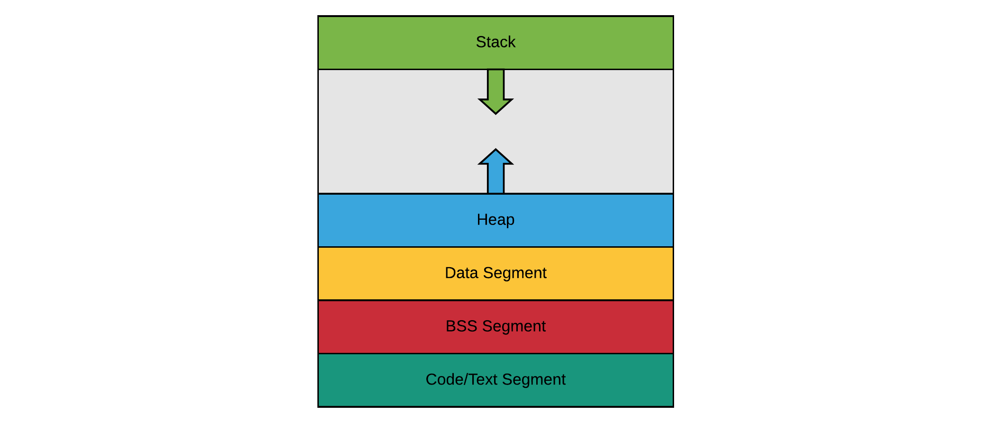

# Chapter 08 - Dynamic Memory Allocation

Basically when executing an application on any machine - be it a server, a desktop or an embedded system - the application requires at least a processing unit (CPU) and memory.

C++ will store data in different places based on how and where in code they were created. The programmer is given the choice based on efficiency and necessity. For maximum runtime speed, the storage and lifetime can be determined by the programmer while the program is being written.

## Memory Segments

The memory that is a assigned to an application when it is being run is typically divided in different regions called memory segments:

* The **code segment**, also called the text segment, is where the compiled binary resides in memory. This is typically a read-only memory segment.
* The **bss segment**, hosts zero-initialized global and static variables.
* The **data segment**, hosts initialized global and static variables.
* The **heap** is used to provide memory at runtime when the application requests dynamically allocated memory.
* The **stack**, tracks function arguments, local variables and other function-related information.



For the moment the two most important regions for this course are the **stack** and **heap** segments.

## The Stack

The stack, often called the *call stack*, is a memory region  implemented as a stack structure (hence the name). It has quitte a big role to play when executing an application on a system. It keeps track of

* all functions that have been called but have not yet terminated since the execution start of the application to the current point of execution.
* the **return address** to where to jump after a function has terminated
* all **function parameters** that are required upon calling the function
* all **local variables** of the functions

### Calling a Function

<!-- Maybe place diagram here later on? -->

Let us take a closer look at the inner workings of the stack when the program encounters a function call.

1. First a stack frame is constructed and placed on the stack by the means of a push action. A stack frame contains the return address to which the CPU must jump after the function has terminated, the function arguments, memory for the local variables declared inside the function and last but not least some CPU register values that need to be restored after the function finishes.
2. Once the stack frame is pushed, the CPU jumps to the first instruction in the function to be executed by the processor.
3. The CPU continues executing instructions until the function is finished or control jumps to another function in which case the whole process repeats for the new function call.

At a certain point in time the function should terminate, which again consists of a number of steps.

1. First register values are restored to the state before the function was called.
2. Next the stack from is removed from the stack (it is popped from the stack). This frees up all the previously allocated variables in the function (function parameters and local variables).
3. Next the return value is handled. Depending on the computer's architecture, the function's return value is placed inside a processor register or placed on the stack. If the value of the function isn’t assigned to anything, no assignment takes place, and the value is lost.
4. Last the return address of the next instruction to execute is popped off the stack, and the CPU resumes execution at that instruction.

### Variables on the Stack

All the variables, arguments and objects shown in the next code sample are placed on the stack.

```cpp
#include <vector>
#include <string>

double foo(int x) {
  std::vector<std::string> listOfStrings;
  int numbers[100];
  double sum = 0;

  // ....
  return sum;
}

int main(void) {
  int value = 55;

  // Calling a function uses the stack
  double result = foo(value);

  return 0;
}
```

The stack is an area in memory that is used directly by the processor to store data during program execution. Variables on the stack are also called **automatic** or **scoped variables**. This because the memory is automatically freed once the variables go out of scope.

The stack memory is a fixed size memory region that is allocated before the program is used. **Allocating static storage is much more speed-optimized**, which can be important in certain situations.

It does however require you to know the exact quantity, lifetime and type of the objects when you are writing the program. Besides that the **stack is also limited in size**. This means that you **can overflow** the stack, especially on smaller embedded systems this can be a limiting factor.

### Stack Overflow

The stack and heap sizes are determined by the operating system on which the application is being run. The stack and heap memory are not included in the binary stored on disk. When a process is loaded in memory then the stack and heap segments are allocated for that process.

A stack overflow occurs if the call stack pointer exceeds the stack bound. In other words, the application is using more stack memory than there was allocated. When a program attempts to use more space than is available on the call stack (that is, when it attempts to access memory beyond the call stack's bounds, which is essentially a buffer overflow), the stack is said to overflow, typically resulting in a program crash.

On Windows, the default stack size is `1MB`. On some unix machines, it can be as large as `8MB`.

Stack overflow is generally the result of allocating too many variables on the stack, and/or making too many nested function calls (where function A calls function B calls function C calls function D etc) On modern operating systems, overflowing the stack will generally cause your OS to issue an access violation and terminate the program.

The following program tries to reserve 10 million doubles on the stack. Of course this results in a stack overflow.

```cpp
#include <iostream>

using namespace std;

int main(void) {
  // This will create a stack overflow
  double loadsOfNumbers[10000000];

  cout << "You won't see this as the app will crash" << endl;

  return 0;
}
```

The next application has a recursive function that calls itself. It keeps doing this until the application crashes. While the number of iterations is quite high when running this application, you should try to add some local variables to the function. This will greatly decrease the number of iterations.

```cpp
#include <iostream>
#include <vector>
#include <string>

using namespace std;

int count(int iNesting) {
  iNesting++;
  cout << "Current iteration: " << iNesting << endl;
  return count(iNesting);
}

int main(void) {
  // Call some recursive function that never stops.
  // This will generate a stack overflow
  count(0);

  return 0;
}
```

::: codeoutput
<pre>
...
Current iteration: 261794
Current iteration: 261795
Current iteration: 261796
Current iteration: 261797
Current iteration: 261798
[1]    9582 segmentation fault (core dumped)  ./stack
</pre>
:::

While this is not a realistic example, it does show that their is a limit to how deep functions can be nested. This limit only decreases as functions take more stack space. This can become problematic quite fast on embedded systems with limited memory.

## The Heap

The heap segment - also knows as the "free store" - is a memory region used for allocating dynamic memory at runtime. Dynamic memory allocation is a way for application to request memory from the operating system at runtime.

Dynamic memory is requested in C++ using the `new` operator or the `malloc` function. Both these operations return a pointer to the requested memory block. If the system runs out of memory (especially important on smaller embedded systems) this operation can fail. In that case a null-pointer is returned.

The process of allocating memory from the heap is also slower as it must pass via the operating system. On top of that dereferencing pointers is also a slower process that accessing memory via variables on the stack.

Important to know is that dynamically allocated memory is not freed automatically, as is the case with local variables on the stack. It is the programmers responsibility to free the memory when it is no langer needed. Failing to do so can create memory leaks and can eventually cause the program to crash.

Looking back at heap memory it seems that it only has disadvantages. However the biggest advantage is the fact that the programmer does not need to know how much memory is required at compile-time. This memory does not come from the program’s limited stack memory -- instead, it is allocated from a much larger pool of memory managed by the operating system called the heap. On modern machines, the heap can be gigabytes in size.

## Stack versus Heap

Declaring variables on the stack has both advantages and disadvantages:

* ✔️ Allocating stack memory is faster than allocating heap memory
* ✔️ Variables are automatically deallocated when the function terminates. It is said that the variables go out of scope.
* ✔️ Variables allocated on the stack have a known data type at compile theme. This means that the allocated memory can be accessed directly trough the variables.
* ❌ The stack is relatively small, which means it's not a good idea to create large local variables on the stack (complex objects, large arrays and such). Also nesting function calls to deep has a serious impact on stack usage.

Also requesting memory from the heap has some advantages and disadvatages:

* ❌ Allocating memory on the heap is slow compared to on the stack
* ❌ Allocated heap memory is not automatically deallocated. This can create memory leaks while the application is running. Most operating systems these days will free the memory after the application is terminated. However some applications such as background services may not terminate for many months/years.
* ❌ Dynamically allocated memory is handled via pointers. Dereferencing pointers is a relative slower process compared to using variables on the stack.
* ✔️ The heap is a big memory pool that allows us to allocate large blocks of memory for more complex objects, large arrays and such.
