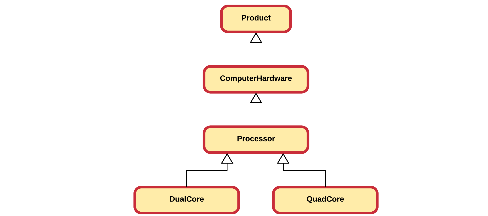

# Chapter 11 - Inheritance

Code reuse is probable one of the most powerful features of an object oriented programming language. While most programming languages provide functions / procedures which provide a low-level construct for code reuse, object oriented programming languages take this an important step further. OOP languages allow us to define classes and create relations between these classes, facilitating not only code reuse but also better overall design.

Inheritance is one of the main pillars of an object-oriented programming language and provides a clean way of reusing functionality. It allows a class to inherit both the attributes and methods of another class. Common data and functionality is structured inside a base class (also called superclass) from which the more specific classes inherit (called subclasses or derived classes) properties and behavior.

> **WARNING** - **Copy paste is not reuse**
>
> For all you copy-paste fanatics out there, copying code from one place to another is not considered code reuse. If the original code is ever extended, changed or corrected, chances are that you will forget to alter one of the copies.

As with most in an OOP language, the solution revolves around the class. Instead of creating classes from scratch we can use existing ones and extend them or embed them within our classes. The main advantages of this approach is that:

* we reuse code that has been tested and debugged
* code is not duplicated
* classes can be kept small and thus more manageable

The trick is to use the classes without soiling the existing code. There are two ways to accomplish this and one has already been discussed in this course.

The first approach is to create and embed objects of the already existing class inside the class you are developing. This is called **composition** as the new class is composed of objects of existing classes.

The second approach is to create a new class as a subtype of an existing class. You literally take the form of an existing class and extend it, and this without modifying the code of existing class. This is called **Inheritance**.

Both approaches are important cornerstones of an object oriented programming language.

## Vehicle Example

Consider a first example that models the classes `Truck`, `Racecar` and `Bus`. Each have a number of attributes and some methods. Below is a partial UML class diagram of the classes modeled without the use of inheritance. Each class has the full functionality implemented into the class itself.


When taking a look at this example it is pretty obvious that the design includes a lot of duplication. This can be solved by creating a **superclass** `Vehicle` that contains all the common attributes and methods of these classes.


> **INFO** - **Inheritance in UML class diagram**
>
> In a UML class diagram inheritance is depicted using a solid line and a hollow arrow attached at the side of the superclass.

While not documented inside the UML class diagrams, the subclasses `Truck`, `Racecar` and `Bus` also contain the attributes and methods of `Vehicle`.

Some attributes (such as the `trailer` of a `Truck`) and methods (such as `board(passenger)` of `Bus`) cannot be generalized to the `Vehicle` class. They are specific to the subclasses. This is perfectly valid when implementing inheritance.

By placing the common functionality and data inside a superclass a cleaner design is realized that also encourages code reuse.

## Introducing Inheritance

Inheritance allows a class to inherit (get) the properties and methods of another class. In other words, the **subclass** inherits the state and behavior from the **base class**. The subclass is also called the **derived class** while the base class is also known as the **super-class**. The derived classes can add their own additional attributes and methods. These additional attributes and methods differentiate the derived classes from the base class.

> **INFO** - **Inheritance = Extension**
>
> Inheritance is also often described as a mechanism to **extend** the behavior and properties of the superclass. This is just the reason why Java for example uses the extend keyword for inheritance.

It is also possible to change the implementation of certain methods in the base class, which is also known as **method overriding**.

> **WARNING** - **Method overloading vs. method overriding**
>
> Do not confuse method overloading with method overriding. Method overloading is a feature that allows a class to have two or more methods having same name, if their argument lists are different. Constructor overloading allows a class to have more than one constructors having different argument lists. Overloaded methods are differentiated by the number and the type of the arguments passed into the method. Method overriding replaces the implementation of a method of the base class.

A super-class can have any number of subclasses. While in Java, a subclass can have only one superclass, in C++ it is possible to inherit from multiple base classes, known as **multiple inheritance** (however not always a good idea or good practice).

## Computer Store Example

Let us revise the following application that is being build for an online computer web shop. A beginning developer has modeled some of the items that his client wants to sell online. However he has come to the conclusion that his design needs to be refactored.


While they are not documented in the UML, all attributes have getters and setters.

In a first iteration the most common attributes are extracted to a superclass. A good name might be `Product`. Since it is a store that sells products, it seems a logical choice. When selecting attributes from the subclasses to be placed inside `Product`, we must ask our self the question if that attribute is a logical property of computer store product. If not, then something is wrong or our models are wrong.


### Code always changes

Something to remember is that code evolves. It changes over time as things get added, removed or refactored. Static code will eventually become outdated and die. On top of that your boss, client, teacher, ... will never tell you the whole story. Once they get the first prototype, and they like it, there will always be a "would it be possible to add ..." moment. That is also why it is also more fun to program based on methodologies such as SCRUM and Agile as they take the fact of change into account.

So let us take the computer store example. Our developer needs help again as his client asked him to also add games to the list of products to sell. The overeager developer created a new class `Game` that inherits from the `Product` class. At first sight nothing seems wrong with it.


First of all it needs to be noted that adding a new product class was really easy as a lot of the functionality and properties are inherited from the `Product` base class.

Now taking a closer look at the classes, something can be noticed. Does a game have a model or a brand? In real life: no. Than why does it have a model and brand in the application?

Actually the class `Product` is not entirely accurate since games came into play. While each computer hardware product does have a model and brand, software and games do not. Basically we need to add a class `Hardware` which inherits from the `Product` class. Then our hardware products can inherit from `Hardware` and implicitly also from `Product`, while `Game` directly inherits from `Product`.


## Private, protected and public members

Attributes and methods are declared with an **access specifier** such as `private`, `protected` or `public`. These allow the developer to determine who can access the class, attributes or methods.

Very important to know is that a **derived class inherits all the members of its base class**, even the private ones. However it cannot access the **private members** (both attributes and methods) of its baseclass. For this reason getters and setters need to be provided for subclasses to have access to the attributes of their superclass.

Another solution would be to make the attributes `protected`. This would allow subclasses to access the attributes directly, while still keeping them inaccessible for outside classes. This can be a good solution in some cases, but most of the time it is cleaner to use accessors (getters and setters).

Do note that you can also make methods protected, allowing subclasses to use them, but not outside classes.

Let's take another example: consider a class `SpaceObject` with a subclass `Planet`. Next to that is a class `Space` which is composed of several `SpaceObject`s and `Planet`s. As shown below, protected attributes and methods are noted using the `#` symbol in UML.


In the example the `size` of a `SpaceObject` can only be accessed by `SpaceObject` itself, not even by the subclass `Planet`. However the `coordinates` are accessible by both `SpaceObject` and all of its subclasses (such as `Planet`). However not accessible from outside. `MAX_SIZE` is a `const` and `static` class variable which is made `public` and so accessible by all. However as it is `const` it can only be read and not written.

Below is an overview:

| Attribute of SpaceObject | Accessible by Planet? | Accessible by Space? |
|----|----|----|
|size|NO|NO|
|coordinates|YES|NO|
|MAX_SIZE|YES|YES|

The same rules apply for access specifiers of methods.

## Is-a Relationships

The superclass and subclass have an **"is-a"** relationship between them. Take the basic example of pets shown below.


Here we can for example state that a `Cat` is-a `Pet`, a `Bunny` is-a `Pet` and a `Dog` is-a `Pet`.

If you cannot logically state that 'subclass' is-a 'superclass' than you made a mistake to make 'subclass' inherit from 'superclass'. An example of this would be the case when you would create a subclass `Mosquito` from `Pet` because `Mosquito` also has color, favorite food and an age. This may seem DRY but it is illogical. You can't state that `Mosquito` is-a `Pet`.

If we needed to model both a `Bus` class and a `Car` class it makes perfect sense to create a `Vehicle` class and make both `Bus` and `Car` inherit from them. It's perfectly valid to state that

* a `Bus` is a `Vehicle`
* a `Car` is a `Vehicle`

However it would of been illogical to make *Bus* inherit from *Car* or vice versa as it would not have been logical to state that:

* a Bus is a Car
* a Car is a Bus

A `ChoppingCart` should not inherit from `Vehicle` because it has wheels.

## Inheritance in C++

To implement inheritance in C++ all you need is a baseclass and a subclass. The subclass needs to *extend* the baseclass and this can be accomplished by using the syntax shown below:

```c++
class <subclass> : public <baseclass>
  // Implementation
}
```

Note that **extending** the baseclass is exactly what we are doing when implementing inheritance. We take a general class and add something to it: data, behavior or both.

Depending on the context and strategy, inheritance can also be though of as **generalization**, where functionality of subclasses is extracted and placed inside a more generalized super class.

### A Cat and Dog Example

Cfr. example in the class.

## Constructors and inheritance

<!-- Constructors are not inherited in C++. Should make this very clear somewhere -->

When creating objects, C++ will not only call the constructor of the type you are creating but it will implicitly call a constructor of each baseclass. Take a look at the inheritance hierarchy shown below.



When for example creating an object of type `QuadCore`, the constructor of `QuadCore` will implicitly call the constructor of `Processor` which will call the constructor of `ComputerHardware` which will call the constructor of `Product`. These calls are provided by default by C++ and are done before anything else. That means that the rest of you constructor code will be executed after the contructor call to the baseclass.

This basically means that if you create an instance of a `QuadCore`, the `Product` portion will be constructed first, next the `ComputerHardware` portion, after which the `Processor` portion and last the `QuadCore` portion. This is a bit logical as you can only initialize the specific data of `ComputerHardware` after the data of `Product` has been initialized.

There is however a catch to this whole constructing system.

Remember that if you do not define a constructor in C++, it will provide you with a **default constructor** (a constructor without arguments) for a class. However once you create a constructor yourself C++ will not provide this default constructor anymore. That means if you create a single constructor that takes arguments, your class will not have a default constructor anymore. Since C++ will add an implicit call to the default constructor of the baseclass for each subclass, it will not find one and the compiler will turn up a compiler error. In other words if no default constructor exists for the baseclass your program will fail.

This can be fixed using two approaches:

* add a default constructor to the baseclass. This is however not always possible or even advisable as you may not have access to the implementation of the baseclass or it might not make sense to add a default constructor.
* explicitly call another constructor of the baseclass. This can be achieved by using the **constructor initialization list** to call a specific constructor of the baseclass.

The second approach mostly takes the preference.

An example of this for the both constructors of the `Tank` class would be:

```c++
Tank::Tank(std::string description)
  : Vehicle(description) {
    // ....
  }
Tank::Tank(std::string description, long id)
  : Vehicle(description, id) {
    // ....
  }
```

Note how the name of the baseclass is used to call a baseclass constructor.

<!-- Here we should place the example with the call hierarchy when also applying composition. -->

Quick simurization

* C++ provides a default constructor if you provide no constructor(s).
* With inheritance each constructor is called from bottom to top but actually executed from top to bottom.
* If no default constructor exists for the baseclass you will need to add one or call another constructor explicitly using the constructor initialization list and provide the required arguments.

## Method overriding

Method overriding, in object oriented programming, is a language feature that allows a subclass or child class to provide a specific implementation of a method that is already provided by one of its superclasses or parent classes. The implementation in the subclass overrides (replaces) the implementation in the superclass by providing a method that has the same name and the same parameters, and same return type as the method in the parent class. These three parts are all together called the **signature of a method**. An overriding method can also return a subtype of the type returned by the overridden method. This subtype is called a covariant return type.

The version of a method that is executed will be determined by the object that is used to invoke it. If an object of a parent class is used to invoke the method, then the version in the parent class will be executed, but if an object of the subclass is used to invoke the method, then the version in the child class will be executed.

The ability of a subclass to override a method allows a class to inherit from a superclass whose behavior is "close enough" and then to modify behavior as needed.


The UML diagram above shows a couple of examples of method overriding. First of all there is the `draw()` method that is defined for the `Shape` class and its descendants. It takes no arguments and has no return value. Next there are the `getArea()` and `getCircumference()` methods which do return a `double`. Last is the `doesContain()` method which checks if the `Shape` contains a `Point`. It takes an argument and returns a value. Important to note is that the **signature** of all these methods are the same!

The rules for method overriding can be summarized as follows:

* The argument list should be exactly the same as that of the overridden method.
* The return type should be the same or a subtype of the return type declared in the original overridden method in the super class.
* The access level cannot be more restrictive than the overridden method’s access level. For example: if the super class method is declared public then the overriding method in the sub class cannot be either private or protected.
* A subclass can only override methods declared public or protected.
* Constructors cannot be overridden.

You can call methods of the base class by using the name of the baseclass followed by **scope resolution operator** `::` followed by the name of the method you wish to call. This can be useful if you do not want to replace the implementation of the baseclass but rather want to extend it.

For example the `to_string()` implementations of `Cat` can make use of the already existing implementation of the `to_string()` method of `Pet` as follows:

```c++
std::string Cat::to_string(void) {
  std::stringstream ss;
  ss << Pet::to_string();
  ss << " | He/she purrs when happy and loves to eat fish and meat.;
  return ss.str();
}
```

## Polymorphism

Consider an example where a class `Tank` and a class `SelfPropelledGun` inherit from a class `WarMachine`.

Now when creating objects on the stack and not using them via baseclass pointers, we would be able to write the following code:

```c++
WarMachine machine("A small rescue jeep used in world war 2 in good shape.", 510000);
WarMachine tank("A Tiger 1 tank prototype in bad shape.", 299250);
WarMachine spg("An ISU-152 SPG in non-working condition. Needs revision.", 2000000);

// ...

cout << machine.to_string() << endl;
cout << tank.to_string() << endl;
cout << spg.to_string() << endl;
```

In this case the output would be:

```text
WarMachine: A small rescue jeep used in world war 2 in good shape. Price = 510'000 euro
Tank: A Tiger 1 tank prototype in bad shape. Price 299'250 euro
SPG: An ISU-152 SPG in non-working condition. Needs revision. Price = 2'000'000 euro
```

Polymorphism comes from Greek and means:

* Poly = many
* Morph = form, shape

So polymorphism is the ability of an object to take on many forms. The most common use of polymorphism in OOP occurs when a parent class reference is used to refer to a child class object.

This basically means that you can do the following in our `WarMachine` example application:

```c++
WarMachine * machine = new WarMachine("A small rescue jeep used in world war 2 in good shape.", 510000);
WarMachine * tank = new Tank("A Tiger 1 tank prototype in bad shape.", 299250);
WarMachine * spg = new SelfPropelledGun("An ISU-152 SPG in non-working condition. Needs revision.", 2000000);
```

Do take note that this only works when using pointers of the baseclass type. We cannot do this when creating local variables on the stack unless we then access them via a pointer of the baseclass as shown below:

```c++
Tank tank;

WarMachine * machine = &tank;
```

This is often used when storing subtypes inside an array or container class:

```c++
std::vector<WarMachine*> machines;

machines.push_back(new WarMachine("A small rescue jeep used in world war 2 in good shape.", 510000));
machines.push_back(new Tank("A Tiger 1 tank prototype in bad shape.", 299250));
machines.push_back(new SelfPropelledGun("An ISU-152 SPG in non-working condition. Needs revision.", 2000000));
```

This allows all the superclass and subclass instances to be store together in a list. If this were not possible it would be necessary to create separate lists for each type.

Of course in a realistic application the list would be populated from a database or a file.

C++ tracks the actually type of the objects. This basically means that while all the objects created above are `WarMachine`s because of inheritance, C++ still knows that some are `Tank`s or `SPG`s.

Polymorphism allows us to store subtypes inside an array of the baseclass type. Now what would happen if we were to add the following code to the application:

```c++
for (unsigned int i = 0; i < machines.size(); i++) {
  cout << machines[i]->to_string() << endl;
}
```

Which would output:

```c++
WarMachine: A small rescue jeep used in world war 2 in good shape. Price = 510'000 euro
WarMachine: A Tiger 1 tank prototype in bad shape. Price 299'250 euro
WarMachine: An ISU-152 SPG in non-working condition. Needs revision. Price = 2'000'000 euro
```

This is actually not what we expected. We expected that each WarMachine item's 'correct' `to_string()` method would be called.

Important to know is that while method overriding can be done out of the box, **polymorphism needs to be enabled in C++** and is default not. A method can be declared a candidate for late binding (polymorphism) by appending the keyword `virtual` before the declaration of the method in the class as shown below. Strictly speaking only the `to_string()` method of `WarMachine` needs to be declared `virtual` here.

```c++
class WarMachine {
  // ...
  public:
    virtual std::string to_string(void);
};
```

```c++
class Tank : public WarMachine {
  // ...
  public:
    std::string to_string(void);
};
```

If the same main code is executed again the output will be:

```c++
WarMachine: A small rescue jeep used in world war 2 in good shape. Price = 510'000 euro
Tank: A Tiger 1 tank prototype in bad shape. Price 299'250 euro
SPG: An ISU-152 SPG in non-working condition. Needs revision. Price = 2'000'000 euro
```

### Another look at polymorphism

Source: [http://stackoverflow.com/questions/2391679/why-do-we-need-virtual-functions-in-c#comment32597274_2392656](http://stackoverflow.com/questions/2391679/why-do-we-need-virtual-functions-in-c#comment32597274_2392656)

Let's say you have these two classes:

```c++
class Animal {
  public:
    void eat(void) {
      std::cout << "I'm eating generic food.";
    }
};
```

```c++
class Cat : public Animal {
  public:
    void eat(void) {
      std::cout << "I'm eating a rat.";
    }
};
```

In your main function:

```c++
void main(void) {
  Animal * animal = new Animal();
  Cat * cat = new Cat();

  animal->eat(); // outputs: "I'm eating generic food."
  cat->eat();    // outputs: "I'm eating a rat."
}
```

So far so good right? Animals eat generic food, cats eat rats, all without virtual.

Let's change it a little now so that eat() is called via an intermediate function (a trivial function just for this example):

```c++

void make_it_eat(Animal * animal) {
  animal->eat();
}

void main(void) {
  Animal * animal = new Animal();
  Cat * cat = new Cat();

  make_it_eat(animal);  // outputs: "I'm eating generic food."
  make_it_eat(cat);     // outputs: "I'm eating generic food."
}
```

Uh oh ... we passed a Cat into `make_it_eat()`, but it won't eat rats. Should you overload `make_it_eat()` so it takes a `Cat *` ? If you have to derive more animals from Animal they would all need their own `make_it_eat()`.

The solution is to make `eat()` a virtual function:

```c++
class Animal {
  public:
    virtual void eat(void) {
      std::cout << "I'm eating generic food.";
    }
};
```

Where now all goes well:

```c++

void make_it_eat(Animal * animal) {
  animal->eat();
}

void main(void) {
  Animal * animal = new Animal();
  Cat * cat = new Cat();

  make_it_eat(animal);  // outputs: "I'm eating generic food."
  make_it_eat(cat);     // outputs: "I'm eating a rat."
}
```

If we did not have this polymorphic behavior we would have to create a `make_it_eat()`
method for each type of Animal. This would definitely cause lots of errors and headaches.

So polymorphism is again another technique that allows us to write short, clean and maintainable code.

### Virtual Destructors

The `virtual` keyword is not only important for methods we which to override and access via baseclass pointers. It is also important when considering dynamic memory usage. When reserving memory in your objects, you need to free it once the objects are destroyed. This is accomplished using the `delete` keyword. This has been discussed in detail in the chapter "Memory Allocation".

However what if you extend this class. Is the destructor of the baseclass still called in that case?

Let's take a look at a simple example:

```c++
class Animal{
  public:
    ~Animal(){
        std::cout << "Destroying an Animal" << std::endl;
    }
};
```

and a subclass from Animal named Cat:

```c++
class Cat : public Animal {
  public:
    ~Cat(){
        std::cout << "Destroying a Cat" << std::endl;
    }
};
```

If we create a new Cat we expect both destructors to be called:

```c++
int main() {
    Animal * a = new Cat();
    delete a;
    return 0;
}
```

However the only thing the output shows is:

```c++
Destroying an Animal
```

Do note that this is not the case when a Cat object is created on the stack.

To fix this, we are required to make the destructor of Animal `virtual`.

```c++
class Animal{
  public:
    virtual ~Animal(){
        std::cout << "Destroying an Animal" << std::endl;
    }
};
```

```c++
int main() {
    Animal * a = new Cat();
    delete a;
    return 0;
}
```

Rendering the output

```c++
Destroying a Cat
Destroying an Animal
```

Note that the destructors are executed in the opposite order as the constructors.