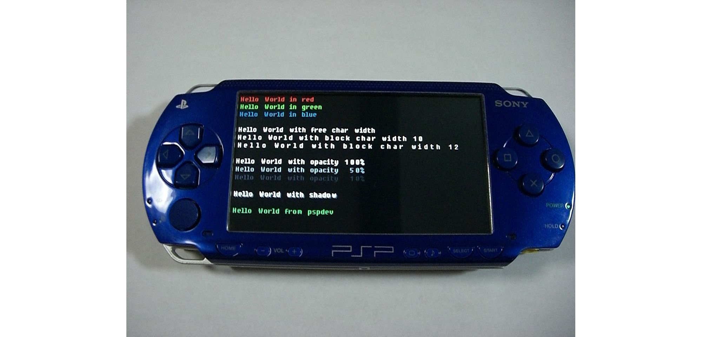
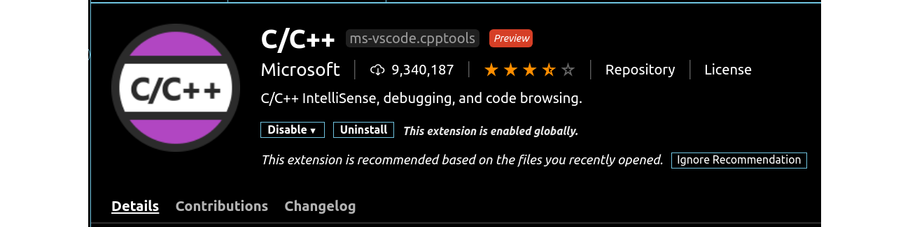
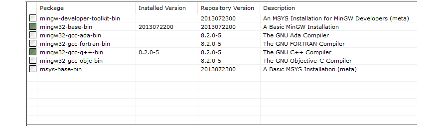
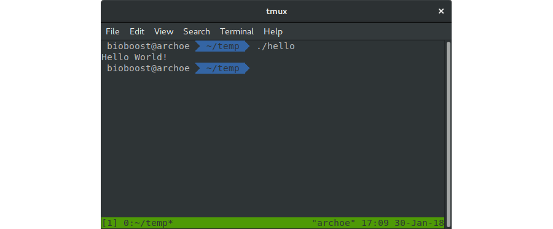
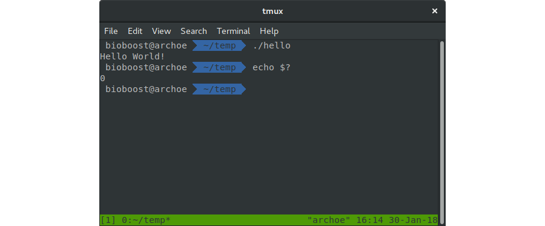

# Hello World

A "Hello, World!" application is a computer program that **outputs or displays the message "Hello, World!" to the user**. Being a very simple program in most programming languages, it is **often used to illustrate the basic syntax of a programming language** for a working program. In many cases it is the very first program people write when they are new to the language.


A "Hello, world!" program is commonly used to introduce novice programmers to a programming language. In general, it is simple enough to be understood easily, especially with the guidance of a teacher or a written guide.

In addition, "Hello world!" can be a **useful sanity test** to make sure that a language's compiler, development environment, and run-time environment are correctly installed. Configuring a complete programming toolchain from scratch to the point where even trivial programs can be compiled and run can involve substantial amounts of work. For this reason, a simple program is used first when testing a new tool chain.

"Hello world!" is also **used by computer hackers as a proof of concept** that arbitrary code can be executed through an exploit where the system designers did not intend code to be executed—for example, on Sony's PlayStation Portable. This is the first step in using homemade content ("home brew") on such a device.



## Writing C++ Code

Writing C++ code does not require a fancy IDE. All one actually needs is a simple text editor. However using an versatile editor such as **Visual Studio Code** or similar does support our programming life a lot more.

Visual Studio Code is a source code editor developed by Microsoft for Windows, Linux and macOS. It includes support for debugging, embedded Git control, syntax highlighting, intelligent code completion, snippets, and code refactoring. It is also customizable, so users can change the editor's theme, keyboard shortcuts, and preferences. It is free and open-source, although the official download is under a proprietary license.

Visual Studio Code can be downloaded at [https://code.visualstudio.com/](https://code.visualstudio.com/).

Before diving head first in the coding game, install the VSCode `C/C++ Extension` which will provide some extra functionality.



::: tip Tip - Other Useful Extensions
Some other useful extensions for Visual Studio Code include:

* [Code Spell Checker](https://marketplace.visualstudio.com/items?itemName=streetsidesoftware.code-spell-checker): a spell checker that works well with code
* [Bracket Pair Colorizer](https://marketplace.visualstudio.com/items?itemName=CoenraadS.bracket-pair-colorizer): a customizable extension for colorizing matching brackets
:::

## C++ Compiler for Windows

As a compiler you can make use of **MinGW** which stands for "Minimalist GNU for Windows", which is a native Windows port of the GNU Compiler Collection (GCC).

::: insight Key Insight - GNU
GNU is an operating system and an extensive collection of computer software. **GNU is composed wholly of free software**, most of which is licensed under GNU's own GPL (General Purpose License). GNU is a recursive acronym for "GNU's Not Unix!", chosen because GNU's design is Unix-like, but differs from Unix by being free software and containing no Unix code. The GNU project includes an operating system kernel, GNU HURD, which was the original focus of the Free Software Foundation (FSF). However, non-GNU kernels, most famously Linux, can also be used with GNU software; and since the kernel is the least mature part of GNU, this is how it is usually used. The combination of GNU software and the Linux kernel is commonly known as GNU/Linux.
:::

MinGW can be downloaded at [http://www.mingw.org/](http://www.mingw.org/). Navigate to `Downloads` and select the `mingw-get-setup.exe` download.

After installing the manager you should get a window where you can select what packages to install. Make sure to select the following packages:

* `mingw32-base-bin`
* `mingw32-gcc-g++-bin`

Next hit `Installation => Apply Changes` and wait for the packages to install. The end result should be the same as shown in the next screenshot.



Next you will need to add the `bin` directory of MinGW to your environment path on Windows by navigating to `Advanced System settings => Advanced => Environment Variables => User variables`. Select the `Path` variable and hit `Edit`. Now create a `New` entry and choose `Browse`. Select the `bin` directory where you installed MinGW, standard this should be `C:\MinGW\bin`.


## Compiling C++ on Linux

Chances are quite high that you won't have to install anything on Linux. Most distributions have the build tools pre-installed. If not, all you need is a terminal and some Linux magic:

```bash
sudo apt update
sudo apt install build-essential
```

## Hello World in C++

Let's jump right in and create our "Hello World" application in C++. Create a new directory somewhere on your system and call it `hello-world-cpp` or something similar. Open the directory with VSCode.

Open your favorite editor or IDE and create a new C++ application. Place the code below in a file called `main.cpp`. This file often serves as the **entry point** of the application containing the `main` function which contains the code to execute when the application is started.

```cpp
#include <iostream>

using namespace std;

int main() {
  // Display Hello World! in the terminal
  cout << "Hello World!" << endl;

  return 0;
}
```

::: insight Key Insight - How code is executed
Code is processed/executed the same way it is written, from top to bottom.
:::

## Compiling the Code

To compile the code (translate our instructions to instructions understood by our computer's processor), the `g++` compiler needs to be called. This can be achieved by entering the following command into a terminal (*bash* or *powershell*):

```bash
g++ main.cpp -o hello
```

On Windows this will produce a binary file called `hello.exe` while on linux it will produce a binary file called `hello`. Both can be executed by entering the following command in the terminal:

```bash
./hello
```

The result should be the text "Hello World!" printed to the terminal as shown below.



## Code Analysis

Below is a small analysis of the "Hello World" application. It will get you familiarized with the syntax of C++ and will serve as a starting point for almost every application you will ever create in C++.

```cpp
#include <iostream>

using namespace std;

int main() {
  // Display Hello World! in the terminal
  cout << "Hello World!" << endl;

  return 0;
}
```

::: tip ⌨️ Tip - Type, Don't Copy
The best tip for the moment is to type over the hello world application into VSCode. Don't copy the code. This will get you familiarized with the syntax of C++. **Want to challenge yourself?** Then try to memorize the hello world example. Type it in and compile it. Does it fail, then fix it. Now do it all over again until you get it right from the first time.
:::

### Pre-Processor Directives

Lines beginning with a hash sign `#` are called **pre-processor directives**. These lines are processed by an application that is run before the actual code compiler. In this case, the directive `#include <iostream>`, instructs the preprocessor to **include a standard C++ header** file called `iostream`. It is **part of the standard C++ library** and allows the rest of the code to perform standard input and output operations, such as writing the output of this program - `Hello World` - to the terminal.

```cpp{1}
#include <iostream>

using namespace std;

int main() {
  // Display Hello World! in the terminal
  cout << "Hello World!" << endl;

  return 0;
}
```

### Whitespace and Case-Sensitive

As in most programming languages, whitespace such as newlines, tabs and spaces have no effect on the code itself as long as they are not placed within variable names or C++ keywords. It is even encouraged to place white space around certain code construct. Code indentation (placing tabs on the last) is also considered good practice as it contributes to the readability of the code.

```cpp{2,4,7}
#include <iostream>

using namespace std;

int main() {
  // Display Hello World! in the terminal
  cout << "Hello World!" << endl;

  return 0;
}
```

C++ is also a programming language that is **case sensitive**, meaning that `int` is not the same as `Int` or `INT`.

### Namespaces

If you have seen C++ code before, you may have seen `cout` being used instead of `std::cout`. Both name the same object: the first one uses its unqualified name `cout`, while the second uses its fully qualified name by specifying it directly within the namespace `std` as `std::cout`.

`cout` is part of the standard library, and all the elements in the standard C++ library are declared within what is called a namespace, think of it as a container for the moment. In this case the namespace is called `std` which is short for *standard*.

```cpp{3}
#include <iostream>

using namespace std;

int main() {
  // Display Hello World! in the terminal
  cout << "Hello World!" << endl;

  return 0;
}
```

In order to refer to the elements in the `std` namespace a program must either qualify each and every use of elements of the library (by prefixing the elements with `std::`), or introduce visibility of the namespace components. The most typical way to introduce visibility of these components is by means of using a declaration such as `using namespace std;`

### The main Function

`int main()` declares a function called `main`. The main function of a C++ application is also called the **entry point** of the application. The execution of all C++ programs begins with the main function, regardless of where the function is actually located within the code.

```cpp{5,9-10}
#include <iostream>

using namespace std;

int main() {
  // Display Hello World! in the terminal
  cout << "Hello World!" << endl;

  return 0;
}
```

Essentially, **a function is a block of statements that are grouped by a name**, in this case `main`. The return type of the `main` function is `int`, short for `integer`, stating that the function **returns an integral value upon completion**. This also explains the `return 0` statement at the end of the function block. Applications are always terminated with an integral value that represents the state with which the application was terminated. A value different from `0` indicates that something has gone wrong. If you execute your application via a terminal such as `bash` or `PowerShell` you can display the status code (the value returned by the `main` function in this case) by executing the command `echo $?`.



Optionally the `main` function can be declared to take arguments from the command line (declared between the parentheses `()`). This will however be discussed later on in this course.

The open brace `{` indicates the beginning of a statement block, in this case the **function definition**. The closing brace `}` indicates the end of a statement block. Everything between these braces is called **the body of the function** and defines what happens when the function is called. All functions use braces to indicate the beginning and end of their definitions.

### Comments

Two forward slash signs `//` indicate that the rest of the line is a **comment**. Comments have no effect on the behavior of the application. They are actually ignored by the compiler. Often programmers insert comments to describe certain pieces of code or to explain their decisions.

```cpp{6}
#include <iostream>

using namespace std;

int main() {
  // Display Hello World! in the terminal
  cout << "Hello World!" << endl;

  return 0;
}
```

### Output to the Terminal Statement

The line `cout << "Hello World!" << endl;` is called a C++ **statement**. A statement is an expression that **can actually produce some effect**. This will not always be visual output. The statements **specify the actual behavior of the application**. Statements are executed in the same order that they appear.

```cpp{7}
#include <iostream>

using namespace std;

int main() {
  // Display Hello World! in the terminal
  cout << "Hello World!" << endl;

  return 0;
}
```

This statement has three parts:

* `cout`, which identifies the standard character output device (usually, this is the computer screen).
* The insertion operator `<<`, which indicates that what follows is inserted into `cout`.
* A text sentence within quotes `"Hello world!"`, being the content inserted into the standard output. In this case **a string** (denoted by the double quotes).

Notice that the **statement ends with a semicolon** `;`. This character marks the end of the statement (that is why it is called the **statement terminator**). All C++ statements must end with a semicolon character. One of the most common syntax errors in C++ is forgetting to end a statement with a semicolon.

::: insight Key Insight - Statement
A statement is an expression that expresses some action to be carried out. This will not always be visual output. The statements specify the actual behavior of the application. Statements are executed in the same order that they appear. In C++ all statements must end with a `;`, the statement terminator.
:::

## Exercises

Try to solve the exercises yourself. Don't go copy pasting other people's solutions.

Mark the exercises using a ✅ once they are finished.

### ❌ endl

*What does `std::endl` do? It is often found after outputting some information to the terminal. What is the difference with `"\n"`?*

### ❌ Namespace std

*Alter the hello world application by removing the statement `using namespace std;`. Fix the statements that fail by prefixing the required components with `std::`. Try to get the application to compile and run.*

```cpp
#include <iostream>

using namespace std;

int main() {
  // Display Hello World! in the terminal
  cout << "Hello World!" << endl;

  return 0;
}
```

### ❌ Status Code

*Create a small C++ application that returns a value other than `0`. Typically a negative number is returned to indicate that something went wrong. Run that application using a terminal and show the status code.*

### ❌ Personalized Output

*Alter the hello world application to output a personalized message. Try to output a text stating who made the application. Also state where you are currently following this course.*

```cpp
#include <iostream>

using namespace std;

int main() {
  // Display Hello World! in the terminal
  cout << "Hello World!" << endl;

  return 0;
}
```
