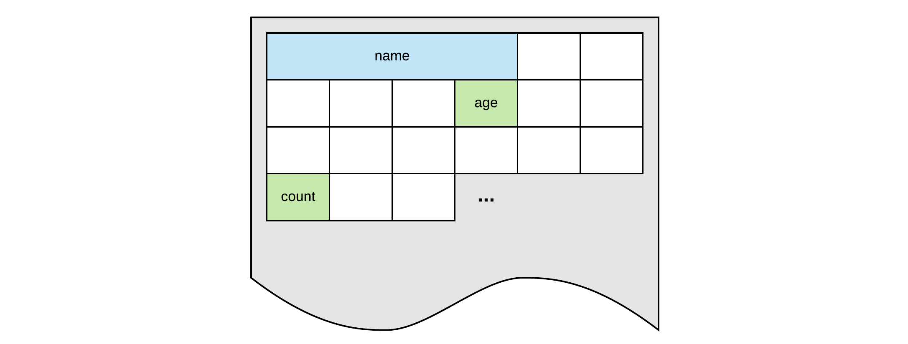

# Variables and Data Types

The main task of almost any application is processing and transforming data. To accomplish this tasks, it needs to store all sorts of information. From basic data such as numbers, characters and strings to complex data types that the programmer can define for himself.

This data is read, stored, manipulated and outputted throughout the application. The **data itself is stored inside the memory of the computer** or system the program is running on. Inside the application one does not need to access the memory directly, for this the developer can make use of variables.

::: insight Key Insight - Processing Data
Applications are collections of instructions that manipulate and process data to produce a required result.
:::

## What are Variables

Computer memory can be thought of as a huge cabinet with millions of small drawers. The content of the drawers is the information stored in memory that is used inside the application. While it is perfectly possible to refer to a drawer using its location, for example `145`, it is a lot harder to remember and not practical to work with. There is also no link between the location and the actual content of the drawer.



Now if one could place a label on the drawer that is descriptive enough of its content, it would be much easier to refer to the drawer using the descriptive name (for example `count`, `age`, `name`). This is analogous with a **variable name, a symbolic label for a location in memory**.

## Creating Variables

**C++ is a strongly-typed language**, and requires every variable to be defined with its **datatype** before its first use.

Defining a variable informs the compiler of

* how the variable is **named**
* what **size** to reserve in memory for the variable
* how to **interpret** its value
* what **operations** can be applied to the variable

::: insight Key Insight - A Variable
A variable is a symbolic label for a location in memory where data is stored. A variable has a name (identifier) and a data type. The data type of the variables determines which operations can be performed on the data and how the value in memory has to be interpreted.
:::

The syntax to define a new variable in C++ is straightforward. Simply write the datatype followed by the variable name (also known as its identifier).

```cpp
<data_type> <variable_name>;
```

To for example define a variable called `numberOfStudents`, capable of holding an integral value, one could declare it using the following statement:

```cpp
int numberOfStudents;
```

When the application is run (at runtime), this variable will be **instantiated** (created) and actual **memory space will be reserved** to store the data.

::: insight Key Insight - Declaration versus definition
Note that defining a variable is not the same as declaring it. Declaring a variable is stating that it exists somewhere, while defining a variable is actually creating it. Declaring a variable is done using the `extern` keyword. While less important for variables, the distinction will be more clear in the context of functions, methods and classes.
:::

While consider bad practice, multiple variables of the same type can also be defined using a single statement. Do note that the data type only needs to be stated once.

```cpp
int x, y, z;
```

::: warning Warning - Defining Multiple Variables
Define each variable using its own statement. Using a single statement to define multiple variables is bad practice and can introduce hard-to-track bugs when using pointers as will be seen later in this course.
:::

## Naming Variables

The name of a variable can be composed of letters, digits, and the underscore character. It must begin with either a letter or an underscore, not with a digit. Upper and lowercase letters are distinct because **C++ is case-sensitive**. A variable name can also not be a language keyword. For example, `int` is a keyword that is used to denote integers.

Choosing a good name for a variable is a big decision. Bad names will make your code less readable and maintainable. Keep in mind that other people might need to study or change your code.

Some good examples are:

* `areaOfRectangle`
* `numberOfStudents`
* `MAX_CAR_SEATS`
* `numberOfBytesSend`
* `username`

**Don't abbreviate variable names** or parts of variable names. These days code completion helps us to complete longer variables names with the hit of a button.

## The Assignment Operator

The assignment operator is probable one of the most used operators in C++. It allows one to assign a value to a variable. The assignment operator takes two operands. The left side, called the left operand, which refers to the variable being assigned and the right hand side representing the value that is assigned to the left operand.

For example:

```cpp{2}
int x;    // Definition
x = 5;    // Assign the value 5 to x
```

In the previous example, `5` is the value that is assigned to the variable `x`. So in this example `x` is the left operand and `5` is the right operand.

One can also assign the value of one variable to another. In this case the data of the right operand is copied into the memory location of the left operand, therefore overwriting the original content of the left operand.

```cpp{5}
int x;    // Definition
x = 5;    // Assign the value 5 to x

int y;    // Definition
y = x;    // Copy value of x to y
```

The last statement assigns the value of the variable `x` to the variable `y`. Consider also that we are only assigning **the value** of `x` to `y` at the moment of the assignment operation. Therefore, if `x` changes at a later moment, it will not affect the value held by `y`. In other words a copy is made of the value held by `x` and then stored in `y`.

## Variable Initialization

When defining a variable, one can immediately assign a value to it. This process is called **initializing the variable**.

```cpp
// Defining and initializing the variable
int numberOfStudents = 14;
```

This code has the same result as the snippet below, it's just more intuitive and shorter.

```cpp
int numberOfStudents;
numberOfStudents = 14;
```

When a value like `14`, `-123` or even a string like `"Hello World"` is used inside code, it is called a **literal value** or even shorter a **literal**.

## Accessing the Variable

Accessing or using a variable is as simple as stating its name where it's value is expected to be used.

The next code examples outputs the value of the variable `numberOfStudents` to the terminal.

```cpp
int numberOfStudents = 35;

cout << numberOfStudents << endl;
```

## Primitive Data Types

**Primitive types** are the **most basic data types available** within a programming language. These types serve as the building blocks of data manipulation. Such types serve only one purpose - containing pure, simple values of a certain type.

Because these data types are defined into the type system by default, they come with a number of predefined operations (`+`, `-`, `*`, `/`, `%`, ...) that can be used on them to manipulate their content.

C++ supports several primitive datatypes as shown in the following tables.

**Character types**

| Type | Size / precision | Literal Example(s) |
| :---: | --- | --- |
| `char` | At least 8 bits. | `'a'`, `'4'`, `'\n'` |
| `char16_t` | At least 16 bits. Not smaller dan `char`. | TODO |
| `char32_t` | At least 32 bits. Not smaller dan `char16_t`. | TODO |
| `wchar_t` | Can represent the largest supported character set. | TODO |

**Signed types**

| Type | Size / precision | Literal Example(s) |
| :---: | --- | --- |
| `short`, `short int` | At least 16 bits. Not smaller than `char`. | `123`, `-666` |
| `int` | At least 16 bits. Not smaller than `short`. | `-22`, `42` |
| `long`, `long int` | At least 32 bits. Not smaller than `int`. | `-32L` |
| `long long`, `long int int` | At least 64 bits. Not smaller than `long`. | `5000000LL`, `-3'120'432LL` |

**Unsigned types**

| Type | Size / precision | Literal Example(s) |
| :---: | --- | --- |
| `unsigned char` | Same size as `char`. | `55` |
| `unsigned short` | Same size as `short`. | `12`, `43` |
| `unsigned int` | Same size as `int`. | `123`, `0` |
| `unsigned long` | Same size as `long`. | `55L` |
| `unsigned long long` | Same size as `long long`. | `5000000LL`, `123'456'789LL` |

**Floating Point types**

| Type | Size / precision | Literal Example(s) |
| :---: | --- | --- |
| `float` | Single precision floating point numbers. | `123.456f` |
| `double` | Double precision floating point numbers. Precision not less than `float`. | `3.14`, `6.02e12` |
| `long double` | Extended double precision floating point numbers. Precision not less than `double`. | `123.456L` |

**Boolean types**

| Type | Size / precision | Literal Example(s) |
| :---: | --- | --- |
| `bool` | | `true`, `false` |

More info can be found at [https://en.cppreference.com/w/cpp/language/types](https://en.cppreference.com/w/cpp/language/types).

::: warning Warning - Datatype sizes
Note that the C++ standard does not specify a concrete size for each type. This means that the size of the data types actually dependent on the system you are compiling for. In certain situations you will need to keep this in mind.
:::

Within each of the groups above, the difference between types is only their size (i.e., how much space they occupy in memory). The first type in each group is the smallest, and the last is the largest, with each type being at least as large as the one preceding it in the same group. Other than that, the types in a group have the same properties.

Type sizes above are expressed in bits. The more bits a type has, the more distinct values it can represent. On the other hand, the larger the size, the more memory a datatype consumes.

| Number of Bits (size) | Unique Representable Values | Unsigned | Signed |
| --- | --- | --- | --- |
| 8-bit | 2^8 = 256 | 0 to 255 | -128 to 127 |
| 16-bit | 2^16 = 65'536 | 0 to 65'535 | -32'768 to 32'767 |
| 32-bit | 2^32 = 4'294'967'296 | 0 to 4'294'967'295 | -2'147'483'648 to 2'147'483'647 |
| 64-bit | 2^32 = 18'446'744'073'709'551'616 | 0 to 18'446'744'073'709'551'615 | -9'223'372'036'854'775'808 to 9'223'372'036'854'775'807 |

::: tip Tip - Octal, Hexadecimal and Binary
C++ also supports integer literal written in a different base notation, for example:

* Hexadecimal format by prefixing the literal with `0x`, for example `0xFF` for `255`.
* Octal format by prefixing the literal with `0`, for example `0377` for `255`.
* Binary format by prefixing the literal with `0b`, for example `0b11111111` for `255`. You can also use single quotes `'` as a nibble separator: `0b1111'1111`.
:::

### Character Types

These can represent a single character, such as `'A'` or `'$'`. The most basic type is `char`, representing a single character. Other types are also provided for wider characters.

The next code snippets shows some examples of how variables of the basic `char` data type can be defined and used.

```cpp
char lastAlfabetLetter;       // Definition
lastAlfabetLetter = 'z';      // Assignment

// Definition + initialization
char firstAlfabetLetter = 'a';

// Accessing value
cout << "The first letter of the alfabet is: ";
cout << firstAlfabetLetter << endl;
```

::: output
<pre>
The first letter of the alfabet is: a
</pre>
:::

More info on character sets and encoding: [https://www.smashingmagazine.com/2012/06/all-about-unicode-utf8-character-sets/](https://www.smashingmagazine.com/2012/06/all-about-unicode-utf8-character-sets/).

Note the difference between text (strings) and single characters. Strings are placed between double quotes `"Hello World"`, while single characters are enclosed between single quotes `'x'`.

### Numerical Integer types

Numerical Integer types can store a whole number value, such as `7` or `1024`. They exist in a variety of sizes, and can either be `signed` or `unsigned`, depending on whether they support negative values or not.

```cpp
unsigned int sum;   // Definition
sum = 0;            // Assignment

// Definition + initialization
long long numberOfBytes = 4'323'553'434LL;

// Accessing value
cout << "Sending " << numberOfBytes;
cout << " bytes via internet takes quite some time" << endl;
```

::: output
<pre>
Sending 4323553434 bytes via internet takes quite some time
</pre>
:::

### Floating-point types

Floating-point types represent real values, such as `3.14` or `0.01`, with different levels of precision, depending on which of the three floating-point types is used.

The next code snippets shows some examples of how variables of different data types can be defined and assigned a value.

```cpp
double radius;    // Definition
radius = 12.4;    // Assignment

// Definition + initialization
float approximationOfPi = 3.1415f;

cout << "Here is an approximation of pi: ";
cout << approximationOfPi << endl;
```

::: output
<pre>
Here is an approximation of pi: 3.1415
</pre>
:::

### The Boolean type

The boolean type, known in C++ as `bool`, can only represent one of two states, `true` or `false`.

While the `bool` type does represent a `true` or `false` value, in the background it is actually an integer value. `false` is represented with the value of `0` and `true` is represented with anything different from `0`.

```cpp
bool a = true;
bool b = false;
bool c = 0;
bool d = 25;

std::cout << "Value of a: " << a << std::endl;
std::cout << "Value of b: " << b << std::endl;
std::cout << "Value of c: " << c << std::endl;
std::cout << "Value of d: " << d << std::endl;
```

::: output
<pre>
Value of a: 1
Value of b: 0
Value of c: 0
Value of d: 1
</pre>
:::

## Fixed-width integers

Why don't data types in C++ have a fixed size? This is somewhat of a C-heritage from the time when computers were much slower and performance was really importent. By leaving the representations of the data types open, compiler implementers were able to select the best performing size for `int` for the computer architecture they were targetting.

By todays standards this is more of a nuisance than a benefit as performance is not always the main concern anymore.

As of the C++11 standard, C++ officially adopted the fixed-width integers (defined in the `stdint.h` header) that are guaranteed to have the same size on any architecture. This greatly helps making applications cross-platform compatible.

| Name | Type | Range | Notes |
| --- | --- | --- | --- |
| `std::int8_t` | 1 byte signed | -128 to 127 | Treated like a signed char on many systems. |
| `std::uint8_t` | 1 byte unsigned | 0 to 255 | Treated like an unsigned char on many systems. |
| `std::int16_t` | 2 byte signed | -32,768 to 32,767 | |
| `std::uint16_t` | 2 byte unsigned | 0 to 65,535 | |
| `std::int32_t` | 4 byte signed | -2,147,483,648 to 2,147,483,647 | |
| `std::uint32_t` | 4 byte unsigned | 0 to 4,294,967,295 | |
| `std::int64_t` | 8 byte signed | -9,223,372,036,854,775,808 to 9,223,372,036,854,775,807 | |
| `std::uint64_t` | 8 byte unsigned | 0 to 18,446,744,073,709,551,615 | |

These fixed-width integers do have two downsides:

* They may not be supported on architectures where those types can't be represented (think embedded systems or specialized hardware)
* They may also be less performant than the built-in types on some architectures.

To fix these downsides, the C++ standard defines two more sets of integers that can be used as required:

* The fast type `std::int_fast#_t` provides the fastest signed integer type with a width of at least `#` bits. So for example, `std::int_fast32_t` will give you the fastest signed integer type that is at least 32 bits.
* The least type `std::int_least#_t` provides the smallest signed integer type with a width of at least `#` bits. So for example, `std::int_least32_t` will give you the smallest signed integer type that is at least 32 bits.

These fast and least types are guaranteed to be defined, and are safe to use. Both sets also come as signed and unsigned types.

| Type | Description |
| --- | --- |
| `int_fast8_t` | Fastest signed integer type with width of at least 8 bits |
| `int_fast16_t` | Fastest signed integer type with width of at least 16 bits |
| `int_fast32_t` | Fastest signed integer type with width of at least 32 bits |
| `int_fast64_t` | Fastest signed integer type with width of at least 64 bits |
| --- | --- |
| `int_least8_t` | Smallest signed integer type with width of at least 8 bits |
| `int_least16_t` | Smallest signed integer type with width of at least 16 bits |
| `int_least32_t` | Smallest signed integer type with width of at least 32 bits |
| `int_least64_t` | Smallest signed integer type with width of at least 64 bits |

### Best Practices for Integers

Now what types should one use for defining integral values.

Here are some best-practice guidelines:

* `int` should be preferred when the size of the integer doesn't matter (e.g. the number will always fit within the range of a 2 byte signed integer). For example, if you’re asking the user to enter their age, or counting from 1 to 10, it doesn’t matter whether int is 16 or 32 bits (the numbers will fit either way).
* If you need a variable guaranteed to be a particular size and want to favor performance, its safer to use `std::int_fast#_t`.
* If you need a variable guaranteed to be a particular size and want to favor memory conservation over performance, its safer to use `std::int_least#_t`. This is used most often when allocating lots of variables.

At the moment these fixed-width integers are still not yet main-stream. Until this happens, the previous guidelines should be taken into account. Try to avoid any compiler-specific fixed-width types (for example, Visual Studio defines `__int8`, `__int16`, ...).

## Variable initialization

While a variable does not need to be initialized immediately, **a variable should not be used before a meaningful value is assigned to it**. Uninitialized variables in C++ actually cause garbage data and may cause unpredictable results if their value is used before they are assigned a decent value.

Try the following code example

```cpp
#include <iostream>

using namespace std;

int main() {
  // These variables are uninitialized
  int a;
  int b;
  int c;

  cout << "a = " << a << endl;
  cout << "b = " << b << endl;
  cout << "c = " << c << endl;

  return 0;
}
```

The output is actually **undefined**.

::: output
<pre>
a = 32765
b = 0
c = 0
</pre>
:::

Both C and C++ define the values as undefined. Undefined means it may be **anything**, including being initialized to 0, taking previous value of the memory, being initialized to `0xDEADBEEF` or consecutive bytes of string `"blarg! blarg! blarg!"`, or anything else. In modern operating systems memory is usually zeroed at start and hence short-lived programs will typically have 0s everywhere. Basically you're getting a random value, which happens to sometimes be 0. But it's not guaranteed to be 0.

So important lesson: **Make sure to assign a meaningful value to variables before using them as they may lead to hard-to-track bugs inside your application.**

## Preprocessor Define

Preprocessor directives are lines included in the code of programs preceded by a hash sign `#`. These lines are not program statements but directives for the preprocessor. The preprocessor examines the code before actual compilation of code begins and resolves all these directives before any code is actually generated by regular statements.

::: insight Key Insight - Preprocessor Directive
A preprocessor directive begins with hashtag `#`. It is processed before compiling the program. A preprocessor directive is not a statement and is therefore also not terminated by a semicolon `;`.
:::

These preprocessor directives extend only across a single line of code. As soon as a newline character is found, the preprocessor directive ends. No semicolon `;` is expected at the end of a preprocessor directive. The only way a preprocessor directive can extend through more than one line is by preceding the newline character at the end of the line by a backslash `\`.

To define preprocessor macros one can use `#define`. Its syntax is:

```cpp
#define identifier replacement
```

When the preprocessor encounters this directive, it replaces any occurrence of `identifier` in the rest of the code by `replacement`. This replacement can be an expression, a statement, a block or simply anything. The preprocessor does not understand C++ proper, it simply replaces any occurrence of `identifier` by `replacement`.

```cpp{5,9}
#include <iostream>

using namespace std;

#define MAX_STUDENTS 24

int main() {

  cout << "There are a maximum of " << MAX_STUDENTS
    << " students allowed in the classroom" << endl;

  return 0;
}
```

::: output
<pre>
There are a maximum of 24 students allowed in the classroom
</pre>
:::

C++ inherited these preprocessor define directives from C. They are however discouraged to be used in modern code because they can introduce hard-to-track bugs and are actually handled by the preprocessor instead of the compiler.

## Constants

A constant, like a variable, is a symbolic representation of a memory location where a value can be stored. Unlike variables, constants never change in value after the application has been compiled. You must initialize a constant when it is created. If the value of a constant has to be changed, the application needs to be recompiled.

The syntax of creating a constant is very similar to the definition of a variable, with the exception that the statement is prefixed with the keyword `const` and initialization is mandatory.

```cpp
const <data_type> <CONSTANT_NAME> = <value>;
```

For example:

```cpp
const int MAX_STUDENTS_PER_CLASS = 54;
```

::: tip Tip - Capitalize Constants
Typically constants are defined using an all CAPITALS name and underscores `_` between the different words. This is generally accepted among programmers of many languages.
:::

Constants should be used in place of magic numbers. A **magic number** is a numeric literal (for example, `54`, `128`) that is used in the middle of a block of code without explanation. It is considered good practice to avoid magic numbers by assigning the numbers to named constants and using the named constants instead. The reasons for this are twofold:

* A number in isolation can be inexplicable to later programmers, whereas a named constant (such as `MAX_STUDENTS_PER_CLASS`) is more readily understood.
* Using the same named constant in many places, makes the code much easier to update if the requirements change (for example, more students are permitted per class).

A named constant defines an actual variable in the language, which you can use like a real variable: take its address, pass it around, use it, cast it, convert it, etc. Perhaps one might think that avoiding the definition of a variable saves time and space, but with any sensible compiler optimization levels there will be no difference, as constant values are already substituted and folded at compile time. But you gain the huge advantage of type checking and making your code known to the debugger, so there's really no reason not to use named constants.

## Exercises

Try to solve the exercises yourself. Don't go copy pasting other people's solutions.

Mark the exercises using a ✅ once they are finished.

### ❌ Data vs Information

*What is the difference between data and information? Give an example.*

### ❌ Initialization is mandatory

*Why do we need to initialize variables? What happens if we don't initialize a variable?*

### ❌ Define a variable for age

*How would you define a variable to store the age a person in? Make sure to give it an appropriate name. Explain why you choose that exact data type.*

### ❌ Multiple Variable Definitions

*Rewrite the following code snippet so each variable is defined separately.*

```cpp
int daysInAWeek, weeksInAYear, monthsInAYear;
```

### ❌ Assigning a value

*How would you assign the correct value to each of the variables in the following code snippet.*

```cpp
int daysInAWeek;
int weeksInAYear;
int monthsInAYear;
```

### ❌ Printing Variables

*Expand the following code snippet by outputting each variable's value to the terminal. Also print a label before each value.*

```cpp
int secondsInAMinute = 60;
int secondsInAnHours = 3600;
int daysInAYear = 365;
```

### ❌ Literals

*What are the literals in the code snippet below?*

```cpp
int a = 1;
int b = 32;
int c = 128;

cout << "a = " << a << endl;
cout << "b = " << b << endl;
cout << "c = " << c << endl;
```

### ❌ Refactoring Defines

*Refactor the code snippet below that makes use of a `define` statement where a constant could have been used. Don't mind the arithmetics for now.*

```cpp
#define PI 3.1415

double radius = 12.5;

double circleArea = PI * radius * radius;
```

### ❌ Magic Numbers have no Meaning

*The following code snippet calculates the total invoice amount that has to be paid. The calculation of the total amount contains a magic number. Can you fix it?*

```cpp
double invoiceAmount = 2342.12;   // Just a random value

double totalInvoice = 0.21 * invoiceAmount;   // 0.21 ?
```
