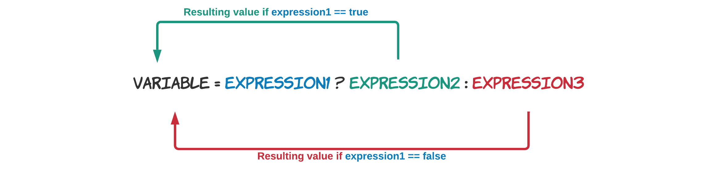
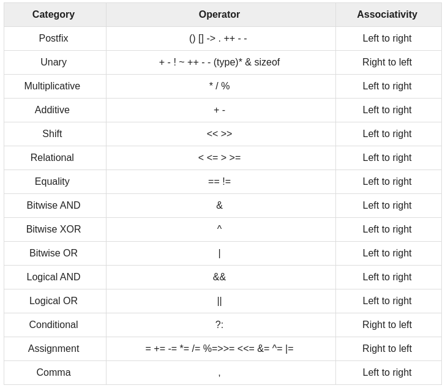

# Operators

Operators are elemental programming building block which are found at the heart of every C++ statement. Operators are a symbolic representation of a single, simple task that needs to be performed by the computer. Most are based on familiar concepts and are therefore easily understood. Others are associated with more complex concepts and are therefore covered in future chapters.

::: definition Definition - Operator
Operators are a symbolic representation of a single, simple task that needs to be performed by the computer.
:::

Operators perform their action on or with **operands**, be it expressions or values.

::: definition Definition - Expression and Statement
An expression is "a sequence of operators and operands that specifies a computation" (that's the definition given in the C++ standard). Examples are `x`, `x + 5`, and `round(12.44)`. Even an assignment `x = 5` is an expression in C++. That's why the following is valid in C++: `x = y = b + 3`

The rule is that an expression must result into a single value.

A statement is a chunk of code that performs an action and is terminated by a semicolon `;`.

So basically `x = y + 3;` is a statement that consists of the three expressions `y`, `y + 3` and `x = y + 3`.
:::

## Arithmetic Operators

The most basic operators are the Arithmetic operators. They are easy to understand because they have the same functionality as in math. The following operators are available to do basic math operations:

| Operator | Description |
| --- | --- |
| `+` | Additive operator (also used for String concatenation) |
| `-` | Subtraction operator |
| `*` | Multiplication operator |
| `/` | Division operator |
| `%` | Remainder operator |

These operators are part of the **binary operators** because they take **two operands**, namely a left and a right operator. For example in the summation below `left` is the left operand and `right` is the right operand. The result of the operation is stored in the variable `sum`.

```cpp{4}
int right = 14;
int left = 12;

int result = left + rights;     // Result is now 26
```

The `+`, `-` and `*` operators function the same as in math. Their use is demonstrated in the next code snippet.

```cpp
int a = 2 + 3;      // a = 5
int b = a + 5;      // b = 10

int c = 6 * b;      // c = 60
int d = c - 120;    // d = -60
```

:::::: kata Code Kata - Squaring a number

How would you square the value in `x` and store it in `squared`? Use only the basic math operators.

```cpp
int x = 12;

int squared;
```

::: details Solution

```cpp
int x = 12;

int squared = x * x;
```

:::
::::::

The division and remainder operators deserve some special attention. The division operator has a different result based on the types of its left and right operand. If both are of an integral type (`short`, `int`, `byte`) then a whole division will be performed. Meaning that `3 / 2` will result in `1`. If either operand is a floating point operand (`float` or `double`) than the division operator will perform a real division: `3.0 / 2` will result in `1.5`.

If your operands are of integral type and you wish to perform a real division, you can always multiply one of the operands with `1.0` to explicitly convert it to a floating point number without having to change its actual data type. Study the examples in the following code snippet.

```cpp
int x = 5;
int y = 2;

int z = x / y;              // z = 2 (whole division)
double w = x / y;           // w = 2.0 (still whole division)
double q = 1.0 * x / y;     // w = 2.5 (real division)

double a = 3.0;
double b = 2;       // 2 will actually be converted to 2.0

double k = a / b;   // k = 1.5 (real division)
```

Notice that even `double w = x / y;` results in `2.0`. The reason behind this is that `x / y` equals to `2` as it is a whole division since both operand are of integral type. The result is then implicitly converted to a `double`, and stored in `w`.

While the **precedence** (order) in which mathematical operations are performed is defined in C++, most programmers do not know all of them by heart. It is much more clear and simpler to use parentheses `()` to enforce the precedence of the calculations. Take a look at the following piece of code:

```cpp
int a = 5;
int b = 6;
int c = 10;
int d = 2;

int result = a * b + c - d * a / 5 - 3;     // result = 35

std::cout << "The result is " << result << std::endl;
```

The result of the code above is `35`. Would you have known? By using parentheses this becomes much clearer and the chance of making a mistake is a lot smaller.

```cpp
int a = 5;
int b = 6;
int c = 10;
int d = 2;

int result = (a * b) + c - (d * a / 5) - 3;     // result = 35

std::cout << "The result is " << result << std::endl;
```

Operators that have the same precedence are bound to their arguments in the direction of their associativity. For example, the expression `a = b = c` is parsed as `a = (b = c)` because of right-to-left associativity of the assignment. The expression `a + b - c` is parsed `(a + b) - c` because of left-to-right associativity of addition and subtraction.

::: tip Tip - Video on Opators, precedence and associativity
[https://www.youtube.com/watch?v=THiWb_5N73g](https://www.youtube.com/watch?v=THiWb_5N73g)
:::

### Increment and Decrement Operators

Incrementing (+1) and decrementing (-1) a variable is done very often in a programming language. It is one of the most used operations on integral values. It is most common used in loop-constructs as will become clear in the next chapters.

Because of this a shorter way has been introduced using an increment `++` or decrement `--` operator as shown in the following code example.

```cpp
int i = 5;

i++;    // Same as writing i = i + 1;
i--;    // Same as writing i = i - 1;
```

There is however a caveat to keep in mind. Both operators come in a **suffix** (e.g. `i++`) and a **prefix** (e.g. `++i`) version. The end result of both versions is exactly the same, but there is a difference if their value is assigned to another variable or when it is used inside another expression.

Take a look at the following two examples. The first example focusses on the prefix version. In this case the value of `i` will be incremented to 6 before its value will be assigned to the variable `b`. Meaning at the end of this code both `i` and `b` will have a value of 6.

```cpp
int i = 5;
int b = ++i;    // b = 6, i = 6
```

The next example demonstrates the suffix version. In this case the value of `i` will first be assigned to `b` before it is incremented. This results in `b` having a value of 5 and `i` having a value of 6 at the end of the example.

```cpp
int i = 5;
int b = i++;  // b = 5, i = 6
```

While this may not seem all that important at the moment, it will be when arrays and loop-constructs are introduced.

:::::: question Question - Incrementing an Expression
Knowing what you know now, could you answer the question if it would be possible to use the increment operator on an expression as demonstrated in the following code snippet.

```cpp
int x = 12;
int y = 34;

int z = (x + y)++;
```

::: details Solution

The code snippit is invalid code. An expression can not be placed on the left-hand side of assignment operator. So the code would be equivalent to:

```cpp
int x = 12;
int y = 34;

int z = (x + y) = (x + y)+1;
```

It is impossible to assign `(x + y)+1` to `(x + y)`.

:::
::::::

## Comparison Operators

Comparison (aka relational) operators are used to **compare two values** with each other.

The table below shows the available comparison operators that can be used in C++ to build conditional expressions.

| Operator | Description |
|---|---|
| `==` | equal to |
| `!=` | not equal to |
| `>` | greater than |
| `>=` | greater than or equal to |
| `<` | less than |
| `<=` | less than or equal to |

Since a conditional expression actually produces a single `true` or `false` result, this result can actually be assigned to a variable of type `bool`.

Take a look at some examples of comparison operators:

```cpp
int a = 4;
int b = 8;
bool result;
result = (a < b);     // true
result = (a > b);     // false
result = (a <= 4);    // a smaller or equal to 4 - true
result = (b >= 9);    // b bigger or equal to 9 - false
result = (a == b);    // a equal to b - false
result = (a != b);    // a is not equal to b - true
```

Note how two equality signs `==` are required to test if two values are equal, while a single assignment sign `=` is used to assign a value to a variable.

While the comparison operators will not often be used in a situation as shown in the previous code, they will often be used to make decisions in code.

## Logical Operators

More complex conditional expressions can be created by combining multiple conditional expressions. This can be achieved by using the logical operators.

The table below gives an overview of the available logical operators in C++.

| Operator | Description |
|---|---|
| `&&` | AND |
| `||` | OR |
| `!` | NOT |

These work as you know them from the Boolean algebra. The `||` (OR) operator will return `true` if either of the operands evaluate to `true`. The `&&` (AND) operator will return `true` if both operands evaluate to `true`. A logical expression can be negated by placing the `!` (NOT) operator in front of it.

The code example below checks if a person is a child, an adult or an adolescent based on his/her `age`.

```cpp
int age = 16;
bool isAChild = (age >= 0 && age <= 14);        // false
bool isAnAdolescent = (age > 14 && age < 18);   // true
bool isAnAdult = (age >= 18 && age <= 75);      // false
```

### Lazy Evaluation

The logical operators exhibit **"short-circuiting"** behavior, which means that the second operand is evaluated only if needed. This is also called **lazy evaluation**. So for example in an OR statement, if the first operand evaluates to `true` the outcome must also be `true`. For this reason the second operand is not checked anymore.

This can lead to confusing C++ constructions which should be avoided when possible. However as a future professional C++ programmer you may encounter them and need to understand their behavior.

An example where the second operand of the condition is not checked:

```cpp
int counter = 0;
bool result = (false && counter++);
std::cout << "Counter: " << counter << std::endl;
std::cout << "Result: " << result << std::endl;
```

::: output
<pre>
Counter: 0
Result: 0
</pre>
:::

And an example where the second operand of the condition is always evaluated:

```cpp
int counter = 0;
bool result = (true && counter++);
std::cout << "Counter: " << counter << std::endl;
std::cout << "Result: " << result << std::endl;
```

::: output
<pre>
Counter: 1
Result: 0
</pre>
:::

Do note that in the last example the postfix operator is used and not the prefix operator. Meaning that the value of `counter` is evaluated before it is incremented. As its initial value was `0` it is evaluated to `false`, meaning that `result` is assigned `false`.

## The Conditional Operator

The conditional operator returns one of two values depending on the result of an expression. The returned value can then be used in another expression or assigned to a variable for later use.



Its syntax is as follows:

```cpp
(expression1) ? expression2 : expression3
```

The parentheses around the first expression are optional but most programmers will place them as often the first expression is a conditional expression.

An example will greatly clarify things:

```cpp
int someValue = -13;
int absoluteValue = (someValue > 0) ? someValue : -someValue;
```

Basically the previous code snippet converts a signed integral value to its absolute value (value without a sign).

The conditional operator is the only operator in C++ that takes **three operands**. That's why it is also often called **the ternary** operator.

While it is possible to nest the ternary operator, it is strongly discouraged as it will lead to unreadable constructions.

::: tip Tip - Video on the Conditional Operator
[https://www.youtube.com/watch?v=ezqsL-st8qg](https://www.youtube.com/watch?v=ezqsL-st8qg)
:::

## BitWise Operators

Bitwise operators **work on bits** and perform bit-by-bit operations.

### Boolean Operators

The next table shows an overview of the boolean operators supported by C++.

| Operator | Description |
|---|---|
| `&` | Boolean *AND* operator |
| `|` | Boolean *OR* operator |
| `~` | Boolean *NOT* operator |
| `^` | Boolean *XOR* operator |

Note that the *NOT* operator is the only boolean unary operator as it only takes a single argument. The other operators are all binary operators.

Study the example below. The results are shown in comments:

```cpp
unsigned char a = 0b1010'1010;
unsigned char b = 0b0000'1111;

unsigned char x = a & b;    // 0b0000'1010
unsigned char y = a | b;    // 0b1010'1111
unsigned char z = a ^ b;    // 0b1010'0101
unsigned char w = ~b;       // 0b1111'0000
```

### Shift Operators

The shift operators bitwise shift the value off their left operand by the number of bits given as their right operand.

| Operator | Description |
|---|---|
| `<<` | left shift |
| `>>` | right shift |

Both operators take two operands. On the left side the value to shift and on the right side the number of places to shift.
Left shifting an integer `a` with an integer `b` (`a << b`) is equivalent to multiplying `a` with `2^b` (2 raised to the power `b`) while right shifting an integer `a` with an integer `b` (`a >> b`) is equivalent to diving `a` with `2^b`.

```cpp
int x = 16;
int shifted = (x << 2);

cout << "Shifting " << x << " two bits to the left: " << shifted << endl;
```

::: output
<pre>
Shifting 16 two bits to the left: 64
</pre>
:::

Notice that the `<<` symbols are both used for passing data to `cout` as for shifting bits in integral values. C++ is smart enough to detect the operation that needs to be performed based on the context of the code.

The left shift operator will shift in zero's on the LSB side. The right shift operator adds either `0`s, if the left-side operand is an unsigned type, or extends the MSB (to preserve the sign) if its a signed type.

Care should be taken when the values of either operand might be negative because:

* For negative `a`, the behavior of `a << b` is undefined.
* For negative `a`, the value of `a >> b` is implementation-defined (in most implementations, this performs arithmetic right shift, so that the result remains negative).
* If the value of the right operand (`b`) is negative, the behavior is undefined.

If the number is shifted more than the size of integer, the behavior is also undefined. For example, `1 << 33` is undefined if integers are stored using 32 bits.

<!-- Apparently shift operators are a mess for for negative numbers (https://en.cppreference.com/w/cpp/language/operator_arithmetic#Bitwise_shift_operators) -->

### Assignment Operators

Next to the basic assignment operator `=`, C++ also supports a whole collection of **compound** assignment operators.

Programmers are very lazy creatures that are always looking for ways to make their life's easier. That is why the compound operators were invented. They are a way to **write shorter mathematical operations** on the same variable as the result should be stored in.

| Operator | Description |
|---|---|
| `=` | Assign value from right operand to left operand. |
| `+=` | Add left operand to right operand and assign result to left operand |
| `-=` | Subtract left operand from right operand and assign result to left operand  |
| `*=` | Multiply left operand by right operand and assign result to left operand |
| `/=` | Divide left operand by right operand and assign result to left operand |
| `%=` | Divide left operand by right operand and assign remainder to left operand |
| `<<=` | Left shift left operand by right operand and assign result to left operand |
| `>>=` | Right shift left operand by right operand and assign result to left operand |
| `&=` | Bitwise AND left operand with right operand and assign result to left operand |
| `|=` | Bitwise OR left operand with right operand and assign result to left operand |
| `^=` | Bitwise XOR left operand with right operand and assign result to left operand |

Note that there are no compound operators available for the logical operators.

```cpp
int x = 5;

x += 4;   // Same as writing x = x + 4;
x -= 4;   // Same as writing x = x - 4;
x *= 4;   // Same as writing x = x * 4;
x /= 4;   // Same as writing x = x / 4;
x %= 4;   // Same as writing x = x % 4;
```

:::::: kata Code Kata - 24 hours

Consider the following example, a code snippet from a student, programming a clock which can display the time in `24h` format. The student however has a small problem where the hours sometimes become bigger than `23`. Can you think of a single operator statement to limit the hours to a value between `0` and `23`?

```cpp
int hours = 25;

// How can we limit hours here so it wraps around to 1?
```

::: details Solution

This is a typical use case of the modulo operator. The second operator can be used to limit the range of the first operator (at least if it's a value between `0` and the right operand).

```cpp
int hours = 25;

// hours is limited to [0, 23]
hours %= 24;
```

:::
::::::

## Number of Operands

Operators can also be categorized depending on the number of operands they take.

* **Unary Operators**: Unary operators only require a single operand. The most common example is the minus-operators, which changes the sign of the value provided as the operand. For example: `-3`.

* **Binary Operators**: Binary operators require two operands to perform their operation. The arithmetic operators are the most familiar examples of binary operators. For example: `health + 15`, where the operator is `+`, and `health` and `15` are the operands.

* **Ternary Operator**: The C++ language has only a single ternary operator, namely the conditional operator `?:`, often also called THE ternary operator. Ex. `(age > 18 ? "Adult" : "Non-Adult"). The result of this ternary operator can then be assigned to a variable or used somewhere else in code.

## List of C++ Operators

While not all operators are discussed in this chapter, here is a list of the most common C++ operators, their precedence and associativity. Operators with the highest precedence appear at the top of the table, those with the lowest appear at the bottom. Within an expression, higher precedence operators will be evaluated first.



By the end of this course all these operators should be clear to you.
