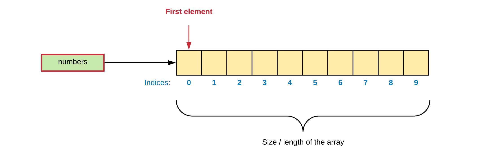

# Arrays

An array data structure, or simply an array, is **a data structure consisting of a collection of elements**, each identified by at least one **array index** or key. An array is stored so that the position of each element can be computed from its index by a mathematical formula. The simplest type of data structure is a linear array, also called one-dimensional array.

The memory address of the first element of an array is called the first address or foundation address.

Because the mathematical concept of a matrix can be represented as a two-dimensional grid, two-dimensional arrays are also sometimes called matrices. Arrays are often used to implement tables, especially lookup tables; the word table is sometimes used as a synonym of array.

Arrays are among the oldest and most important data structures, and are used by almost every program. They are also used to implement many other data structures, such as lists and strings. They effectively exploit the addressing logic of computers. In most modern computers and many external storage devices, the memory is a one-dimensional array of words, whose indices are their addresses.

Arrays are useful mostly because the element indices can be computed at run time. Among other things, this feature allows a single iterative statement to process arbitrarily many elements of an array. For that reason, the elements of an array data structure are required to have the same size and should use the same data representation.

::: tip 🔍 Lookup Tables
Arrays are often used to implement tables, especially lookup tables; the word **table** is sometimes used as a synonym of array. In computer science, a lookup table is an array that replaces runtime computation with a simpler array indexing operation. The savings in terms of processing time can be significant, since retrieving a value from memory is often faster than undergoing an "expensive" computation or input/output operation. The tables may be precalculated and stored in static program storage, calculated (or "pre-fetched") as part of a program's initialization phase.
:::

## One Dimensional Arrays

An array is a **container object** that holds a **fixed number of values** of a **single type**. The length of an array is established when the array is created. After creation, its length is fixed.

The next code example shows how to declare and create an array of `10` integers:

```cpp
int someNumbers[10];
```

By placing square brackets after the name of the variable we declare the variable to be an array.

A visualization of the array may look something like this:



Each item in an array is called **an element**, and each element is accessed by its numerical index. As shown in the preceding visualization, numbering begins with 0 (this is called **zero-indexed**). The 9th element, for example, would therefore be accessed at index 8.

Let us take a look at some code that stores 5 integers requested from the user. Once all numbers are inputted the total and average is calculated and reported back to the user.

```cpp
const unsigned int NUMBERS_SIZE = 5;
int userNumbers[NUMBERS_SIZE];

double sum = 0;        // Make sure to initialize
for (unsigned int i = 0; i < NUMBERS_SIZE; i++) {
    cout << "Please enter a number (" << (NUMBERS_SIZE-i) << " left): ";
    cin >> userNumbers[i];
    sum += userNumbers[i];
}

cout << "The average equals " << (sum/NUMBERS_SIZE) << endl;
return 0;
```

::: output
<pre>
Please enter a number (5 left): 3
Please enter a number (4 left): 542
Please enter a number (3 left): 3
Please enter a number (2 left): 556 
Please enter a number (1 left): 34
The average equals 227.6
</pre>
:::

From the code above it can be seen that the array elements can be accessed by using `[]` with the index specified between them.

## Quick Initialization

It is perfectly possible to initialize all array elements using a for-loop construct as shown below.

```cpp
#include <iostream>
using namespace std;
int main()
{
  const unsigned int NUMBERS_SIZE = 5;
  int numbers[NUMBERS_SIZE];

  for (unsigned int i = 0; i < NUMBERS_SIZE; i++) {
      numbers[i] = 0;
  }
  return 0;
}
```

However in some cases shorter options are available using an array initialization list. Obviously if no initialization is done, the elements contain "random" scrap data.

Initializing all elements to zero can be achieved using the following constructs:

```cpp
// initialize all elements to 0
// (not allowed in C)
int someArray[10] = {};

// Initialize all elements to 0
// (allowed in C)
int someOtherArray[10] = { 0 };
```

Initializing elements to a certain value is also possible.

```cpp
int myArray[10] = { 5, 5, 5, 5, 5, 5, 5, 5, 5, 5 };
```

Elements with missing values will be initialized to 0:

```cpp
int myArray[10] = { 1, 2 };   // initialize to 1, 2, 0, 0, 0 ...
```

If you provide enough initialization values you can also omit the array size. The compiler will then automatically create an array large enough to hold the values.

```cpp
int myArray[] = { 1, 2, 3, 4, 5 };      // Will automatically create an array of 5 elements
```

## Variable Length Arrays

As of C99 (an informal name for ISO/IEC 9899:1999, a past version of the C programming language standard) VLAs or Variable Length Arrays can be declared as a local variable (on the stack). Some C++ compilers also support this construct.

```cpp
#include <iostream>

using namespace std;

int main() {

  int size = 0;
  cout << "Please enter size of array: ";
  cin >> size;

  int numbers[size] = { 0 };
  cout << "The size of the array is " << sizeof(numbers)/sizeof(int) << endl;

  return 0;
}
```

::: output
<pre>
Please enter size of array: 22
The size of the array is 22
</pre>
:::

Pre-C99, the length of the array had to be known at compile time. Only a literal, defined value or constant was allowed for the declaration size of an array.

::: warning Not part of the C++ Standard
Note that VLAs are not present in the C++ standards, even as an optional feature. The only reason some compilers support this feature, is to be compatible with C. Even many C implementations never supported VLAs (for example some embedded systems compilers). As of C11 this feature has become optional.
:::

## Multi-Dimensional Arrays

C++ allows the declaration of multi-dimensional arrays. Multidimensional arrays can be described as **"arrays of arrays"**. Below is the general declaration template of such a structure:

```cpp
<type> name_of_array[size1][size2]...[sizeN];
```

The simplest form of the multi-dimensional array is the two-dimensional array. A two-dimensional array is, in essence, an array of one-dimensional arrays. To declare a two-dimensional integer array of size 2 by 4 one would declare it as follows:

```cpp
int matrix[2][4];
```

So this can be thought of as an array with two elements where each element points to an array of 4 elements.

The initialization list can also be used with multi-dimensional arrays as shown below:

```cpp
int matrix[2][4] = {  
   {0, 1, 2, 3},
   {4, 5, 6, 7}
};
```

Of course if you wish to access the elements you will need to provide as much indexes as there are dimensions in the array structure.

```cpp
const unsigned int ROWS = 2;
const unsigned int COLS = 4;

int matrix[ROWS][COLS] = {  
  {0, 1, 2, 3},
  {4, 5, 6, 7}
};

for (unsigned int r = 0; r < ROWS; r++) {
  for (unsigned int c = 0; c < COLS; c++) {
    cout << matrix[r][c] << " ";
  }
  cout << endl;
}
```

Resulting in the following output:

::: output
<pre>
0 1 2 3 
4 5 6 7
</pre>
:::

As multi-dimensional arrays can become complex quite fast, it is important to name your indexes clearly and also to keep it as simple as possible.

## Sizeof an Array

When using the `sizeof` operator on an array, the result will be the total number of bytes required by the array to store all the elements.

```cpp
int numbers[] = {1, 2, 3};

cout << "Sizeof numbers: " << sizeof(numbers) << " bytes." << endl;
```

::: output
<pre>
Sizeof matrix: 12 bytes.
</pre>
:::

Using this information it is quitte straight-forward to determine how many elements the array holds by dividing the size of the array with the size of the first element (or the size of an `int`).

```cpp
int numbers[] = {1, 2, 3};

cout << "Sizeof numbers: " << sizeof(numbers) << " bytes." << endl;
cout << "It holds " << sizeof(numbers)/sizeof(numbers[0]) << " elements." << endl;
```

::: output
<pre>
Sizeof numbers: 12 bytes.
It holds 3 elements.
</pre>
:::

When using the `sizeof` on a 2D array `sizeof(matrix)` will give you the total number of bytes, `sizeof(matrix[0]` will give you the number of bytes required by the first dimension, ...).

```cpp
int matrix[2][4] = {  
  {0, 1, 2, 3},
  {4, 5, 6, 7}
};

cout << "Sizeof matrix: " << sizeof(matrix) << " bytes.";
cout << " It holds " << sizeof(matrix)/sizeof(int) << " elements." << endl;

cout << "Sizeof first dimension: " << sizeof(matrix[0]) << " bytes.";
cout << " It holds " << sizeof(matrix[0])/sizeof(int) << " elements." << endl;
```

::: output
<pre>
Sizeof matrix: 32 bytes. It holds 8 elements.
Sizeof first dimension: 16 bytes. It holds 4 elements.
</pre>
:::

## Foreach Loop

A foreach loop is used to access elements of an array quickly without the hassle of initializing an iterator, testing and increment/decrement that iterator. The idea of a foreach loop is to do something with every element rather than doing something a number of times.

There is no foreach loop in C, but as of C++ 11 support for the foreach loop has been added.

```cpp
int numbers[] = { 1, 2, 3, 4, 5 };

for (auto value : numbers) {
  cout << value << " ";
}
cout << endl;
```

::: output
<pre>
1 2 3 4 5
</pre>
:::

In the previous example the `value` variable holds a copy of the original value. Meaning that if we change value it will not be reflected to the original.

::: insight Key Insight - Type inference 
Type inference refers to automatic deduction of the data type of an expression in a programming language. Before C++ 11, each data type needs to be explicitly declared at compile time, limiting the values of an expression at runtime but after the new version of C++, many keywords are included which allows a programmer to leave the type deduction to the compiler itself.

With type inference capabilities, we can spend less time having to write out things compiler already knows. As all the types are deduced in compiler phase only, the time for compilation increases slightly but it does not affect the run time of the program.

The `auto` keyword specifies that the type of the variable that is being declared will be automatically deducted from its initializer.

The variable declared with `auto` keyword should be initialized at the time of its declaration only or else there will be a compile-time error.
:::

However, C++ would not be C++ if it weren't possible to change the actual `numbers` by passing the *reference* to the values instead of copies:

```cpp
int numbers[] = { 1, 2, 3, 4, 5 };

// Let us first square all values
for (auto &value : numbers) {
  value = value * value;
}

for (auto &value : numbers) {
  cout << value << " ";
}
cout << endl;
```

::: output
<pre>
1 4 9 16 25
</pre>
:::

More on references later. <!-- TODO: Checkout chapter xxx -->

## Exercises

Try to solve the exercises yourself. Don't go copy pasting other people's solutions.

Mark the exercises using a ✅ once they are finished.

### ❌ Day of the Week

*Refactor the following code snippet using an array of `std::string` elements and lookup the result.*

```cpp
#include <iostream>

using namespace std;

int main() {

  unsigned int dayOfTheWeek = 0;
  do {
    cout << "Please enter the day of the week (1 - 7): ";
    cin >> dayOfTheWeek;
  } while (dayOfTheWeek < 1 || dayOfTheWeek > 7);
  
  switch(dayOfTheWeek) {
    case 1:
      std::cout << "Than it's Monday today" << std::endl;
      break;
    case 2:
      std::cout << "Than it's Tuesday today" << std::endl;
      break;
    case 3:
      std::cout << "Than it's Wednesday today" << std::endl;
      break;
    case 4:
      std::cout << "Than it's Thursday today" << std::endl;
      break;
    case 5:
      std::cout << "Than it's Friday today" << std::endl;
      break;
    case 6:
      std::cout << "Than it's Saturday today" << std::endl;
      break;
    case 7:
      std::cout << "Than it's Sunday today" << std::endl;
      break;
  }

  return 0;
}
```

### ❌ Matrix and Vector Multiplication

*Check the vector and matrix multiplication below by writing a small application for it.*


