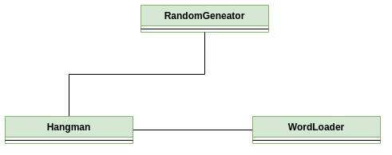
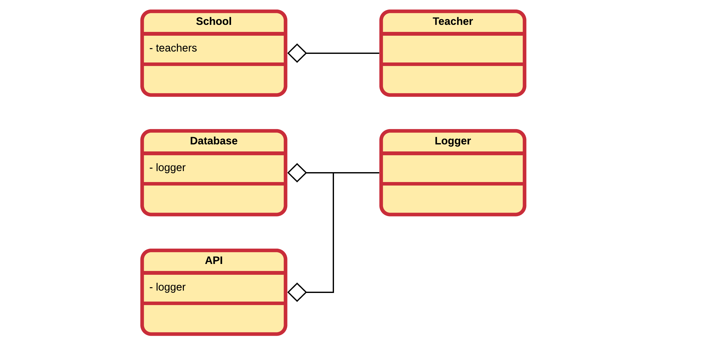
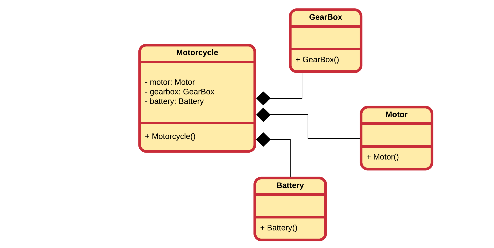
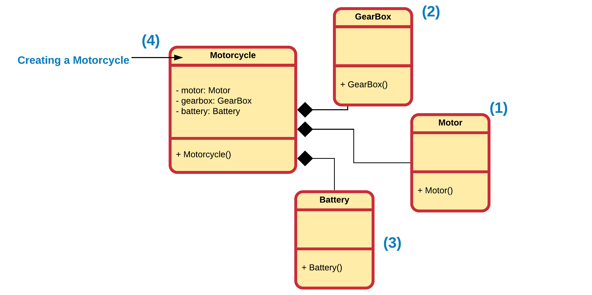

# Composition

By using composition one builds **objects that consist of other objects**. Think of it as creating a new type of object by packaging together other objects.

Composition also allows one to hide complexity behind the simplicity of objects. In other words, objects allow one to create new levels of abstraction.

Composition comes with a great deal of flexibility. Member objects of the new class can be made private, making them inaccessible to client programmers. This means that there can be changes without disturbing existing client code. This can even be done at runtime, to dynamically change the behavior of your program. This cannot be done using inheritance since the compiler must place compile-time restrictions on classes created with inheritance.

Because inheritance is one of the main pillars of object oriented design, it is often over-estimated and over-used. When used wrongly, it can result in awkward and overly-complicated designs. A good practice is to look at composition first when creating new classes as it is **simpler and more flexible**.

## Association, Composition and Aggregation

The simplest way to use a class is by creating objects from it and using those objects. In other words **an object of one class may use services/methods provided by an object of another class**. This kind of relationship is termed as an **association**.

An association represents a relationship between two or more objects where all objects have their own lifecycle and there is no owner. The name of an association specifies the nature of relationship between objects. This is represented in UML by a solid line.



The previous UML class diagram shows a typical association where a `Hangman` object uses a `WordLoader` object to load a file with words. It also uses an instance of the `RandomGenerator` to select a random word from the list. 

While in **most cases aggregation is synonym with composition**, there is a **subtle difference**.

**Composition** implies a relationship where the **child cannot exist independent of the parent**. In this relationship there is a **strong lifecycle dependency** between the child objects and the parent object. If a parent object is destroyed, its composed child objects will also be destroyed. In UML this is represented by a solid diamond followed by a line.


**Aggregation** implies a relationship where the child can exist independently of the parent. Aggregation is a specialized form of association where all object have their own life cycle. In UML this is represented by a hollow diamond followed by a line.

The aggregation link is usually used to stress the point that one class instance is not the exclusive container of the other class instance, as in fact the same class B instance can exist in (an)other container(s).



<!-- Source: https://www.visual-paradigm.com/guide/uml-unified-modeling-language/uml-aggregation-vs-composition/ -->

While a clear distinction is made here between aggregation and composition, it is not always done so in practice. In practice, one does often speak of composition even if he/she were to mean aggregation. As a result this course may also use the word composition where aggregation is meant. Of course in cases where a clear distinction is needed, the correct term will be used.

::: definition Definition - Association, Composition and Aggregation
To sum it up association is a very generic term used to represent when one class uses the functionalities provided by another class. It is sayed it's a composition if one parent class object owns another child class object and that child class object cannot meaningfully exist without the parent class object. If it can then it is called aggregation.
:::

## Creating new Classes Through Composition

You probable have already been using composition without realizing it. Consider the example below of a class Product that might be used in an online web shop as a model for products that are sold.


While developers will almost never document them as such in a UML diagram, the `name` and `description` attributes are actually instances of a class too, namely of `std::string`. So in other words `Product` is already a basic example of composition.


When composing objects of other objects, the *sub objects* are generally made private. This hides implementation and allows the designer of the class to change the implementation if needed.

Consider the following example where a `Canvas` is modelled as a composition of a `PixelDisplay` object, which interacts with actual hardware, and `Color` objects that define the color of the foreground drawing and background.


By hiding the `PixelDisplay` object inside the `Canvas`, one hides the complexity of the hardware dependent class. This class may have methods for setting and resetting pixels, for changing hardware timings, for drawing rectangles, circles, and so on. All that is hidden only the ability to show some text, through `display(text:string)`, and display a bitmap, through `display(image:Bitmap)` is made publicly available. This keeps the `Canvas` simple and very user friendly.

Also if one ever wanted to switch from a backlit LCD pixel display to an OLED display, the classes that use the `Canvas` never even have to change.

## Construction of Composite Objects

**Whenever an object of a class is instantiated, a constructor is called**. This however is not all that happens. When the object is composed of other objects, the **constructors of those sub-objects are also called**.

Take for example the class `Motorcycle` shown below, that is composed of several other classes, such as `GearBox`, `Motor` and `Battery`.



It is very important to know **which constructors** are called and at what time. Let's use the following implementation to illustrate which constructors are called when. Note that the constructors are implemented inline to shorten the code for this example.

### Battery

```cpp
// battery.h
#pragma once
#include <iostream>

class Battery {
  public:
    Battery(void) {
      std::cout << "Constructing Battery" << std::endl;
    }
};
```

### Gearbox

```cpp
// gearbox.h
#pragma once
#include <iostream>

class GearBox {
  public:
    GearBox(void) {
      std::cout << "Constructing GearBox" << std::endl;
    }
};
```

### Motor

```cpp
// motor.h
#pragma once
#include <iostream>

class Motor {
  public:
    Motor(void) {
      std::cout << "Constructing Motor" << std::endl;
    }
};
```

### Motorcycle

A `Motorcycle` is a composed object of a `Motor`, a `GearBox`and a `Battery`.

```cpp
// motorcycle.h
#pragma once

#include <iostream>
#include "motor.h"
#include "gearbox.h"
#include "battery.h"

class Motorcycle {
  public:
    Motorcycle(void) {
      std::cout << "Constructing Motorcycle" << std::endl;
    }

  private:
    Motor motor;
    GearBox gearbox;
    Battery battery;
};
```

### Basic Main Application

The main program could be as simple as:

```cpp
//main.cpp
#include "motorcycle.h"

int main() {
    Motorcycle vn800;
    return 0;
}
```

::: output
<pre>
Constructing Motor
Constructing GearBox
Constructing Battery
Constructing Motorcycle
</pre>
:::

So basically, when constructing an object of a class, **the default constructors of the composed objects are called first**. When all composed objects are created, **then the composing object is constructed**.



Important to think about is:

* **Why are the constructors of the composed objects invoked before the actual constructor of the composing object ?** Simple, because those objects should be ready and in a valid state for the composing object to use it when it is constructed. For example: the `MotorCycle` may want to change the battery voltage to a different level in its constructor. It would not be able to do this if the battery was not yet constructed.
* The sub-objects are created in the order they are defined as attributes in the composing class.

This picture will become a bit more complicate

## Constructor Initialization List

By default, the constructors invoked are the **default** ("no-argument") constructors. Moreover, all of these constructors are called before the class's own constructor is executed.

But what if we do not want the default constructor to be invoked, or what if the composed object classes have no default constructors? In that case we need to be able to tell the compiler to execute a particular constructor when initializing the objects. This can be achieved using the **constructor initialization list**.

A constructor initialization list immediately follows the constructor's signature, separated by a colon `:`. Calling a different constructor a sub-object is accomplished by specifying the name of the attribute (object) followed by parentheses and the appropriate arguments.

### Composition of a Television

Let's for example take a `Television` class that contains two `PowerSupply` objects that can convert any input voltage to any output voltage. We keep it simple and just implement the constructors to see what happens when the objects are instantiated.

The header file of the `PowerSupply` looks like:

```cpp
// power_supply.h
#pragma once

class PowerSupply {
  public:
    PowerSupply(double inputVoltage, double outputVoltage);

  private:
    double inputVoltage;
    double outputVoltage;
};
```

While the implementation is:

```cpp
// power_supply.cpp
#include "power_supply.h"
#include <iostream>

PowerSupply::PowerSupply(double inputVoltage, double outputVoltage) {
    this->inputVoltage = inputVoltage;
    this->outputVoltage = outputVoltage;

    std::cout << "Constructing PowerSupply: Input = " << this->inputVoltage;
    std::cout << " Output = " << this->outputVoltage << std::endl;
}
```

The class definition of the `Television` declares that it has two sub-objects of the type `PowerSupply`. One power supply for the embedded system and one for the LED display.

```cpp
// television.h
#pragma once
#include "power_supply.h"

class Television {
  public:
    Television(double inputVoltage);

  private:
    PowerSupply embeddedPower;
    PowerSupply display;
};
```

::: warning Common Mistake
A common mistake for new C++ programmers is to try to call another constructor when defining the attributes as shown in the next code snippet:

```cpp
// attributes
  private:
    PowerSupply embeddedPower(220, 3.3);    // Not possible !!!
    PowerSupply display(220, 12);           // Not possible !!!
```

A non-default constructor for sub-objects can only be called via the constructor initialization list.
:::

Since the `PowerSupply` class has no default constructor, the `Television` class needs to use the constructor initialization list to call a specific constructor of `PowerSupply`. Note that it is the name of the attribute that is used and not the name of the class. Otherwise if multiple attributes of the same class would be available one would not be able to differentiate between them.

```cpp{6}
// television.cpp
#include "television.h"
#include <iostream>

Television::Television(double inputVoltage)
    : embeddedPower(inputVoltage, 3.3), display(inputVoltage, 12) {
    // Notice how we call the correct constructor
    // using the initialization list.
    // Multiple calls can be comma-separated

    std::cout << "Constructing Television"<< std::endl;
}
```

A example program can be as simple as:

```cpp
// main.cpp
#include "television.h"

int main() {
    Television samsungTv(220);
    return 0;
}
```

Which would result in the output:

::: output
<pre>
Constructing PowerSupply: Input = 220 Output = 3.3
Constructing PowerSupply: Input = 220 Output = 12
Constructing Television
</pre>
:::

In practice most classes will have default constructors and if you need to change anything to the state of the internal objects you can often do this by calling the appropriate setters. However, if other constructors are available which initialize the sub-object to the wanted state, it is a good idea to use them as it keeps the code cleaner.

## LineSegment Example

Let's apply all this knowledge on a class `LineSegment` that models a line from a start point to an end point. In the previous section (constructors) we've build a `Point` class that is perfect for this.

The `LineSegment` can be composed of a start `Point` and an end `Point` as shown in the class definition:

```cpp
// line_segment.h
#pragma once
#include "point.h"

namespace Geometry {

  class LineSegment {
  public:
    LineSegment(void);
    LineSegment(double x1, double y1, double x2, double y2);
    LineSegment(Point start, Point end);

  public:
    void set_start(Point start);
    void set_end(Point end);

  public:
    double length(void);

  private:
    Point start;
    Point end;
  };

};
```

By adding multiple constructors, an object of `LineSegment` can be instantiated using a both coordinates as well as `Point` instances for `start` and `end`.

A possible implementation for the `LineSegment` class could then be:

```cpp
// line_segment.cpp
#include "line_segment.h"
#include <cmath>    // for sqrt

namespace Geometry {

  LineSegment::LineSegment(void) {
    // No need to do anything. Point's default constructors
    // will automatically be called
  }

  LineSegment::LineSegment(double x1, double y1, double x2, double y2)
    : start(x1, y1), end(x2, y2) {
      // Call specific constructors of the points.

      // We also could of called the move method here but
      // code is cleaner like this
  }

  LineSegment::LineSegment(Point start, Point end) {
    // Calling setters is cleanest here
    set_start(start);
    set_end(end);
  }

  void LineSegment::set_start(Point start) {
    this->start = start;
  }

  void LineSegment::set_end(Point end) {
    this->end = end;
  }

  double LineSegment::length(void) {
    return sqrt(
      (start.get_x() - end.get_x()) * (start.get_x() - end.get_x())
      +
      (start.get_y() - end.get_y()) * (start.get_y() - end.get_y())
    );
  }

};
```

with a small demo app being:

```cpp
#include <iostream>
#include "line_segment.h"

using namespace std;

int main() {
  cout << "Line Segment demo" << endl;

  Geometry::Point start(7, 11);
  Geometry::Point end(-1, 5);

  Geometry::LineSegment line0;
  cout << "Line 0 has a length of " << line0.length() << endl;

  Geometry::LineSegment line1(start, end);
  cout << "Line 1 has a length of " << line1.length() << endl;

  Geometry::LineSegment line2(1, 3, -2, 9);
  cout << "Line 2 has a length of " << line2.length() << endl;

  return 0;
}
```

::: output
<pre>
Line Segment demo
Line 0 has a length of 0
Line 1 has a length of 10
Line 2 has a length of 6.7082
</pre>
:::
