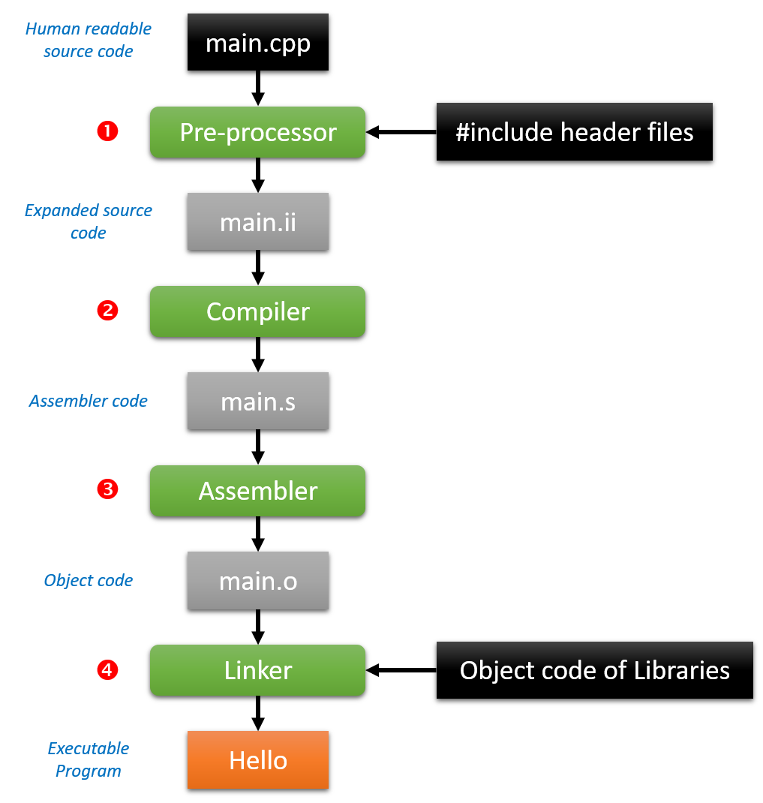

# The Compilation Process

<!-- TODO: Explain the linker more in-depth -->

Writing programs can be a fun thing to do. By expressing ourselves in a high-level language we can actually tell a computer or embedded system, which only understands low-level binary, what to do. This high-level language needs to be translated to binary processor instructions specific for the architecture the application will be running on. This is a job for compilers and interpreters.

Compiling source code (the high-level language) can be a very complex job, especially when your project starts to become big and complex. Modern IDE (Integrated Development Environments) such as Visual Studio and Eclipse have spoiled us a bit on this matter. However in the Linux and embedded world you do not always have these tools at your disposal. This is where makefiles can make our life's a little easier. Makefiles are textual files that tell a compiler how the source code has to be build into an executable program. This approach is also preferred as it allows for automated build processes and such.

While makefiles can be as complex as the projects they build, they are often generated or build step by step. In this chapter a brief introduction in makefiles is given.

## The C++ Compilation Process

Compiling a C++ source code file into an executable program is a four-step process. To compile for example a single `main.cpp` file containing a basic hello world application, one could use the `g++` command to compile it into an executable binary:

```bash
g++ -Wall -o Hello main.cpp -save-temps
```

`-Wall` tells the compiler to **show all warnings** as they may describe possible errors in your source code. If warnings are the only messages you get when you compile your source code, an executable will still be created. However it is good practice to fix the code to get no warnings or errors at all.

`-save-temps` tells the compiler to save all intermediate files to the compilation folder (pre-processed files, object files, ...).

In the example above the compilation process looks like this:



1. The C++ **preprocessor** copies the contents of the included header files into the source code file, generates macro code, and replaces symbolic constants defined using `#define` with their values. The output of this step is a "pure" C++ file without any pre-processor directives (which start with a `#`). It also adds special markers that tell the compiler where each line came from so that these can be used to produce sensible error messages. The "pure" source code files can be really huge. Even a simple hello world program is transformed into a file with about 11'000 lines of code.

2. The expanded source code file produced by the C++ pre-processor is fed to a compiler and **compiled** into the assembly language for the platform.

3. The assembler code generated by the compiler is **assembled** into the object code for the platform. Object files can refer to symbols that are not defined. This is the case when you use a declaration, and don't provide a definition for it. The compiler doesn't mind this, and will happily produce the object file as long as the source code is well-formed. Compilers usually let you stop compilation at this point. This is very useful because with it you can compile each source code file separately. The advantage this provides is that you don't need to recompile everything if you only change a single file. This will later integrate perfectly with makefiles.

4. The object code file generated by the assembler is **linked** together with the object code files for any library functions used to produce an executable file. It links all the object files by replacing the references to undefined symbols with the correct addresses. Each of these symbols can be defined in other object files or in libraries. If they are defined in libraries other than the standard library, you need to tell the linker about them. The output of the linker can be either a dynamic library or an executable.

## Difference between GCC and G++

Both `gcc` and `g++` are compiler-drivers of the 'GNU Compiler Collection' (which was once upon a time just the 'GNU C Compiler', but it eventually changed when more languages were added.).

::: tip GNU
GNU is an operating system and an extensive collection of computer software. GNU is composed wholly of free software, most of which is licensed under GNU's own GPL (General Purpose License).
GNU is a recursive acronym for "GNU's Not Unix!", chosen because GNU's design is Unix-like, but differs from Unix by being free software and containing no Unix code. The GNU project includes an operating system kernel, GNU HURD, which was the original focus of the Free Software Foundation (FSF). However, non-GNU kernels, most famously Linux, can also be used with GNU software; and since the kernel is the least mature part of GNU, this is how it is usually used. The combination of GNU software and the Linux kernel is commonly known as Linux (or less frequently GNU/Linux).
:::

The programs `gcc` and `g++` are not compilers, but really drivers that call other programs depending on what arguments you provide to them. These other programs include macro pre-processors (such as `cpp`), compilers (such as `cc1`), linkers (such as `ld`) and assemblers (such as `as`), as well as others, most of which are part of the GNU Compiler Collection (some are assumed to be on your system).

The actual compilers are `cc1` for C and `cc1plus` for C++.

Even though they automatically determine which compiler to call depending on the file-type, unless overridden with `-x` language flag, there are some important differences.

The main differences between `gcc` and `g++` are:

* `gcc` will compile: `.c/.cpp` files as C and C++ respectively.
* `g++` will compile: `.c/.cpp` files but they will all be treated as C++ files.
* Also if you use `g++` to link the object files, it automatically links in the std C++ libraries (`gcc` does not do this).
* `gcc` compiling C files has less predefined macros.
* `gcc` compiling .cpp and `g++` compiling `.c/.cpp` files has a few extra macros.

So basically, the most important difference is which libraries they link against by default.

`g++` is equivalent to `gcc -xc++ -lstdc++ -shared-libgcc` (the `-xc++` is a compiler option, while `-lstdc++` and `-shared-libgcc` are linker options).

### Compiling Hello World

A simple hello world example:

```cpp
// main.cpp
#include <iostream>

int main(void) {
  std::cout << "Hello world from C++" << std::endl;

  return 0;
}
```

Compiling this with `g++` results a fine working program:

```bash
g++ main.cpp -o hello
```

Running the `hello` binary results in

::: output
<pre>
Hello world from C++
</pre>
:::

Trying to do the same with `gcc` results in linking errors:

```bash
gcc main.cpp -o hello
/tmp/ccg5ztrG.o:main.cpp:(.text+0x21): undefined reference to `std::cout'
/tmp/ccg5ztrG.o:main.cpp:(.text+0x26): undefined reference to `std::basic_ostream&lt;char, std::char_traits&lt;char&gt; &gt;&amp; std::operator&lt;&lt; &lt;std::char_traits&lt;char&gt; &gt;(std::basic_ostream&lt;char, std::char_traits&lt;char&gt; &gt;&amp;, char const*)'
/tmp/ccg5ztrG.o:main.cpp:(.text+0x2d): undefined reference to `std::basic_ostream&lt;char, std::char_traits&lt;char&gt; &gt;&amp; std::endl&lt;char, std::char_traits&lt;char&gt; &gt;(std::basic_ostream&lt;char, std::char_traits&lt;char&gt; &gt;&amp;)'
/tmp/ccg5ztrG.o:main.cpp:(.text+0x34): undefined reference to `std::ostream::operator&lt;&lt;(std::ostream&amp; (*)(std::ostream&amp;))'
/tmp/ccg5ztrG.o:main.cpp:(.text+0x54): undefined reference to `std::ios_base::Init::~Init()'
/tmp/ccg5ztrG.o:main.cpp:(.text+0x75): undefined reference to `std::ios_base::Init::Init()'
collect2.exe: error: ld returned 1 exit status
```

However if we repeat the command but inform the linker to link in the standard C++ libraries all is well:

```bash
gcc main.cpp -lstdc++ -o hello
```

Conclusion: don't make your life more complex than needed and use `g++` to compile your C++ and C programs.

## Separate Compilation

One of the features of C and C++ that's considered a strength is the idea of "separate compilation". Instead of writing all the code in one file, and compiling that one file, C/C++ allows you to write many `.cpp` files and compile them separately. With few exceptions, most `.cpp` files have a corresponding `.h` file.

A `.cpp` usually consists of:

* the implementations of all methods in a class,
* standalone functions (functions that aren't part of any class),
* and global variables (usually avoided).

The corresponding `.h` file contains:

* class definition,
* function prototypes,
* and extern variables (again, for global variables).
* The purpose of the .h files is to export "services" to other .cpp files.

For example, suppose you wrote a `Vector` class. You would have an `.h` file which included the class definition. Suppose you needed a `Vector` in an `ArrayList` class. Then, you would write `#include "vector.h"`.

Why all the talk about how `.cpp` files get compiled in C++? Because of the way C++ compiles files, makefiles can take advantage of the fact that when you have many `.cpp` files, it's not necessary to recompile all the files when you make changes. You only need to recompile a small subset of the files. Back in the old days, a makefile was even more convenient as compiling was very slow. Therefore, having to avoid recompiling every single file meant saving a lot of time.

Although it's much faster to compile these days, it's still not very fast. If you begin to work on projects with hundreds of files, where recompiling the entire code can take many hours, you will still want a makefile to avoid having to recompile everything.
