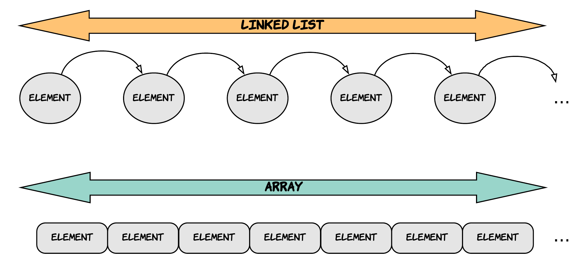
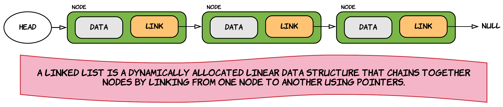

# Guide - Linked List

Like arrays, linked lists allow the **storage of data elements** of any data type in an sequential manner. Unlike arrays, the elements of a linked list are **not stored at contiguous locations in memory**, the **elements are linked one after another using pointers**.



::: tip Definition
A **linked list** is a dynamically allocated **linear data structure** that chains together **nodes** by **linking** from one node to another using pointers.
:::

The datatype of the elements of both arrays and linked lists is not important since essentially the same structure works to store elements of any type.

## A Closer Look

A linked list is a **linear data structure** where each element, called a **node**, is a separate object. In contrary to arrays, the nodes are **not stored at contiguous location**, because they are dynamically allocated as needed. The nodes of the linked lists are linked using pointers.



Each node of a list is made up of two items - the **data** and a **link to the next node**. The end of the list is denoted by making the last node point to `null`. The **entry point** into a linked list is called the **head of the list**. Important to understand is that  head is not a separate node, but the pointer to the first node. If the list is empty then the head contains the `null` value.

## Why Linked Lists are so Important

The concept of a linked list is important to learn for two reasons:

* First, linked lists are data structures that are **used in real life applications**. Understanding the strengths and weaknesses of such data structures is really important. These insights will give you an appreciation and deeper understanding of processing performance, memory consumption and other code issues.
* Secondly, linked lists are probable the **best way to learn about pointers**. In fact, you may never implement a linked list yourself in a real application, but you are sure to use pointers. Linked list problems are a good combination of algorithms and pointer manipulations. Traditionally, linked lists have been the domain where beginning programmers get the practice to really understand pointers.

## Linked Lists vs Arrays

Arrays are by far the most common data structure used to store collections, available in practically any programming language. They are **easy to create** and offer an easy to use **indexing mechanism** using square brackets `[]` allowing **direct access to any element**. The **elements are stored sequentially** in a contiguous block of memory.

Arrays are however not all sunshine and rainbows. They also have some disadvantages:

* The **size of an array is fixed** and most often specified at compilation time. Of course there are ways to use dynamic memory to create larger arrays on the fly, but these operations are very expensive in terms of processing time and memory consumption.
* The fact that arrays are fixed in size, leads to programmers making arrays "large enough". This often leads to a **lot of wasted memory space**. On top of that, if ever the need arrises for the array to be just a little larger, than the program crashes if this was not foreseen by the programmer. A surprising amount of
commercial code has this sort of naive array allocation which wastes space most of the time and crashes for special occasions.
* **Inserting elements towards the front of an array is expensive in terms of processing time.** This is an operation that is required when for example adding a value to an array where the elements are ordered. All the elements after the newly inserted element have to be moved 1 place towards the end of the array. Removing elements from an array has a similar disadvantage as elements have to be moved to close the gap.

Arrays and linked lists have a lot in common as they are both linear data structures, that allow storage of elements of any given data type. Linked lists have their own strengths and weaknesses, but they happen to be strong where arrays are weak. While arrays store elements in a sequential manner in a contiguous block of memory, linked lists use an entirely different strategy. Linked lists allocate memory for an element when requested and free the allocated memory when the element is removed. This means that they can grow dynamically and elements can almost be added indefinitely.

Linked lists however also have some drawbacks:

* Random access is not possible. Elements have to accessed sequentially starting from the first node.
* While an array only stores the actual data in memory, a linked list adds the overhead of a pointer to the next element for each node.
* Arrays have better cache locality that can make a pretty big difference in performance.

## Implementation in C++

A linked list is represented by a pointer to the first node of the linked list. The first node is called the head. If the linked list is empty, then the value of the head is `null`.

Each node in a list consists of at least two parts:

1. the actual data
2. a pointer to the next node

Let us create a basic implementation of a linked list where we store characters as data. Later on we'll switch to storing objects and kick the pointer-usage in overdrive.

## The Node class

Allowing a `Node` object to store data of type `char` and point to the `next` element will require the basic interface shown in the next UML diagram. A getter and setter method are provided for the `next` node. This will allow the nodes to be reorganized in the actual list as will be required for adding or removing elements in the actual linked list.


This leads to the following header file in C++:

```cpp
// node.h
#pragma once
#include <string>

namespace LinkedListWithChars {
  class Node {

    // Constructors
    public:
      Node(char data);

    // Methods
    public:
      void set_next(Node * next);

    public:
      char get_data(void);
      Node * get_next(void);

    public:
      std::string to_string(void);

    // Attributes
    private:
      char data;
      Node * next = nullptr;
  };
};
```

Important to note is that the `next` pointer should always point to a valid `Node` or to `nullptr` (nothing), indicating the end of the linked list.

Also no setter is provided for the data. This because the data is taken in via the constructor of the `Node` class. Changing the actual data will require that the `Node` be replaced.

Time to add the actual implementation of the methods.

```cpp
// node.cpp
#include "node.h"

namespace LinkedListWithChars {

  Node::Node(char data) {
    this->data = data;
  }

  void Node::set_next(Node * next) {
    this->next = next;
  }

  char Node::get_data(void) {
    return data;
  }

  Node * Node::get_next(void) {
    return next;
  }

  std::string Node::to_string(void) {
    return std::string("[ data: '") + data + "', next: "
      + (next ? "Node" : "null") + "]";
  }

};
```

Most of this code is pretty straight-forward. Maybe a small note is require on the implementation of the `to_string()` method. Notice the explicit creation of an `std::string` object using `std::string("[ data: '")`. This is require because otherwise C++ treats all the strings as `null-terminated character arrays` (C-style strings) and doesn't want to concatenate the different parts together. This can be circumvented by explicitly turning one of the C-style strings into an `std::string` object.

If you hover over one of the string literals, VSCode will tell you what the type is:


Notice that the array is 1 element bigger than the actual number of characters. That is because the string is terminated using a null-termination character `\0`. This occupies an extra space at the end of the array. This element allows C and C++ to detect the end of the string.

Let us test it using a simple main:

```cpp
#include <iostream>
#include "lib/node.h"

using namespace std;

int main() {
  cout << "Welcome to Linked List with chars ..." << endl;

  LinkedListWithChars::Node head('a');

  cout << "Node: " << head.to_string() << endl;

  return 0;
}
```

::: codeoutput
<pre>
Welcome to Linked List with chars ...
Node: [ data: 'a', next: null]
</pre>
:::

This implementation is just a start and by not considered finished. It may be extended or adopted as this example progresses.

## Big O Comparison of Arrays versus Linked Lists

<!-- TODO: Add description -->

| Operation | Dynamic Array | Linked List |
| --- | --- | --- |
| Indexing | Θ(1) | Θ(n) |
| Insert/Delete at beginning | Θ(n) | Θ(1) |
| Insert/Delete at end | Θ(1) | Θ(1) if tail is tracked<br>Θ(n) if tail is not tracked |
| Insert/Delete at middle | Θ(n) | search time + Θ(1) |

<!-- Source: https://en.wikipedia.org/wiki/Linked_list#Linked_lists_vs._dynamic_arrays -->
