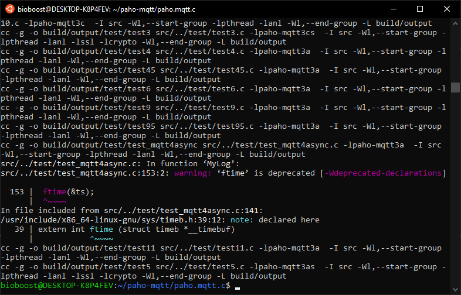
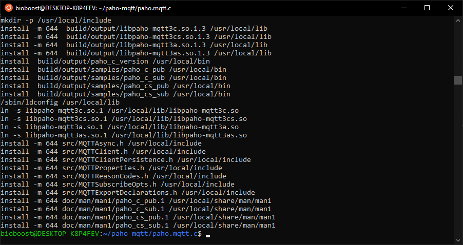
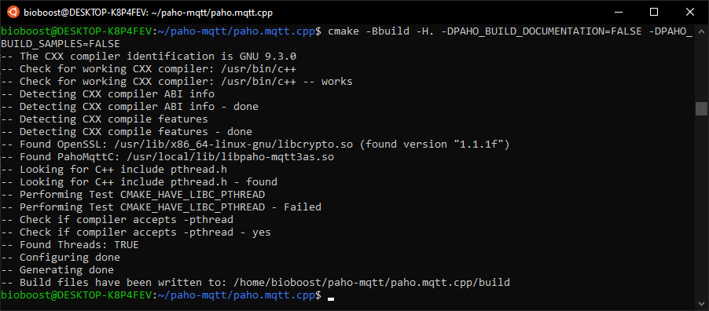
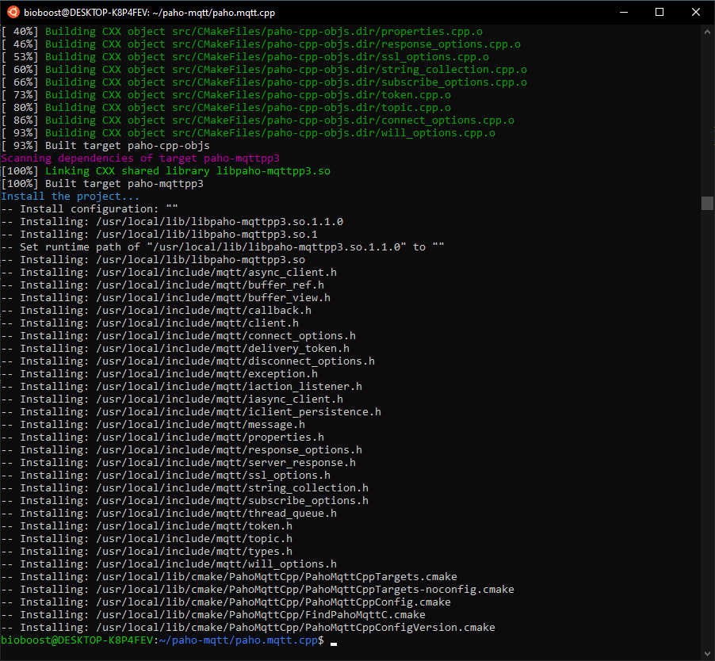
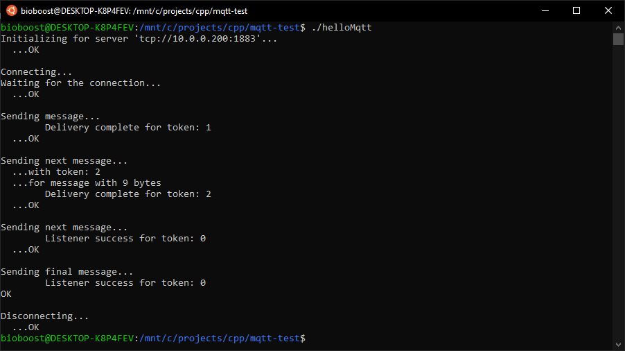

# MQTT

MQTT is an open OASIS and ISO standard lightweight, publish-subscribe network protocol that transports messages between devices. The protocol usually runs over TCP/IP; however, any network protocol that provides ordered, lossless, bi-directional connections can support MQTT.

This chapter will explain how to compile and use the Paho MQTT libraries.

## Libraries

To enable the powerfull yet light-weight messaging protocol we will require the Eclipse Paho MQTT C++ Client Library which can be found at [https://github.com/eclipse/paho.mqtt.cpp](https://github.com/eclipse/paho.mqtt.cpp).

However this library requires the Eclipse Paho C Client Library for the MQTT Protocol which in term can be found at [https://github.com/eclipse/paho.mqtt.c](https://github.com/eclipse/paho.mqtt.c).

Both libraries will need to be compiled before we can make use of them.

## Native Windows

At the moment it is not possible to compile the library for Windows using a normal GCC compiler.

## Windows Subsystem for Linux 2

The Windows Subsystem for Linux lets developers run a GNU/Linux environment -- including most command-line tools, utilities, and applications -- directly on Windows, unmodified, without the overhead of a traditional virtual machine or dual-boot setup.

::: warning App runs on Linux
Do note that while you are developing the app on your Windows machine, you are compiling and running it on Linux. This means that some Windows specific libraries/headers are not available.
:::

To setup WSL 2, if you haven't done so already, you can follow the guide of Microsoft: [https://docs.microsoft.com/en-us/windows/wsl/install-win10](https://docs.microsoft.com/en-us/windows/wsl/install-win10). Take it slow and make sure to read it carefully before executing the commands.

Install **Ubuntu 20.04 LTS** and setup an account.

::: tip Accessing Files
Your Windows file system is available in Linux distro via `/mnt/` where are all drives will be mounted by their Windows letter.
:::

From now on all commands should be executed inside Linux, unless specified otherwise.

Before starting make sure your system is up-to-date:

```bash
sudo apt update
sudo apt upgrade
```

### Compiling the Eclipse Paho C Client Library for the MQTT Protocol library

Start by installing the dependencies to allow for compilation of the library.

```bash
sudo apt update
sudo apt install git build-essential gcc make cmake cmake-gui cmake-curses-gui libssl-dev
```

Next clone the GitHub repository. It's best to use a release version of the source code instead of the current master branch. For this we ill checkout the `v1.3.6` release and build this.

```bash
mkdir paho-mqtt && cd paho-mqtt
git clone https://github.com/eclipse/paho.mqtt.c.git
cd paho.mqtt.c
git checkout v1.3.6
```

This library can be compiled on many systems and has a lot of configuration options available for building, but since we are on a standard distro and using the default built tools all we need to do is execute the `make` command.

```bash
make
```

You may receive some warnings but there should be no compile errors:



If all went well it's time to "install" the libraries so they become available system wide when compiling applications that use them or when running an application that needs them.

::: tip Dynamic / Shared Library
The library is default configured to be compiled as a dynamically shared library. This basically means that the library needs to be made available on the system it is being used on. So the people who want to run your app are also required to install the library.
:::

```bash
sudo make install
sudo ldconfig
```

If all went well you should get similar output and no errors.



The Paho C client comprises four shared libraries:

* libmqttv3a.so - asynchronous
* libmqttv3as.so - asynchronous with SSL
* libmqttv3c.so - "classic" / synchronous
* libmqttv3cs.so - "classic" / synchronous with SSL

You can check if the libraries are correctly installed by using the following command:

```bash
ldconfig -p | grep mqtt
```

::: output
<pre>
libpaho-mqtt3cs.so.1 (libc6,x86-64) => /usr/local/lib/libpaho-mqtt3cs.so.1
libpaho-mqtt3cs.so (libc6,x86-64) => /usr/local/lib/libpaho-mqtt3cs.so
libpaho-mqtt3c.so.1 (libc6,x86-64) => /usr/local/lib/libpaho-mqtt3c.so.1
libpaho-mqtt3c.so (libc6,x86-64) => /usr/local/lib/libpaho-mqtt3c.so
libpaho-mqtt3as.so.1 (libc6,x86-64) => /usr/local/lib/libpaho-mqtt3as.so.1
libpaho-mqtt3as.so (libc6,x86-64) => /usr/local/lib/libpaho-mqtt3as.so
libpaho-mqtt3a.so.1 (libc6,x86-64) => /usr/local/lib/libpaho-mqtt3a.so.1
libpaho-mqtt3a.so (libc6,x86-64) => /usr/local/lib/libpaho-mqtt3a.so
</pre>
:::

### Compiling the Eclipse Paho MQTT C++ Client Library

This code builds a library which enables C++11 applications to connect to an MQTT broker, publish messages to the broker, and to subscribe to topics and receive published messages.

Start by installing the dependencies to allow for compilation of the library.

```bash
sudo apt update
sudo apt install git build-essential gcc make cmake cmake-gui cmake-curses-gui libssl-dev
```

Next clone the GitHub repository. Normally it would be best to checkout a stable version but apparently there is a bug in the `v1.1` that makes the library incompatible with the later releases of the C library. At the moment of this writing, the commit `076fc9977d07c25fa9fef1e19026d8be069c8e94` has been tested and works perfectly fine.

```bash
cd ~/paho-mqtt
git clone https://github.com/eclipse/paho.mqtt.cpp.git
cd paho.mqtt.cpp
git checkout 076fc9977d07c25fa9fef1e19026d8be069c8e94
```

For the C++ library GNU Make and autotools were deprecated and removed in the v1.1 release. CMake is a cross-platform build system suitable for Unix and non-Unix platforms such as Microsoft Windows. It is now the only supported build system. On *nix systems CMake creates Makefiles.

This means in contrary to the C-library, the build setup first needs to be configured.

```bash
cmake -Bbuild -H. -DPAHO_BUILD_DOCUMENTATION=FALSE -DPAHO_BUILD_SAMPLES=FALSE
```



Time to build and install the library.

```bash
sudo cmake --build build/ --target install
sudo ldconfig
```



You can check if the libraries are correctly installed by using the following command:

```bash
ldconfig -p | grep mqttpp
```

::: output
<pre>
libpaho-mqttpp3.so.1 (libc6,x86-64) => /usr/local/lib/libpaho-mqttpp3.so.1
libpaho-mqttpp3.so (libc6,x86-64) => /usr/local/lib/libpaho-mqttpp3.so
</pre>
:::

### Testing it all

In the C++ repository you will find a directory `src/samples` where some examples can be found. Some more complex than others.

The basic example `async_publish.cpp` should work almost out-of-the-box. Just copy the file to `main.cpp` and change the broker in `line 43` from `localhost` to `labict.be`. Now you should be able to compile the app.

::: tip Developing with WSL2
Just create a directory for the project on your Windows machine, for example `C:\cpp_projects\mqtt` and traverse to on your Ubuntu VM via `/mnt/c/cpp_projects/mqtt`. You can compile there and run the app, and code using VSCode in Windows.
:::

```bash
g++ main.cpp -lpaho-mqttpp3 -lpaho-mqtt3a -o helloMqtt
```

The `-l` flags tells the linker to include the `paho-mqtt3a` and `paho-mqttpp3` libraries when linking the final application.



## Linux

Well basically you just need to follow the [WSL guide](#windows-subsystem-for-linux-2) without the need for installing Windows and WSL :).

## Simple MQTT Library

If you wish you can make use of my Simple MQTT Library which hides a lot of the complexity of the C++ MQTT library.

Feel free to use it inside your projects. There is even a nice example included.

You can find it at [https://github.com/BioBoost/simple_mqtt_client](https://github.com/BioBoost/simple_mqtt_client).
