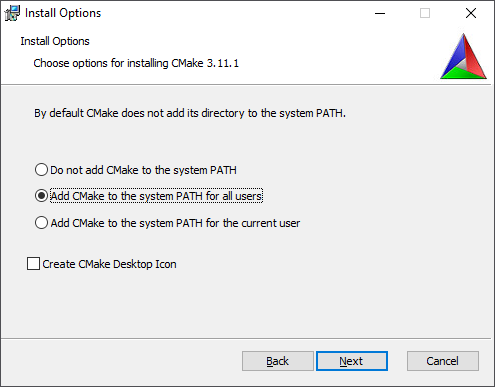
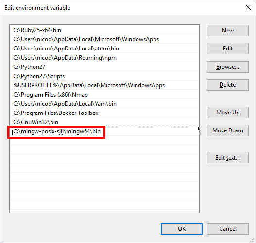
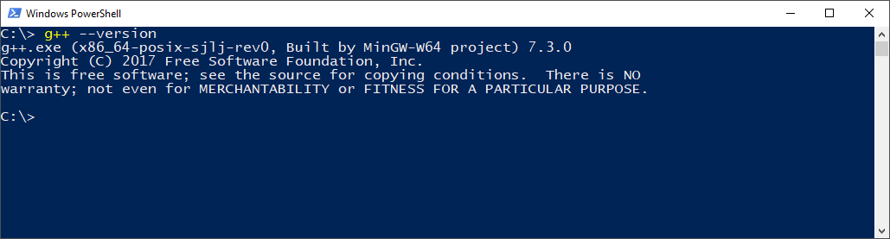
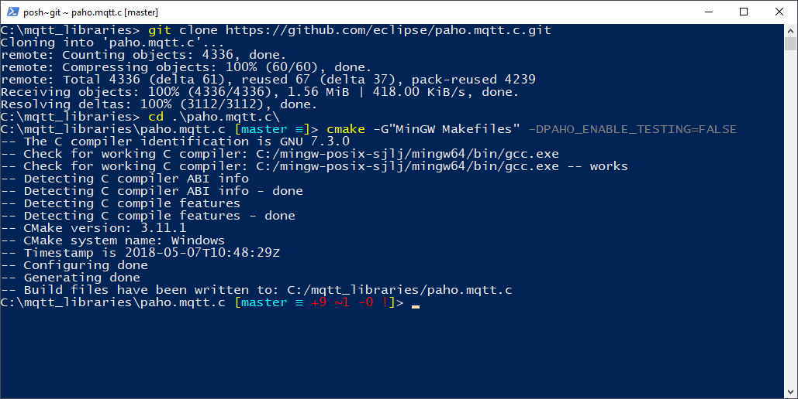

# Hands on MQTT

This chapter will explain how to compile and use the Paho MQTT libraries.

## For Windows

### CMake

CMake is an open-source, cross-platform family of tools designed to build, test and package software. CMake is used to control the software compilation process using simple platform and compiler independent configuration files, and generate native makefiles and workspaces that can be used in the compiler environment of your choice.

Navigate to [https://cmake.org/download/](https://cmake.org/download/) and download the latest version. Make sure to add it to the PATH environment when asked. Otherwise you will be able to use it as a command line tool from PowerShell.



### Make for Windows

Next you need to install the make utility for Windows. Download the complete package without sources at [http://gnuwin32.sourceforge.net/packages/make.htm](http://gnuwin32.sourceforge.net/packages/make.htm).

### MinGW compiler with POSIX Thread Support

The default MinGW compiler has no support for threads on Windows. There is however an alternative MinGW compiler that does include support for threads. Download the latest version at [https://sourceforge.net/projects/mingw-w64/files/Toolchains%20targetting%20Win32/Personal%20Builds/mingw-builds/](https://sourceforge.net/projects/mingw-w64/files/Toolchains%20targetting%20Win32/Personal%20Builds/mingw-builds/). Make sure to pick the "x86_64-posix-sjlj" compiler.

Download the compressed archive and extract it directly (using 7Zip or similar) to your C-drive. Rename the directory to `mingw-posix-sjlj`. `mingw64` should be directly below this directory.

Next add `C:\mingw-posix-sjlj\mingw64\bin` to your system environment path.



Check the rest of your include paths. Make sure no other MinGW compiler is included in the path.

Next open a PowerShell and verify that the correct compiler is called.



### Libraries directory

Before continuing, create a directory `mqtt_libraries` directly under your C-drive. Open a PowerShell inside the directory.

### Compiling the C libraries

First we need to compile the Paho MQTT C libraries because these are needed by the C++ libraries.

Navigate to [https://github.com/eclipse/paho.mqtt.c](https://github.com/eclipse/paho.mqtt.c) and clone the latest version below the `mqtt_libraries` directory.

```shell
cd C:\mqtt_libraries
git clone https://github.com/eclipse/paho.mqtt.c.git
cd paho.mqtt.c
```

Next we need to generate makefiles for MinGW using CMake so we can compile the libraries. Issue the following command to generate these makefiles:

```shell
cmake -G"MinGW Makefiles" -DPAHO_ENABLE_TESTING=FALSE .
```



You should now be able to compile the libraries using the `make` command.


Make sure it does not generate any errors. Warnings you can ignore.

The compiled libraries are now available at `C:\mqtt_libraries\paho.mqtt.c\src`. We need to copy the dll's to the `lib` directory of the compiler so it can find them. Do this by executing the command below:

```shell
cp src/*.dll C:/mingw-posix-sjlj/mingw64/lib
```

<!-- Is this the correct directory to use ? -->

### Compiling the C++ libraries

Next we need to compile the C++ libraries. The process is very similar to the C libraries with a few minor differences.

Navigate to [https://github.com/eclipse/paho.mqtt.cpp](https://github.com/eclipse/paho.mqtt.cpp) and clone the latest version below the `mqtt_libraries` directory.

```shell
cd C:\mqtt_libraries
git clone https://github.com/eclipse/paho.mqtt.cpp.git
cd paho.mqtt.cpp
```

Next we need to generate makefiles for MinGW using CMake so we can compile the libraries. This time we also need to state where the C libraries can be found. Issue the following command to generate these makefiles:

```shell
cmake -G"MinGW Makefiles" -DPAHO_MQTT_C_PATH="..\paho.mqtt.c" .
```

You should now be able to compile the libraries using the `make` command.


Make sure it does not generate any errors. Warnings you can ignore.

The compiled library is now available at `C:\mqtt_libraries\paho.mqtt.cpp\src`. We need to copy the static library file to the `lib` directory of the compiler so it can find it. Do this by executing the command below:

```shell
cp C:\mqtt_libraries\paho.mqtt.cpp\src\libpaho-mqttpp3.a C:\mingw-posix-sjlj\mingw64\lib
```