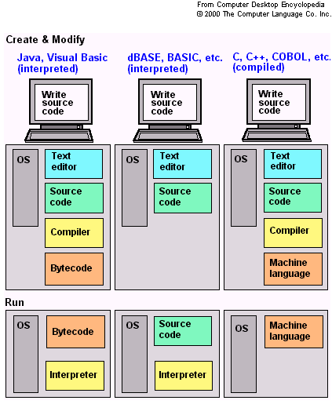
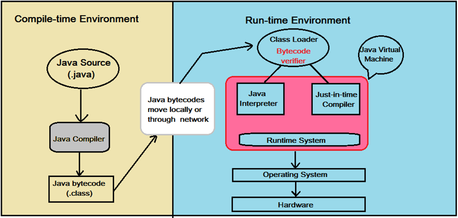
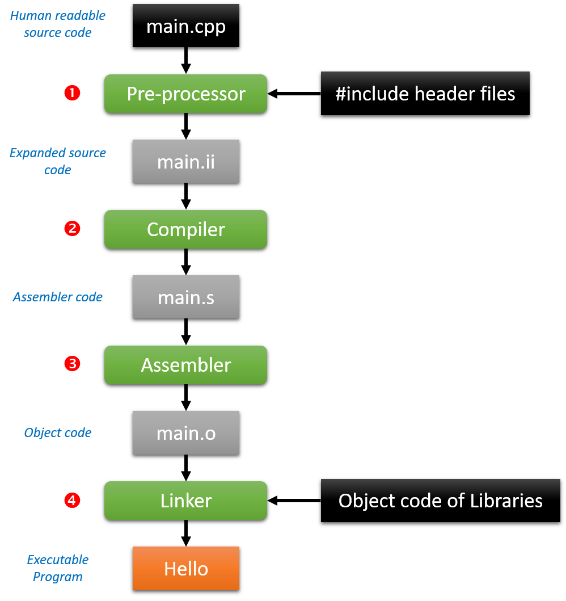

<!-- toc -->

# Hello Universe

A "Hello, World!" program is a computer program that outputs or displays "Hello, World!" to the user. Being a very simple program in most programming languages, it is often used to illustrate the basic syntax of a programming language for a working program.[1] It is often the very first program people write when they are new to the language.

![Hello World [^1]](img/hello_world.jpg)

[^1]: Source https://www.haikudeck.com/test-deck-uncategorized-presentation-0b3abf30c5

A "Hello, world!" program is often used to introduce novice programmers to a programming language. In general, it is simple enough to be understood easily, especially with the guidance of a teacher or a written guide.

In addition, "Hello world!" can be a useful sanity test to make sure that a language's compiler, development environment, and run-time environment are correctly installed. Configuring a complete programming toolchain from scratch to the point where even trivial programs can be compiled and run can involve substantial amounts of work. For this reason, a simple program is used first when testing a new tool chain.

"Hello world!" is also used by computer hackers as a proof of concept that arbitrary code can be executed through an exploit where the system designers did not intend code to be executed—for example, on Sony's PlayStation Portable. This is the first step in using homemade content ("home brew") on such a device.

![Hello World on PSP [^2]](img/psp_hello_world.jpeg)

[^2]: Source https://en.wikipedia.org/wiki/%22Hello,_World!%22_program

## Hello World

Let's jump right in and create our "Hello World" application in C++.

Open Code::Blocks and create a new Project using the "Console application" template.

It will automatically generate a "Hello World" application with the code shown below. Compile and execute it.

```c++
#include <iostream>

using namespace std;

int main()
{
    cout << "Hello world!" << endl;
    return 0;
}
```

The default compiler for Code::Blocks is GNU GCC Compiler.

> #### Info::"GNU"
>
> GNU is an operating system and an extensive collection of computer software. GNU is composed wholly of free software, most of which is licensed under GNU's own GPL (General Purpose License).
>
> GNU is a recursive acronym for "GNU's Not Unix!", chosen because GNU's design is Unix-like, but differs from Unix by being free software and containing no Unix code. The GNU project includes an operating system kernel, GNU HURD, which was the original focus of the Free Software Foundation (FSF). However, non-GNU kernels, most famously Linux, can also be used with GNU software; and since the kernel is the least mature part of GNU, this is how it is usually used. The combination of GNU software and the Linux kernel is commonly known as Linux (or less frequently GNU/Linux).

## Compilers and Interpreters

Writing programs can be a fun thing to do. By expressing ourselfes in a high-level language we can actually tell a computer or embedded system, which only understands low-level binary, what to do. This high-level language does have to be translated to binary processor instructions specific for the architecture we are going to run the program on. This is a job for compilers and interpreters.

Compiling source code (the high-level language) can be a very complex job, especially when your project starts to become big and complex. Modern IDE (Integrated Development Environments) such as Code::Blocks, Visual Studio and Eclipse have spoiled us a bit on this matter.

We generally write a computer program using a high-level language. A high-level language is one which is understandable by us humans. It contains words and phrases from the English (or other) language. But a computer does not understand high-level language. It only understands program written in 0's and 1's in binary, called the machine code. A program written in high-level language is called a source code. We need to convert the source code into machine code and this is accomplished by compilers and interpreters. Hence, a compiler or an interpreter is a program that converts program written in high-level language into machine code understood by the computer.

In computer science, an interpreter is a computer program that directly executes, i.e. performs, instructions written in a programming or scripting language, without previously compiling them into a machine language program. An interpreter generally uses one of the following strategies for program execution:

* parse the source code and perform its behavior directly.
* translate source code into some efficient intermediate representation and immediately execute this.
* explicitly execute stored precompiled code made by a compiler which is part of the interpreter system.

While interpretation and compilation are the two main means by which programming languages are implemented, they are not mutually exclusive, as most interpreting systems also perform some translation work, just like compilers.

> #### Note::Just-in-time compilation
>
> Further blurring the distinction between interpreters, byte-code interpreters and compilation is just-in-time compilation (JIT), a technique in which the intermediate representation is compiled to native machine code at runtime. This confers the efficiency of running native code, at the cost of startup time and increased memory use when the bytecode or AST is first compiled. Adaptive optimization is a complementary technique in which the interpreter profiles the running program and compiles its most frequently executed parts into native code. Both techniques are a few decades old, appearing in languages such as Smalltalk in the 1980s.
>
> Just-in-time compilation has gained mainstream attention amongst language implementers in recent years, with Java, the .NET Framework, most modern JavaScript implementations, and Matlab now including JITs.


| Compiler | Interpreter|
|----------|------------|
| Compiler works on the complete program at once. It takes the entire program as input. | Interpreter program works line-by-line. It takes one statement at a time as input.|
| Compiler generates intermediate code, called the object code or machine code. | Interpreter does not generate intermediate object code or machine code. |
| Compiler executes conditional control statements (like if-else and switch-case) and logical constructs faster than interpreter. | Interpreter execute conditional control statements at a much slower speed. |
| Compiled programs take more memory because the entire object code has to reside in memory. | Interpreter does not generate intermediate object code. As a result, interpreted programs are more memory efficient. |
| Compile once and run anytime. Compiled program does not need to be compiled every time. | Interpreted programs are interpreted line-by-line every time they are run. |
| Errors are reported after the entire program is checked for syntactical  and other errors. | Error is reported as soon as the first error is encountered. Rest of the program will not be checked until the existing error is removed. |
| A compiled language is more difficult to debug. | Debugging is easy because interpreter stops and reports errors as it encounters them. |
| Compiler does not allow a program to run until it is completely error-free. | Interpreter runs the program from first line and stops execution only if it encounters an error. |
| Compiled languages are more efficient but difficult to debug. | Interpreted languages are less efficient but easier to debug. This makes such languages an ideal choice for new students. |
| Examples of programming languages that use compilers: C,  C++, COBOL | Examples of programming languages that use interpreters: BASIC, Visual Basic, Python, Ruby, PHP, Perl, MATLAB, Lisp |



### Java is Both a Compiled and Interpreted Language

Java is both a compiled and interpreted language. When you write a Java program, the javac compiler converts your program into something called bytecode. All the Java programs run inside a JVM (Java Virtual Machine; the secret behind Java being cross-platform language). Bytecode compiled by javac, enters into JVM memory and there it is interpreted by another program called java. This java program interprets bytecode line-by-line and converts it into machine code to be run by the JVM. Following flowchart shows how a Java program executes.




## The C++ Compilation Process

Compiling a C++ source code file into an executable program is a four-step process.

1. The C++ **preprocessor** copies the contents of the included header files into the source code file, generates macro code, and replaces symbolic constants defined using #define with their values. The output of this step is a "pure" C++ file without any pre-processor directives (start with a #). It also adds special markers that tell the compiler where each line came from so that these can be used to produce sensible error messages. The "pure" source code files can be really huge. Even a simple hello world program is transformed into a file with about 11'000 lines of code.

2. The expanded source code file produced by the C++ pre-processor is fed to a compiler and **compiled** into the assembly language for the platform.

3. The assembler code generated by the compiler is **assembled** into the object code for the platform. Object files can refer to symbols that are not defined. This is the case when you use a declaration, and don't provide a definition for it. The compiler doesn't mind this, and will happily produce the object file as long as the source code is well-formed. Compilers usually let you stop compilation at this point. This is very useful because with it you can compile each source code file separately. The advantage this provides is that you don't need to recompile everything if you only change a single file.

4. The object code file generated by the assembler is **linked** together with the object code files for any library functions used to produce an executable file. It links all the object files by replacing the references to undefined symbols with the correct addresses. Each of these symbols can be defined in other object files or in libraries. If they are defined in libraries other than the standard library, you need to tell the linker about them. The output of the linker can be either a dynamic library or an executable.



### Separate Compilation

One of the features of C and C++ that's considered a strength is the idea of "separate compilation". Instead of writing all the code in one file, and compiling that one file, C/C++ allows you to write many .cpp files and compile them separately. With few exceptions, most .cpp files have a corresponding .h file.

A .cpp usually consists of:

* the implementations of all methods in a class,
* standalone functions (functions that aren't part of any class),
* and global variables (usually avoided).

The corresponding .h file contains

* class declarations,
* function prototypes,
* and extern variables (again, for global variables).
* The purpose of the .h files is to export "services" to other .cpp files.

For example, suppose you wrote a Vector class. You would have a .h file which included the class declaration. Suppose you needed a Vector in a MovieTheater class. Then, you would `#include "vector.h`.

Why all the talk about how .cpp files get compiled in C++? Because of the way C++ compiles files, IDE's can take advantage of the fact that when you have many .cpp files, it's not necessary to recompile all the files when you make changes. You only need to recompile a small subset of the files. Back in the old days compiling was slow, and therefore, having to avoid recompiling every single file meant saving a lot of time.

Although it's much faster to compile now, it's still not very fast. If you begin to work on projects with hundreds of files, where recompiling the entire code can take many hours, you will still want to avoid having to recompile everything.
