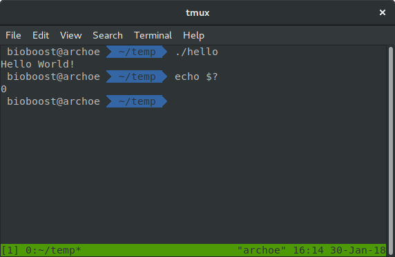

## Code Analysis

Below is a small analysis of the "Hello World" application. It will get you familiarized with the syntax of C++ and will serve as a starting point for almost every application you will ever create in C++.

```c++
#include <iostream>

using namespace std;

int main() {
  // Display Hello World! in the terminal
  cout << "Hello World!" << endl;

  return 0;
}
```

Lines beginning with a hash sign `#` are called **pre-processor directives**. These lines are processed by an application that is run before the actual code compiler. In this case, the directive `#include <iostream>`, instructs the preprocessor to include a standard C++ header file called `iostream`. It is part of the standard C++ library and allows the rest of the code to perform standard input and output operations, such as writing the output of this program (Hello World) to the terminal.

As in most programming languages, whitespace such as newlines, tabs and spaces have no effect on the code itself as long as they are not placed within variable names or C++ keywords. C++ is also a programming language that is **case sensitive**, meaning that `this` is not the same as `This` or `THIS`.

If you have seen C++ code before, you may have seen cout being used instead of `std::cout`. Both name the same object: the first one uses its unqualified name `cout`, while the second qualifies it directly within the namespace `std` as `std::cout`. `cout` is part of the standard library, and all the elements in the standard C++ library are declared within what is called a namespace. In this case the namespace is called `std` which is short for standard.

In order to refer to the elements in the `std` namespace a program must either qualify each and every use of elements of the library (by prefixing the elements with `std::`), or introduce visibility of its components. The most typical way to introduce visibility of these components is by means of using declarations: `using namespace std;`

`int main()` declares a function called `main`. The main function of a C++ application is also called the **entry point** of the application. The execution of all C++ programs begins with the main function, regardless of where the function is actually located within the code.

Essentially, a function is a block of statements that are grouped by a name, in this case `main`. The return type of the main function is `int`, short for integer, stating that the function returns an integral value upon completion. This also explains the `return 0` statement at the end of the function block. Applications are always terminated with an integral value that represents the state with which the application was terminated. A value different from `0` indicates that something has gone wrong. If you execute your application via a terminal such as `Bash` or `PowerShell` you can display the status code (the value returned by the main function in this case) by executing the command `echo $?`.



Optionally the main function can be declared to take arguments from the command line (declared between the parentheses `()`). This will however be discussed later on in this course.

The open brace `{` indicates the beginning of statement block, in this case the **function definition**. The closing brace `}` indicates the end of a statement block. Everything between these braces is called the body of the function and defines what happens when the function is called. All functions use braces to indicate the beginning and end of their definitions.

Two forward slash signs `//` indicate that the rest of the line is a **comment**. Comments have no effect on the behavior of the application. They are actually ignored by the compiler. Often programmers insert comments to describe certain pieces of code or to explain their decisions.


The line `cout << "Hello World!" << endl;` is called a C++ **statement**. A statement is an expression that can actually produce some effect. This will not always be visual output. The statements specify the actual behavior of the application. Statements are executed in the same order that they appear.

This statement has three parts:
* `cout`, which identifies the standard character output device (usually, this is the computer screen).
* The insertion operator `<<`, which indicates that what follows is inserted into `cout`.
* A text sentence within quotes ("Hello world!"), being the content inserted into the standard output. In this case a string (denoted by the double quotes).

Notice that the statement ends with a semicolon `;`. This character marks the end of the statement (that is why it is called the a statement terminator). All C++ statements must end with a semicolon character. One of the most common syntax errors in C++ is forgetting to end a statement with a semicolon.
