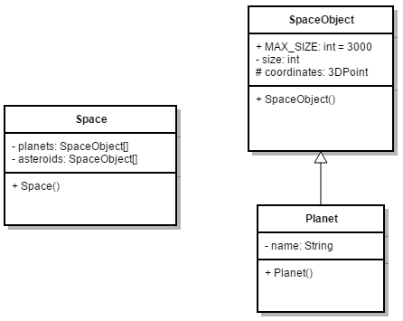
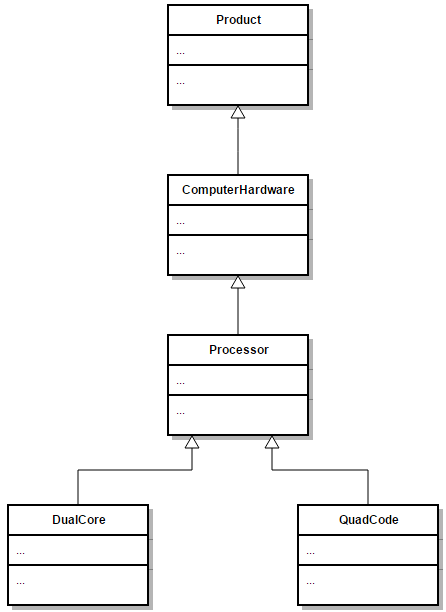

<!-- toc -->

# Inheritance

One of the best features of an object oriented programming language are the abilities for code reuse.
Programmers are generally lazy in the way that they hate to repeat themselves or do things twice.

> #### Warning::Copy paste is not reuse
>
> For all you copy-paste fanatics out there, copying code from one place to another
> is not considered code reuse. If the original code is ever extended, changed or corrected,
> chances are that you will forget to alter one of the copies.

As with most in an OOP language, the solution revolves around the class. Instead of creating classes
from scratch we can use existing ones and extend or embed them with our classes. The main advantages of this
approach is that:
* we reuse code that has been tested and debugged
* code is not duplicated
* classes can be kept small and thus more manageable

The trick is to use the classes without soiling the existing code.
There are two ways to accomplish this and one has already been discussed in this course.

The first approach is to create objects of the already existing class inside the class you are developing.
This is called **composition** as the new class is composed of objects of existing classes.

The second approach is to create a new class as a subtype of an existing class. You literally
take the form of an existing class and extend it, and this without modifying the existing class.
This is called **Inheritance** and it is one of the cornerstones of an object oriented programming language.

## A wargame as an example

Let us start based on an example game. Imagine you get the assignment to create a simple game
where a player can manage an army base, where they can build tanks and other gears of war. They can then use these to fight other players (could be computer controlled AI).

As an example we will take a closer look at the modeling of some possible classes in this game. As we are just starting out with this game, we start easy and only implement parts as needed.

To start of we create a *Tank* class and a *Soldier* class. The UML diagrams of both classes are depicted below.


For the Tank class we define the properties *health*, *numberOfShells* and *gunCalibre*.

All attributes are initialized to default values inside the default constructor. Some setters are adding to allow the Tank to resupply and repair. Getters allow access to the attributes to be displayed in some sort of interface.

Since only two classes are available, two fight methods (overloading) are added so a Tank can fight a Tank and a Tank can fight a Soldier.


For the Soldier class we define the properties *health* and *numberOfBullets*.

All attributes are initialized to default values inside the default constructor. Some setters are adding to allow the Soldier to resupply and heal. Again all attributes can be accessed via getters.

Two overloaded fight methods allow the Soldier to initiate a fight with another Soldier or Tank.

In both classes the *to_string()* is mainly for debugging and logging.

Even when your programming experience is still not that great, you might feel that there are a couple of things that feel wrong about these models. This will be fixed as we advance through this chapter. Some questions you need to ask yourself:
* Is this code DRY?
* What if we added other gears of wars? Or other types of soldier and tanks?
* What about the fight methods?

## Code always changes

Something to remember is that code evolves. It changes over time as things get added, removed or refactored. Static code will eventually become outdated and die. On top of that your boss, client, teacher, ... will never tell you the whole story. Once they get the first prototype, and they like it, there will always a "would it be possible to add a ..." moment. That is also why it is also more fun to program based on methodologies such as SCRUM and Agile as they take the fact of change into account.

So let's take the game example from the previous section as an example. You created the *Tank* and *Soldier* class after which your boss shows up and tells you to add an identifier to the Soldier and Tank classes to be able to save them in a database. This means you need to change both classes as shown in the following UML class diagrams.


Note that the id is not added as an argument to the constructor of the classes. This because of the assumption that most of the time the id will be generated based on the ones that are already taken. On top of the attribute a getter methods is also supplied for the id.

Notice that we had to change two classes to add an id attribute and a getter. We actually also need to change the implementation of the constructor to generate an id based on the ones already taken. And if we are not careful we might forget to change the `to_string()` implementation.

It should feel awkward to change two classes for a single change based on a single property. And what if we had like 10, 20 or a 100 sorts of army weapons. It would be a days work to add such a simple change to our game.

Let's be lazier but smarter programmers and take another approach to this problem.

## Introducing inheritance

The extension of the classes with an id can be easily solved (literally minutes, even with 100 different types of vehicles and soldier classes) if we had some sort of general class that held all the common properties and actions of all the things that can fight in our game. This is exactly what inheritance provides for us.

Inheritance allows a class to inherit (get) the properties and methods of another class. In other words, the **subclass** inherits the states and behaviors from the **base class**. The subclass is also called the **derived class** while the base class is also known as the **super-class**. The derived class can add its own additional attributes and methods. These additional attributes and methods differentiates the derived class from the base class.

It is also possible to change the implementation of certain methods in the base class, also known as **method overriding**.

A super-class can have any number of subclasses. While in java, a sublcass can have only one superclass, in C++ it is possible to inherit from multiple base classes, known as **multiple inheritance** (however not always a good idea or good practice).

So going back to our example we could create a `Entity` class and put all the common properties of `Tank` and `Soldier` in this class. The same can be done for the methods of the `Tank` and `Soldier` class. Do take note that the constructor of the `Entity` class can only be used to create a general `Entity` object and does not know of the `Tank` and `Soldier` classes and their more specific properties such as *gunCalibre*.


In an UML class diagram inheritance is depicted by drawing a closed arrow from the subclass to the base class as shown in the diagram above.

Entity has two constructors (constructor overloading). One default (no arguments) and one that takes *health* as an argument. This second one was added because one could image that a tank has a lot more health than a soldier. So when a Tank object is constructed, we could use the constructor initialization list to call the second constructor of Entity.

We also provided an implementation for the `to_string()` method.

Now the derived class `Tank` can be refactored to a simple class with only the specific `numberOfShells` and `gunCalibre` attributes, a constructor, some getters, some setters and a more specific implementation of `to_string()`. The *fight* methods cannot be refactored yet and need to stay inside the specific classes. More on this later.

A similar refactor needs to be done to the `Soldier` class.

While a Soldier had a `numberOfBullets` and Tank a `numberOfShells` both are actually the same. However it feels incorrect to refactor this to `Entity` as this would mean that every Entity will have some sort of ballistic weapon with shells. As Agile programmers, we await a better solution.

## Private, protected and public members

Attributes and methods are declared with an **access specifier** such as `private`, `protected` or `public`. These allow the developer to determine who can access the class, attributes or methods.

Very important to know is that a derived class inherits all the members of its base class, even the private ones, However it cannot access the **private members** (both attributes and methods) of its baseclass. This means that the Tank class cannot directly access the id and health of Entity. For this reason getters are provided for these attributes.

Since a Tank and Soldier both need to be able to change their health, a setter needs to be added to the Entity class. As a `heal()` method is already available, a `damage()` method was added to provide the opposite action of healing.

Another solution would be to make the attributes protected. This would allow subclasses to access the attributes directly, while still keeping them inaccessible for outside classes. This can be a good solution in same cases, but most of the time it is cleaner to use accessors.

Do note that you can also make methods protected, allowing subclasses to use them, but not outside classes.

Let's take another example: consider a class `SpaceObject` with a subclass `Planet`. Than we also create a class `Space` which is composed of several `SpaceObject`s and `Planet`s. As shown below, protected attributes and methods are noted using the `#` symbol in UML.



In the example the `size` of a SpaceObject can only be accessed by SpaceObject itself, not even by the subclass Planet. However the `coordinates` are accessible by both SpaceObject and all of its subclasses (such as Planet). However not accessible from outside. `MAX_SIZE` is a `final` and `static` class variable which is made `public` and so accessible by all. However as it is `final` it can only be read and not written.

Let's make an overview

| Attribute of SpaceObject | Accessible by Planet? | Accessible by Space? |
|----|----|----|
|size|NO|NO|
|coordinates|YES|NO|
|MAX_SIZE|YES|YES|

The same rules apply for access specifiers of methods.

## Is-a relationships

The superclass and subclass have an **"is-a"** relationship between them. This means we can state that `Tank` is-an `Entity` and `Soldier` is-an `Entity` if we take the previous example.

If you cannot logically state that 'subclass' is-a 'superclass' than you made a mistake to make 'subclass' inherit from 'superclass'. An example of this would be the case when you would create a subclass `Cement` from `Food` because `Cement` also has an expiration date. This may seem DRY but it is illogical. You can't state that `Cement` is-a `Food`.

Let's see some examples:

If we needed to model both a *Bus* class and a *Car* class it makes perfect sense to create a *Vehicle* class and make both *Bus* and *Car* inherit from them. It's perfectly valid to state that
* a Bus is a Vehicle
* a Car is a Vehicle

However it would of been illogical to make *Bus* inherit from *Car* or vice versa as it would not have been logical to state that:
* a Bus is a Car
* a Car is a Bus

## Inheritance in C++

To implement inheritance in C++ all you need is a baseclass and a subclass. The subclass needs to extend the baseclass and this can be accomplished by using the syntax shown below:

```c++
class <subclass> : public <baseclass>
  // Implementation
}
```

Note that *extending* the baseclass is exactly what we are doing when implementing inheritance. We take a general class and add something to it: data, behavior or both.

### Constructors and inheritance

When creating objects, C++ will not only call the constructor of the type you are creating but it will implicitly call a constructor of each baseclass. Let's take a look at the inheritance hierarchy below.



When for example creating an object of type *QuadCore*, the constructor of *QuadCore* will implicitly call the constructor of *Processor* which will call the constructor of *ComputerHardware* which will call the constructor of *Product*. These calls are provided by default by C++ and are done before anything else. That means that the rest of you constructor code will be executed ofter the contructor call to the baseclass.

This basically means that the *Product* will be constructed first, next the *ComputerHardware*, after which the *Processor* and last the *QuadCore*. This is a bit logical as you can only initialize the specific data of *ComputerHardware* after the data of *Product* has been initialized.

There is however a catch to this whole constructing system.

Remember that if you do not define a constructor in C++, it will provide you with a *default constructor* for a class. However once you create a constructor yourself C++ will not provide this default constructor anymore. That means if you create a single constructor that takes arguments, your class will not have a default constructor anymore.

Since C++ will add an implicit call to the default constructor of the baseclass for each subclass, it will not find one and the compiler will turn up a compiler error. In other words if no default constructor exists for the baseclass your program will fail.

This can be fixed using two approaches:
* add a default constructor to the baseclass. This is however not always possible or even advisable as you may not have access to the implementation of the baseclass or it might not make sense to add a default constructor.
* explicitly call another constructor of the baseclass. This can be achieved by using the **constructor initialization list** to call a specific constructor of the baseclass.

The second approach mostly takes the preference.

An example of this for the constructor of the Tank class would be:

```c++
Tank::Tank(void)
  : Entity(START_HEALTH) {
    // ....
  }
```

Note how the name of the baseclass is used to call a baseclass constructor. `START_HEALTH` is the default health value with which a tank enters the game.

#### Quick summary

* C++ provides a default constructor if you provide no constructor(s).
* With inheritance each constructor is called from bottom to top but actually executed from top to bottom.
* If no default constructor exists for the baseclass you will need to add one or call another constructor explicitly using the constructor initialization list and provide the required arguments.

## Method overriding

Method overriding, in object oriented programming, is a language feature that allows a subclass or child class to provide a specific implementation of a method that is already provided by one of its superclasses or parent classes. The implementation in the subclass overrides (replaces) the implementation in the superclass by providing a method that has the same name and the same parameters, and same return type as the method in the parent class. These three parts are all together called the **signature of a method**. An overriding method can also return a subtype of the type returned by the overridden method. This subtype is called a covariant return type.

> #### Alert:: Method overriding <=> Method overloading
> Method Overloading is a feature that allows a class to have two or more methods having same name, if their argument lists are different. Constructor overloading allows a class to have more than one constructors having different argument lists. Overloaded methods are differentiated by the number and the type of the arguments passed into the method.
>

The version of a method that is executed will be determined by the object that is used to invoke it. If an object of a parent class is used to invoke the method, then the version in the parent class will be executed, but if an object of the subclass is used to invoke the method, then the version in the child class will be executed.

The ability of a subclass to override a method allows a class to inherit from a superclass whose behavior is "close enough" and then to modify behavior as needed.


The UML diagram below shows a couple of examples of method overriding. First of all there is the `draw()` method that is defined for the *Shape* class and its descendants. It takes no arguments and has no return value. Next there are the `getArea()` and `getCircumference()` methods which do return a `double`. Last is the `doesContain()` method which checks if the *Shape* contains a *Point*. It takes an argument and returns a value. Important to note is that the *signature* of all these methods are the same! The rules for method overriding are less strict than that but more on this later.

Some rules:

* The argument list should be exactly the same as that of the overridden method.
* The return type should be the same or a subtype of the return type declared in the original overridden method in the super class.
* The access level cannot be more restrictive than the overridden method’s access level. For example: if the super class method is declared public then the overriding method in the sub class cannot be either private or protected.
* A subclass can only override methods declared public or protected.
* Constructors cannot be overridden.

You can call methods of the base class by using the name of the baseclass followed by **scope resolution operator** `::` followed by the name of the method you wish to call. This can be useful if you do not want to replace the implementation of the baseclass but rather want to extend it.

For example the `to_string()` implementations of Soldier can make use of the already existing implementation of the `to_string()` method of Entity as follows:

```c++
std::string Soldier::to_string(void) {
  std::stringstream ss;
  ss << Entity::to_string();
  ss << " | Shells: " << numberOfShells;
  return ss.str();
}
```

Some main code lines like this:

```c++
Entity entity;
Soldier soldier;
Tank tank;

cout << entity.to_string() << endl;
cout << soldier.to_string() << endl;
cout << tank.to_string() << endl;
```

would output something like:

```
[id = 13] Health = 510
[id = 14] Health = 40 | Shells: 546
[id = 15] Health = 301 | Shells: 98 (52mm)
```

## Polymorphism

Polymorphism comes from Greek and means:
* Poly = many
* Morph = form, shape

So polymorphism is the ability of an object to take on many forms. The most common use of polymorphism in OOP occurs when a parent class reference is used to refer to a child class object.

This basically means that you can do the following in our `Entity` example application:

```c++
Entity * entity = new Entity();
Entity * soldier = new Soldier();
Entity * tank = new Tank();
```

Do take note that this only works when using pointer of the baseclass type. We cannot do this when creating local variables on the stack unless we then access them via a pointer of the baseclass as so:

```c++
Soldier soldier;

Entity * soldierEntity = &soldier;
```

This is often used when storing subtypes inside and array or container class:

```c++
std::vector<Entity*> entities;

entities.push_back(new Entity());
entities.push_back(new Soldier());
entities.push_back(new Tank());
```

Of course in a realistic application we would populate the list from a database or a file.

C++ tracks the actually type of object. This basically means that while all the objects created above
are Entities because of inheritance, C++ still knows that some are Tanks or Soldier.

Polymorphism allows us to store subtypes inside an array of the baseclass type> Now what would happen if we were to add the following code to the application:

```c++
for (unsigned int i = 0; i < entities.size(); i++) {
  cout << entities[i]->to_string() << endl;
}
```

Which would output:

```
[id = 17] Health = 510
[id = 18] Health = 40
[id = 19] Health = 301
```

This is actually not what we expected. We expected that each entities 'correct' `to_string()` method would be called.

Important to know is that while method overriding can be done out of the box, polymorphism needs to be enabled in C++ and is default not. A method can be declared a candidate for late binding (polymorphism) by appending the keyword `virtual` before the declaration of the method in the class as shown below. Strictly speaking only the `to_string()` method of Entity needs to be declared virtual here.

```c++
class Entity {
  // ...
  public:
    virtual std::string to_string(void);
};

class Soldier : public Entity {
  // ...
  public:
    std::string to_string(void);
};
```

If we execute the main code again now the output will be:

```
[id = 17] Health = 510
[id = 18] Health = 40 | Shells: 546
[id = 19] Health = 301 | Shells: 98 (52mm)
```

### Another look at polymorphism

Source: http://stackoverflow.com/questions/2391679/why-do-we-need-virtual-functions-in-c#comment32597274_2392656

Let's say you have these two classes:

```c++
class Animal {
  public:
    void eat(void) {
      std::cout << "I'm eating generic food.";
    }
};
```

```c++
class Cat : public Animal {
  public:
    void eat(void) {
      std::cout << "I'm eating a rat.";
    }
};
```

In your main function:

```c++
void main(void) {
  Animal * animal = new Animal();
  Cat * cat = new Cat();

  animal->eat(); // outputs: "I'm eating generic food."
  cat->eat();    // outputs: "I'm eating a rat."
}
```

So far so good right? Animals eat generic food, cats eat rats, all without virtual.

Let's change it a little now so that eat() is called via an intermediate function (a trivial function just for this example):

```c++

void make_it_eat(Animal * animal) {
  animal->eat();
}

void main(void) {
  Animal * animal = new Animal();
  Cat * cat = new Cat();

  make_it_eat(animal);  // outputs: "I'm eating generic food."
  make_it_eat(cat);     // outputs: "I'm eating generic food."
}
```

Uh oh ... we passed a Cat into `make_it_eat()`, but it won't eat rats. Should you overload `make_it_eat()` so it takes a `Cat *` ? If you have to derive more animals from Animal they would all need their own `make_it_eat()`.

The solution is to make `eat()` a virtual function:

```c++
class Animal {
  public:
    virtual void eat(void) {
      std::cout << "I'm eating generic food.";
    }
};
```

Where now all goes well:

```c++

void make_it_eat(Animal * animal) {
  animal->eat();
}

void main(void) {
  Animal * animal = new Animal();
  Cat * cat = new Cat();

  make_it_eat(animal);  // outputs: "I'm eating generic food."
  make_it_eat(cat);     // outputs: "I'm eating a rat."
}
```

If we did not have this polymorphic behavior we would have to create a `make_it_eat()`
method for each type of Animal. This would definitely cause lots of errors and headaches.

So polymorphism is again another technique that allows us to write short, clean and maintainable code.

### Virtual Destructors

The `virtual` keyword is not only important for methods we which to override and access via baseclass pointers. It is also imporant when considering dynamic memory usage. When reserving memory in your objects, you need to free it once the objects are destroyed. This is accomplished using the `delete` keyword. This has been discussed in detail in the chapter "Memory Allocation".

However what if you extend this class. Is the destructor of the baseclass still called in that case?

Let's take a look at a simple example:

```c++
class Animal{
  public:
    ~Animal(){
        std::cout << "Destroying an Animal" << std::endl;
    }
};
```

and a subclass from Animal named Cat:

```c++
class Cat : public Animal {
  public:
    ~Cat(){
        std::cout << "Destroying a Cat" << std::endl;
    }
};
```

If we create a new Cat we expect both destructors to be called:

```c++
int main() {
    Animal * a = new Cat();
    delete a;
    return 0;
}
```

However the only thing the output shows is:

```
Destroying an Animal
```

Do note that this is not the case when a Cat object is created on the stack.

To fix this, we are required to make the destructor of Animal `virtual`.

```c++
class Animal{
  public:
    virtual ~Animal(){
        std::cout << "Destroying an Animal" << std::endl;
    }
};
```

```c++
int main() {
    Animal * a = new Cat();
    delete a;
    return 0;
}
```

Rendering the output

```
Destroying a Cat
Destroying an Animal
```

Note that the destructors are executed in the opposite order as the constructors.

## Abstract classes

Abstract classes are classes that cannot be instantiated. In other words you cannot construct objects from it.

A common use of abstract classes is to provide an outline of a class. It can already provide functionality, i.e. some parts of the class are implemented and some parts are just outlined with a method declaration.

While an abstract class cannot be instantiated, you can create a concrete class based on an abstract class (through inheritance), which then can be instantiated. To do so you have to inherit from the abstract class and override the abstract methods, i.e. implement them.

An abstract class does a few things for the inheriting subclass:
* Define methods which can be used by the inheriting subclass.
* Define abstract methods which the inheriting subclass must implement.
* Provide a common interface which allows the subclass to be interchanged with all other subclasses.

A class is mostly made abstract because it contains some abstract methods. An abstract method is a method that is declared without an implementation (without braces, and followed `=0` and a semicolon), like this:

```C++
void draw() = 0;
```

In C++, a class is automatically and implicitly declared abstract if at least one method lacks an implementation.

When an abstract class is subclassed, the subclass usually provides implementations for all of the abstract methods in its parent class. However, if it does not, then the subclass is also an abstract class.


<!--
Interfaces:
A pure Abstract class has only abstract member functions and no data or concrete member functions. In general, a pure abstract class is used to define an interface and is intended to be inherited by concrete classes. It's a way of forcing a contract between the class designer and the users of that class. The users of this class must declare a matching member function for the class to compile. -->
