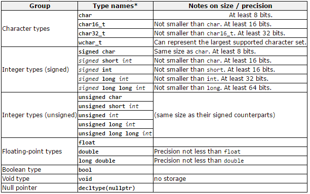

## Variables

While programming in any programming language, you need to reserve memory when you wish to store data. This can be achieved by using variables. When you create a variable, you actually reserve space in memory. Luckily you do not need to use the actual memory location to access the data, but you can use the variable which is a symbolic name that references the memory location.

C++ supports several **primitive datatypes** as shown in the following table.

Primitive types are the most basic data types available within a programming  language. These types serve as the building blocks of data manipulation. Such types serve only one purpose — containing pure, simple values of a kind. Because these data types are defined into the type system by default, they come with a number of operations predefined (+, -, \*, / , ...).

Primitive data types are basic types implemented directly by the language that represent the basic storage units supported natively by most systems. They can mainly be classified into:
* Character types: They can represent a single character, such as 'A' or '$'. The most basic type is `char`, which is a one-byte character. Other types are also provided for wider characters.
* Numerical integer types: They can store a whole number value, such as 7 or 1024. They exist in a variety of sizes, and can either be `signed` or `unsigned`, depending on whether they support negative values or not.
* Floating-point types: They can represent real values, such as 3.14 or 0.01, with different levels of precision, depending on which of the three floating-point types is used.
* Boolean type: The boolean type, known in C++ as `bool`, can only represent one of two states, `true` or `false`.



> #### Alert::Datatype sizes
>
> Note that the C++ standard does not specify a concrete size for each type. This means that the size of the data types is actually dependent on the system you are compiling for. In certain situations you will need to keep this in mind.

Within each of the groups above, the difference between types is only their size (i.e., how much they occupy in memory): the first type in each group is the smallest, and the last is the largest, with each type being at least as large as the one preceding it in the same group. Other than that, the types in a group have the same properties.

Type sizes above are expressed in bits; the more bits a type has, the more distinct values it can represent, but at the same time, also consumes more space in memory:


**C++ is a strongly-typed language**, and requires every variable to be declared with its type **before** its first use. This informs the compiler the size to reserve in memory for the variable and how to interpret its value. The syntax to define (declaring and defining a variable is not the same as we will see later on) a new variable in C++ is straightforward: simply write the type followed by the variable name (also known as its identifier).

```c++
int radius;                 // Definition
double area;                // Definition
char firstLetter = 'a';     // Definition + initialization
bool isSucces, isFinished;  // Multiple definitions are possible as comma separated list
```

As shown in the example above, you can also initialize the variable while defining it.

The name of a variable can be composed of letters, digits, and the underscore character. It must begin with either a letter or an underscore, not with a digit. Upper and lowercase letters are distinct because **C++ is case-sensitive**.

<!-- For definition without an initializer: variables with static storage duration are implicitly initialized with NULL (all bytes have the value 0); the initial value of all other variables is undefined. -->
