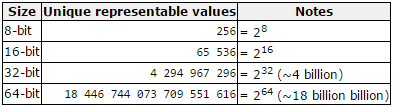

## Variables

While programming in any programming language, you need to reserve memory when you wish to store data. This can be achieved by using variables. When you create a variable, you actually **reserve space in memory**. Luckily you do not need to use the actual memory location to access the data, but you can use the variable which is a symbolic name that references the memory location.

C++ supports several **primitive datatypes** as shown in the following table.

Primitive types are the **most basic data types available** within a programming language. These types serve as the building blocks of data manipulation. Such types serve only one purpose - containing pure, simple values of a certain type. Because these data types are defined into the type system by default, they come with a number of operations predefined (`+`, `-`, `*`, `/`, `%`, ...).

Primitive data types are basic types implemented directly by the language that represent the basic storage units supported natively by most systems. They can mainly be classified into:
* **Character types**: These can represent a single character, such as `'A'` or `'$'`. The most basic type is `char`, representing a single character. Other types are also provided for wider characters.
* **Numerical integer types**: They can store a whole number value, such as `7` or `1024`. They exist in a variety of sizes, and can either be `signed` or `unsigned`, depending on whether they support negative values or not.
* **Floating-point types**: These types represent real values, such as `3.14` or `0.01`, with different levels of precision, depending on which of the three floating-point types is used.
* **Boolean type**: The boolean type, known in C++ as `bool`, can only represent one of two states, `true` or `false`.


> #### Alert::Datatype sizes
>
> Note that the C++ standard does not specify a concrete size for each type. This means that the size of the data types is actually dependent on the system you are compiling for. In certain situations you will need to keep this in mind.

Within each of the groups above, the difference between types is only their size (i.e., how much they occupy in memory): the first type in each group is the smallest, and the last is the largest, with each type being at least as large as the one preceding it in the same group. Other than that, the types in a group have the same properties.

> #### Info::The fundamental storage unit in C++
>
> From the draft version of the C++ 17 Standard $4.4/1
> The fundamental storage unit in the C++ memory model is the byte. A byte is at least large enough to contain any member of the basic execution character set (5.3) and the eight-bit code units of the Unicode UTF-8 encoding form and is composed of a contiguous sequence of bits, the number of which is implementation defined.

Type sizes above are expressed in bits; the more bits a type has, the more distinct values it can represent. On the other hand, the larger the size, the more memory a datatype consumes.



### Declaring variables

**C++ is a strongly-typed language**, and requires every variable to be declared with its type **before** its first use. This informs the compiler the size to reserve in memory for the variable and how to interpret its value. The syntax to define a new variable in C++ is straightforward: simply write the type followed by the variable name (also known as its identifier).

> #### Warning::Declaration versus definition
>
> Note that defining a variable is not the same as declaring it. Declaring a variable is stating that it exists somewhere, while defining a variable is actually creating it. Declaring a variable is done using the `extern` keyword. While less important for variables, the distinction will be more clear in the context of functions, methods and classes.

```c++
int radius;                 // Definition
double area;                // Definition
char firstLetter = 'a';     // Definition + initialization
bool isSucces, isFinished;  // Multiple definitions are possible as comma separated list
int sum = 0;
int average = 0.0;
```

As shown in the example above, you can also initialize the variable while defining it. When a value like `'a'` or `0.0` is used inside code, it is called a **literal value**.

The name of a variable can be composed of letters, digits, and the underscore character. It must begin with either a letter or an underscore, not with a digit. Upper and lowercase letters are distinct because **C++ is case-sensitive**.

### The Assignment Operator

The most used operator is the assignment operator `=`. It assigns a value to a variable. For example:

```c++
int x = 5;
```

This statement assigns the integer value `5` to the variable `x`. The assignment operation always takes place from right to left, and never the other way around:

```c++
int x = 5;
// ...
int y = x;
```

The last statement assigns the value of the variable `x` to the variable `y`. The old value of `y` is lost as soon as the statement is executed and replaced by the value of `x`.

Consider also that we are only assigning the value of `x` to `y` at the moment of the assignment operation. Therefore, if `x` changes at a later moment, it will not affect the value held by `y`.

### Variable initialization

While a variable does not need to be initialized, it should not be used before a meaningful value is assigned to it. Uninitialized variables in C++ actually cause garbage data and may cause unpredictable results if their value is used before they are assigned a decent value.

Try the following code example

```c++
#include <iostream>

using namespace std;

int main() {
  int a, b, c

	cout << "a = " << a << endl;
	cout << "b = " << b << endl;
	cout << "c = " << c << endl;

  return 0;
}
```

The output is **undefined**. Example:

```text
a = 32765
b = 0
c = 0
```

Both C and C++ define the values as undefined. Undefined means it may be **anything**, including being initialized to 0, taking previous value of the memory, being initialized to `0xDEADBEEF` or consecutive bytes of string `"blarg! blarg! blarg!"`, or anything else. In modern operating systems memory is usually zeroed at start and hence short-lived programs will typically have 0s everywhere. Basically you're getting a random value, which happens to sometimes be 0. But it's not guaranteed to be 0.

So important lesson: **Make sure to assign a meaningful value to variables before using them as they may lead to hard-to-track bugs inside your application.**
