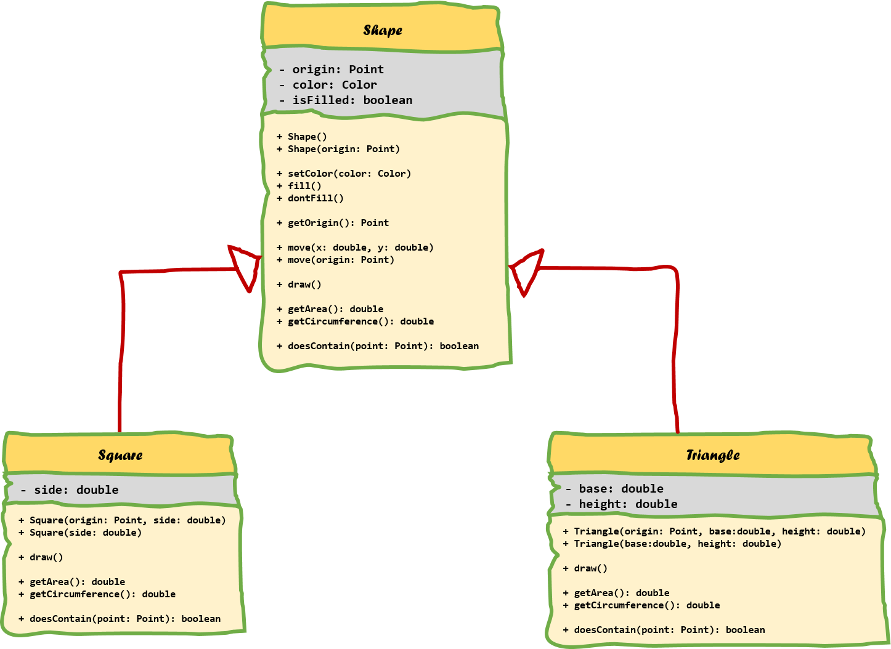

<!-- toc -->

# Inheritance

One of the best features of an object oriented programming language are the abilities for code reuse.
Programmers are generally lazy in the way that they hate to repeat themselves or do things twice.

> #### Warning::Copy paste is not reuse
>
> For all you copy-paste fanatics out there, copying code from one place to another
> is not considered code reuse. If the original code is ever extended, changed or corrected,
> chances are that you will forget to alter one of the copies.

As with most in an OOP language, the solution revolves around the class. Instead of creating classes
from scratch we can use existing ones and extend or embed them with our classes. The main advantages of this
approach is that:
* we reuse code that has been tested and debugged
* code is not duplicated
* classes can be kept small and thus more manageable

The trick is to use the classes without soiling the existing code.
There are two ways to accomplish this and one has already been discussed in this course.

The first approach is to create objects of the already existing class inside the class you are developing.
This is called **composition** as the new class is composed of objects of existing classes.

The second approach is to create a new class as a subtype of an existing class. You literally
take the form of an existing class and extend it, and this without modifying the existing class.
This is called **Inheritance** and it is one of the cornerstones of an object oriented programming language.

## Learn by Example

Let us start based on an example application. Imagine yourself taking on the job to create an application for a store that
sells antique war vehicles, boats, airplanes, weapons and such. As an example we will take a closer look at the modeling of some possible classes in this application.
As we are just starting out, we start small and only implement parts as needed.

To start of we create a *Bomber* class (a sort of airplane that can drop a number of bombs) and a *Tank* class (a vehicle with tracks and a huge main gun), which are currently sold by the store.
Possible models of these classes are shown as UML diagrams below.


For the Bomber class we define the attributes *bombCapacity*, *description*, *price* and *wingWidth*.
For the Tank class we define the attributes *gunCaliber*, *description* and *price*.

All attributes are initialized to default values inside the constructor except for the description, which is passed as an argument.
Other attributes can however be changed using the appropriate setters. Currently no getters are supplied, but all information is
included in a string that can be retrieved using the `to_string()` method.

Even when your programming experience is still not that great, you might feel that there are a couple of things that feel wrong about these models.
This will be fixed as we advance through this chapter. Some questions you need to ask yourself:
* Is this code DRY?
* What if we added other gears of war? Or other types of tanks and planes?
* What about the attributes that are available in both classes?
* Why is Tank a more general class name than Bomber. Should we not rename Bomber to Airplane or something?

## Code always changes

Something to remember is that code evolves. It changes over time as things get added, removed or refactored. Static code will eventually become outdated and die. On top of that your boss, client, teacher, ... will never tell you the whole story. Once they get the first prototype, and they like it, there will always be a "would it be possible to add ..." moment. That is also why it is also more fun to program based on methodologies such as SCRUM and Agile as they take the fact of change into account.

So let's take the application example from the previous section a step further. We created the *Tank* and *Bomber* class after which your boss shows up and tells you to add an identifier to the Bomber and Tank classes to be able to save them in a database. This means you need to change both classes as shown in the following UML class diagrams.


An extra attribute `id` is added of type `long` to store this unique (in scope of a single class type) identifier. This identifier will be used to uniquely identify instances inside the database. A seconds constructor needs to be added to the application so that when instances are loaded from the database the already existing id can be used. The constructor that was already present generates the id based on the ones that are already taken. On top of that a getter method is also supplied for the id.

Notice that two classes had to change to add an id attribute, a getter and a constructor. Actually the implementation of the already present constructor also needs to change to generate an id based on the ones that have already been taken. And if not careful, one might forget to change the `to_string()` implementation to also output the id.

It should feel awkward to change two classes for a single change based on a single property. And what if there were like 10, 20 or a 100 sorts of army weapons. It would be a days work to add this simple change to such an application.

A second change that will be required but has not been discussed yet is the fact that getters need to be implemented for all the attributes that will need to be stored in the database. Currently only the to_string method provides access to that information. However it would be an extreme bad design choice to parse the output of this to_string method for the needed information or to store the output string in the database.

Let's be lazier but smarter programmers and take another approach to this problem.

## Introducing inheritance

The extension of the classes with an id can be easily solved (literally minutes, even with 100 different types of vehicles, airplanes, ... classes) if some sort of general class existed that held all the common properties and actions of all the things that can be sold in the store. This is exactly what inheritance provides for us.

Inheritance allows a class to inherit (get) the properties and methods of another class. In other words, the **subclass** inherits the states and behaviors from the **base class**. The subclass is also called the **derived class** while the base class is also known as the **super-class**. The derived classes can add their own additional attributes and methods. These additional attributes and methods differentiate the derived classes from the base class.

> #### Info::Inheritance = Extension
>
> Inheritance is also often described as a mechanism to **extend** the behavior and properties of the superclass.
> This is just the reason why Java uses the extend keyword for inheritance.

It is also possible to change the implementation of certain methods in the base class, which is also known as **method overriding**.

A super-class can have any number of subclasses. While in Java, a subclass can have only one superclass, in C++ it is possible to inherit from multiple base classes, known as **multiple inheritance** (however not always a good idea or good practice).

So going back to the store example, it an `AntiqueItem` class could be created that contains all the common properties of `Tank` and `Bomber`. The same can be done for the shared behavior of both classes. Do take note that the constructor of the `AntiqueItem` class can only be used to create a general AntiqueItem object and does not know of the Tank and Bomber classes and their more specific properties such as *gunCaliber*, *bombCapacity* and *wingWidth*.


In an UML class diagram inheritance is depicted by drawing a closed arrow from the subclass to the base class as shown in the diagram above.

AntiqueItem has two constructors (constructor overloading). One that takes a description and one that takes a description and an id. The correct constructors will need to be called from the initializer list of subclasses constructors. The to_string method will also provide a basic implementation for the information available inside an AntiqueItem object (id, description and price). The subclasses can extend this behavior or have their own implementation.

Now the derived class `Tank` can be refactored to a simple class with only a specific `gunCaliber` attribute, two constructors, a setter for gun caliber and a more specific implementation of `to_string()`. Do note
that `set_price()` and `get_id()` are not repeated in the class diagram of Tank and Bomber. While both do inherit these methods they do not override their behavior. For this reason most programmers will not repeat these methods inside the subclasses. However the `to_string` method does differ from the implementation of the superclass, therefore it is repeated in the subclasses diagrams.

A similar refactor needs to be applied to the `Bomber` class.

## Private, protected and public members

Attributes and methods are declared with an **access specifier** such as `private`, `protected` or `public`. These allow the developer to determine who can access the class, attributes or methods.

Very important to know is that a **derived class inherits all the members of its base class**, even the private ones, However it cannot access the **private members** (both attributes and methods) of its baseclass. This means that the Tank class cannot directly access the id and price of AntiqueItem. For this reason getters and setters need to be provided for subclasses to have access to the attributes of their superclass.

Another solution would be to make the attributes `protected`. This would allow subclasses to access the attributes directly, while still keeping them inaccessible for outside classes. This can be a good solution in same cases, but most of the time it is cleaner to use accessors (getters and setters).

Do note that you can also make methods protected, allowing subclasses to use them, but not outside classes.

Let's take another example: consider a class `SpaceObject` with a subclass `Planet`. Next to that is a class `Space` which is composed of several `SpaceObject`s and `Planet`s. As shown below, protected attributes and methods are noted using the `#` symbol in UML.


In the example the `size` of a SpaceObject can only be accessed by SpaceObject itself, not even by the subclass Planet. However the `coordinates` are accessible by both SpaceObject and all of its subclasses (such as Planet). However not accessible from outside. `MAX_SIZE` is a `const` and `static` class variable which is made `public` and so accessible by all. However as it is `const` it can only be read and not written.

Below is an overview:

| Attribute of SpaceObject | Accessible by Planet? | Accessible by Space? |
|----|----|----|
|size|NO|NO|
|coordinates|YES|NO|
|MAX_SIZE|YES|YES|

The same rules apply for access specifiers of methods.

## Is-a relationships

The superclass and subclass have an **"is-a"** relationship between them. This means one can state that a `Tank` is-an `AntiqueItem` and a `Bomber` is-an `AntiqueItem` if you consider the previous example.

If it is not logical to state that 'subclass' is-a 'superclass' than you made a mistake to make 'subclass' inherit from 'superclass'. An example of this would be the case when you would create a subclass `Cement` from `Food` because `Cement` also has an expiration date. This may seem DRY but it is illogical. You can't state that `Cement` is-a `Food`.

Let's see some examples:

If we needed to model both a *Bus* class and a *Car* class it makes perfect sense to create a *Vehicle* class and make both *Bus* and *Car* inherit from them. It's perfectly valid to state that
* a Bus is a Vehicle
* a Car is a Vehicle

However it would of been illogical to make *Bus* inherit from *Car* or vice versa as it would not have been logical to state that:
* a Bus is a Car
* a Car is a Bus

## Inheritance in C++

To implement inheritance in C++ all you need is a baseclass and a subclass. The subclass needs to *extend* the baseclass and this can be accomplished by using the syntax shown below:

```c++
class <subclass> : public <baseclass>
  // Implementation
}
```

Note that *extending* the baseclass is exactly what we are doing when implementing inheritance. We take a general class and add something to it: data, behavior or both.

### Constructors and inheritance

When creating objects, C++ will not only call the constructor of the type you are creating but it will implicitly call a constructor of each baseclass. Take a look at the inheritance hierarchy shown below.


When for example creating an object of type *QuadCore*, the constructor of *QuadCore* will implicitly call the constructor of *Processor* which will call the constructor of *ComputerHardware* which will call the constructor of *Product*. These calls are provided by default by C++ and are done before anything else. That means that the rest of you constructor code will be executed after the contructor call to the baseclass.

This basically means that if you create an instance of a QuadCore, the *Product* portion will be constructed first, next the *ComputerHardware* portion, after which the *Processor* portion and last the *QuadCore* portion. This is a bit logical as you can only initialize the specific data of *ComputerHardware* after the data of *Product* has been initialized.

There is however a catch to this whole constructing system.

Remember that if you do not define a constructor in C++, it will provide you with a *default constructor* (a constructor without arguments) for a class. However once you create a constructor yourself C++ will not provide this default constructor anymore. That means if you create a single constructor that takes arguments, your class will not have a default constructor anymore. Since C++ will add an implicit call to the default constructor of the baseclass for each subclass, it will not find one and the compiler will turn up a compiler error. In other words if no default constructor exists for the baseclass your program will fail.

This can be fixed using two approaches:
* add a default constructor to the baseclass. This is however not always possible or even advisable as you may not have access to the implementation of the baseclass or it might not make sense to add a default constructor.
* explicitly call another constructor of the baseclass. This can be achieved by using the **constructor initialization list** to call a specific constructor of the baseclass.

The second approach mostly takes the preference.

An example of this for the both constructors of the Tank class would be:

```c++
Tank::Tank(std::string description)
  : AntiqueItem(description) {
    // ....
  }
Tank::Tank(std::string description, long id)
  : AntiqueItem(description, id) {
    // ....
  }
```

Note how the name of the baseclass is used to call a baseclass constructor.

#### Quick summary

* C++ provides a default constructor if you provide no constructor(s).
* With inheritance each constructor is called from bottom to top but actually executed from top to bottom.
* If no default constructor exists for the baseclass you will need to add one or call another constructor explicitly using the constructor initialization list and provide the required arguments.

## Method overriding

Method overriding, in object oriented programming, is a language feature that allows a subclass or child class to provide a specific implementation of a method that is already provided by one of its superclasses or parent classes. The implementation in the subclass overrides (replaces) the implementation in the superclass by providing a method that has the same name and the same parameters, and same return type as the method in the parent class. These three parts are all together called the **signature of a method**. An overriding method can also return a subtype of the type returned by the overridden method. This subtype is called a covariant return type.

> #### Alert:: Method overriding <=> Method overloading
> Method Overloading is a feature that allows a class to have two or more methods having same name, if their argument lists are different. Constructor overloading allows a class to have more than one constructors having different argument lists. Overloaded methods are differentiated by the number and the type of the arguments passed into the method.
>

The version of a method that is executed will be determined by the object that is used to invoke it. If an object of a parent class is used to invoke the method, then the version in the parent class will be executed, but if an object of the subclass is used to invoke the method, then the version in the child class will be executed.

The ability of a subclass to override a method allows a class to inherit from a superclass whose behavior is "close enough" and then to modify behavior as needed.



The UML diagram above shows a couple of examples of method overriding. First of all there is the `draw()` method that is defined for the *Shape* class and its descendants. It takes no arguments and has no return value. Next there are the `getArea()` and `getCircumference()` methods which do return a `double`. Last is the `doesContain()` method which checks if the *Shape* contains a *Point*. It takes an argument and returns a value. Important to note is that the *signature* of all these methods are the same!

The rules for method overriding can be summarized as follows:

* The argument list should be exactly the same as that of the overridden method.
* The return type should be the same or a subtype of the return type declared in the original overridden method in the super class.
* The access level cannot be more restrictive than the overridden method’s access level. For example: if the super class method is declared public then the overriding method in the sub class cannot be either private or protected.
* A subclass can only override methods declared public or protected.
* Constructors cannot be overridden.

You can call methods of the base class by using the name of the baseclass followed by **scope resolution operator** `::` followed by the name of the method you wish to call. This can be useful if you do not want to replace the implementation of the baseclass but rather want to extend it.

For example the `to_string()` implementations of Tank can make use of the already existing implementation of the `to_string()` method of AntiqueItem as follows:

```c++
std::string Tank::to_string(void) {
  std::stringstream ss;
  ss << AntiqueItem::to_string();
  ss << " | Gun caliber: " << gunCaliber;
  return ss.str();
}
```

Some example code that could make use of this:

```c++
AntiqueItem antique("A small rescue boat used in world war 2 in good shape.", 13);
antique.set_price(510000);

Tank tank("A Tiger 1 tank prototype in bad shape.", 14);
tank.set_price(299250);
tank.set_gun_caliber(88);

Bomber bomber("A B52 bomber in non-working condition. Needs revision.", 15);
bomber.set_price(2000000);
bomber.set_wing_width(56);
bomber.set_bomb_capacity(32000);

cout << antique.to_string() << endl;
cout << tank.to_string() << endl;
cout << bomber.to_string() << endl;
```

might output something like:

```
[id = 13] A small rescue boat used in world war 2 in good shape. Price = 510'000 euro
[id = 14] A Tiger 1 tank prototype in bad shape. Price 299'250 euro | Gun caliber: 88
[id = 15] A B52 bomber in non-working condition. Needs revision. Price = 2'000'000 euro | Wingspan = 56m | Max 32'000 kg of bombs
```

## Polymorphism

Polymorphism comes from Greek and means:
* Poly = many
* Morph = form, shape

So polymorphism is the ability of an object to take on many forms. The most common use of polymorphism in OOP occurs when a parent class reference is used to refer to a child class object.

This basically means that you can do the following in our `AntiqueItem` example application:

```c++
AntiqueItem * antique = new AntiqueItem("A small rescue boat used in world war 2 in good shape.", 13);
AntiqueItem * tank = new Tank("A Tiger 1 tank prototype in bad shape.", 14);
AntiqueItem * bomber = new Bomber("A B52 bomber in non-working condition. Needs revision.", 15);
```

Do take note that this only works when using pointers of the baseclass type. We cannot do this when creating local variables on the stack unless we then access them via a pointer of the baseclass as so:

```c++
Tank tank;

AntiqueItem * tankItem = &tank;
```

This is often used when storing subtypes inside an array or container class:

```c++
std::vector<AntiqueItem*> items;

items.push_back(new AntiqueItem("A small rescue boat used in world war 2 in good shape.", 13));
items.push_back(new Tank("A Tiger 1 tank prototype in bad shape.", 14));
items.push_back(new Bomber("A B52 bomber in non-working condition. Needs revision.", 15));
```

This allows all the superclass and subclass instances to be store together in a list. If this were not possible it would be necessary to create separate lists for each type.

Of course in a realistic application the list would be populated from a database or a file.

C++ tracks the actually type of the objects. This basically means that while all the objects created above
are AntiqueItems because of inheritance, C++ still knows that some are Tanks or Bombers.

Polymorphism allows us to store subtypes inside an array of the baseclass type. Now what would happen if we were to add the following code to the application:

```c++
for (unsigned int i = 0; i < items.size(); i++) {
  cout << items[i]->to_string() << endl;
}
```

Which would output:

```
[id = 13] A small rescue boat used in world war 2 in good shape. Price = 510'000 euro
[id = 14] A Tiger 1 tank prototype in bad shape. Price 299'250 euro
[id = 15] A B52 bomber in non-working condition. Needs revision. Price = 2'000'000 euro
```

This is actually not what we expected. We expected that each antique item's 'correct' `to_string()` method would be called.

Important to know is that while method overriding can be done out of the box, **polymorphism needs to be enabled in C++** and is default not. A method can be declared a candidate for late binding (polymorphism) by appending the keyword `virtual` before the declaration of the method in the class as shown below. Strictly speaking only the `to_string()` method of AntiqueItem needs to be declared virtual here.

```c++
class AntiqueItem {
  // ...
  public:
    virtual std::string to_string(void);
};
```
```c++
class Tank : public AntiqueItem {
  // ...
  public:
    std::string to_string(void);
};
```

If the same main code is executed again the output will be:

```
[id = 13] A small rescue boat used in world war 2 in good shape. Price = 510'000 euro
[id = 14] A Tiger 1 tank prototype in bad shape. Price 299'250 euro | Gun caliber: 88
[id = 15] A B52 bomber in non-working condition. Needs revision. Price = 2'000'000 euro | Wingspan = 56m | Max 32'000 kg of bombs
```

### Another look at polymorphism

Source: http://stackoverflow.com/questions/2391679/why-do-we-need-virtual-functions-in-c#comment32597274_2392656

Let's say you have these two classes:

```c++
class Animal {
  public:
    void eat(void) {
      std::cout << "I'm eating generic food.";
    }
};
```

```c++
class Cat : public Animal {
  public:
    void eat(void) {
      std::cout << "I'm eating a rat.";
    }
};
```

In your main function:

```c++
void main(void) {
  Animal * animal = new Animal();
  Cat * cat = new Cat();

  animal->eat(); // outputs: "I'm eating generic food."
  cat->eat();    // outputs: "I'm eating a rat."
}
```

So far so good right? Animals eat generic food, cats eat rats, all without virtual.

Let's change it a little now so that eat() is called via an intermediate function (a trivial function just for this example):

```c++

void make_it_eat(Animal * animal) {
  animal->eat();
}

void main(void) {
  Animal * animal = new Animal();
  Cat * cat = new Cat();

  make_it_eat(animal);  // outputs: "I'm eating generic food."
  make_it_eat(cat);     // outputs: "I'm eating generic food."
}
```

Uh oh ... we passed a Cat into `make_it_eat()`, but it won't eat rats. Should you overload `make_it_eat()` so it takes a `Cat *` ? If you have to derive more animals from Animal they would all need their own `make_it_eat()`.

The solution is to make `eat()` a virtual function:

```c++
class Animal {
  public:
    virtual void eat(void) {
      std::cout << "I'm eating generic food.";
    }
};
```

Where now all goes well:

```c++

void make_it_eat(Animal * animal) {
  animal->eat();
}

void main(void) {
  Animal * animal = new Animal();
  Cat * cat = new Cat();

  make_it_eat(animal);  // outputs: "I'm eating generic food."
  make_it_eat(cat);     // outputs: "I'm eating a rat."
}
```

If we did not have this polymorphic behavior we would have to create a `make_it_eat()`
method for each type of Animal. This would definitely cause lots of errors and headaches.

So polymorphism is again another technique that allows us to write short, clean and maintainable code.

### Virtual Destructors

The `virtual` keyword is not only important for methods we which to override and access via baseclass pointers. It is also imporant when considering dynamic memory usage. When reserving memory in your objects, you need to free it once the objects are destroyed. This is accomplished using the `delete` keyword. This has been discussed in detail in the chapter "Memory Allocation".

However what if you extend this class. Is the destructor of the baseclass still called in that case?

Let's take a look at a simple example:

```c++
class Animal{
  public:
    ~Animal(){
        std::cout << "Destroying an Animal" << std::endl;
    }
};
```

and a subclass from Animal named Cat:

```c++
class Cat : public Animal {
  public:
    ~Cat(){
        std::cout << "Destroying a Cat" << std::endl;
    }
};
```

If we create a new Cat we expect both destructors to be called:

```c++
int main() {
    Animal * a = new Cat();
    delete a;
    return 0;
}
```

However the only thing the output shows is:

```
Destroying an Animal
```

Do note that this is not the case when a Cat object is created on the stack.

To fix this, we are required to make the destructor of Animal `virtual`.

```c++
class Animal{
  public:
    virtual ~Animal(){
        std::cout << "Destroying an Animal" << std::endl;
    }
};
```

```c++
int main() {
    Animal * a = new Cat();
    delete a;
    return 0;
}
```

Rendering the output

```
Destroying a Cat
Destroying an Animal
```

Note that the destructors are executed in the opposite order as the constructors.

## Casting pointers of superclass to more specific subtypes

Consider the code from the previous section

```c++
AntiqueItem * antique = new AntiqueItem("A small rescue boat used in world war 2 in good shape.", 13);
AntiqueItem * tank = new Tank("A Tiger 1 tank prototype in bad shape.", 14);
AntiqueItem * bomber = new Bomber("A B52 bomber in non-working condition. Needs revision.", 15);
```

While we as programmers know that the variable `tank` is a pointer to a Tank, it cannot be used in its current state to
call a method that is not declared in the AntiqueItem class and that is specific for a Tank such as `set_gun_caliber()`.

So the following code will fail:

```c++
AntiqueItem * tank = new Tank("A Tiger 1 tank prototype in bad shape.", 14);
tank->set_gun_caliber(88);
```

While the actual instance is of type Tank, the pointer that is used to access the reference is of a **more general** type AntiqueItem.
However, if you are sure that the pointer of the type you think it to be, you can always **cast** it to the more specific type as shown in the following example.

```c++
AntiqueItem * tank = new Tank("A Tiger 1 tank prototype in bad shape.", 14);
((Tank*)tank)->set_gun_caliber(88);
```

Using the syntax above a supertype reference can be converted or cast to a more specific subtype.
To accomplish this, specify the type to which to cast (name of class followed by a `*` to indicate that it needs to be a pointer) and surround this with parentheses.
Next add the pointer variable you wish to cast. Surround the whole thing again with parentheses and threat this whole construct as a pointer to the subtype.

If you require this construct multiple times it can be consider unDRY code. For this reason it may then be more reasonable to save the result of the construct in
a pointer of the subtype as shown in the following example.

```c++
AntiqueItem * item = new Bomber("A B52 bomber in non-working condition. Needs revision.", 15);

Bomber * bomber = ((Bomber*)item);

bomber->set_price(2000000);
bomber->set_wing_width(56);
bomber->set_bomb_capacity(32000);
```

## Abstract classes

Abstract classes are classes that cannot be instantiated. In other words you cannot construct objects from it.

A common use of abstract classes is to provide an outline of a class. It can already provide functionality, i.e. some parts of the class are implemented and some parts are just outlined with a method declaration.

While an abstract class cannot be instantiated, you can create a concrete class based on an abstract class (through inheritance), which then can be instantiated. To do so you have to inherit from the abstract class and override the abstract methods, i.e. implement them.

An abstract class does a few things for the inheriting subclass:
* Define methods which can be used by the inheriting subclass.
* Define abstract methods which the inheriting subclass must implement.
* Provide a common interface which allows the subclass to be interchanged with all other subclasses.

A class is mostly made abstract because it contains some abstract methods. An abstract method is a method that is declared without an implementation (without braces, and followed by `=0` and a semicolon), like this:

```C++
void draw() = 0;
```

In C++, a class is automatically and implicitly declared abstract if at least one method lacks an implementation.

When an abstract class is subclassed, the subclass usually provides implementations for all of the abstract methods in its parent class. However, if it does not, then the subclass is also an abstract class.

Consider the example shown below. An abstract class `Animal` is defined which contains some attributes common to animals such as a `favoriteFood` and a `gender`. The class also implements getter methods for food and gender. By declaring an abstract method `make_noise(): String` a contract is created stating that every Animal can make noise. An implementation cannot be added for this method to the class as Animal is too general and it cannot be known what noise an Animal will make.


This abstract class can however serve as a baseclass for more specific animal types such Dog, Cat, Bear, ... Those subclasses can implement the `make_noise()` method because the programmer knows that a Dog goes 'Woooofffff' and a cat goes 'Miiaaaauwwww'. An advantage of this approach is that a developer of an abstract class defines a common interface and also can provide a partial implementation.

While **no objects can be instantiated from an abstract class** (compiler will complain with *cannot declare variable to be of abstract type*), it can serve as a datatype for referencing more specific subtypes. This serves the same purpose as outlined earlier in this chapter on polymorphism. You can for example create a method that takes an argument of type Animal and calls the `make_noise()` of that animal. This way a reference to any type of animal can be passed to the method, instead of creating a method for each existing type of animal.

Let us take a look at the actual implementation of Animal and Dog.

Important to note about the header file of Animal is that the `make_noise()` method lacks an implementation (done by assigning the signature `= 0`). The method also needs to be declared `virtual` otherwise the implementation of a subclass will not be called when a reference to Animal is used to reference for example a Dog instance.

[include](code/abstract_animal/include/animal.h)

The implementation of Animal is pretty straight forward. Do note that no definition for the `make_noise()` method is given in the cpp file.

[include](code/abstract_animal/src/animal.cpp)

When inheriting from the Animal class an implementation must be given to `make_noise()`, otherwise that subclass is also implicitly abstract. Because of this the method must not be assigned to `= 0` as shown below.

[include](code/abstract_animal/include/dog.h)

The Dog class has a simple implementation for `make_noise()` which just returns "Wooooffff". Note how the superclass constructor needs to be called using the constructor initialization list as Animal does not provide a default constructor.

[include](code/abstract_animal/src/dog.cpp)

Again, objects cannot be instantiated from an abstract class. The compiler will complain. Of course it would not make sense to have such objects, as they lack implementation for certain methods.

As an example, a method `let_animal_speak()` is added which takes an Animal pointer as argument and calls the `make_noise()` method. The output is redirected to the console. A reference to any type of animal can be passed to this method. Assume a method had been created which takes a pointer to a Dog as an argument. Some time later it is decided to create a class Bear. Now a second method needs to be created to take an argument of type Bear, and so on. By using the superclass as datatype for the reference, any type of Animal can be made to make some noise.

[include](code/abstract_animal/main.cpp)

Of course, the reference of type Animal can only be used to call the methods that have been declared inside the Animal class. That means that specific methods for a Dog or a Cat cannot be called using this reference unless the reference is casted back to its original subtype.

Important to note is also that this technique only works using pointers (or by passing objects by reference using `&` as shown by the second method in the example code above). The following example would not work as the objects are actually copied when passing an object into a method (pass-by-value). The compiler will complain that it *cannot declare variable animal to be of abstract type Animal*. This is normal because when passing by value, the compiler will actually create a new object of that class which is a copy of the original. This means it will need to be able to actually instantiate an object of type Animal.

```c++
void let_animal_speak(Animal animal) {
    cout << animal.make_noise() << endl;
}
```

Even when Animal would not have been an abstract class this would not work because the compiler would not be able to copy a subtype into a supertype object. This is understandable as the subtype is more specific than the general supertype. Its like trying to cram a Chicken into to memory space of a Bird because a Chicken is a type of Bird.


<!--
Interfaces:
A pure Abstract class has only abstract member functions and no data or concrete member functions. In general, a pure abstract class is used to define an interface and is intended to be inherited by concrete classes. It's a way of forcing a contract between the class designer and the users of that class. The users of this class must declare a matching member function for the class to compile. -->
